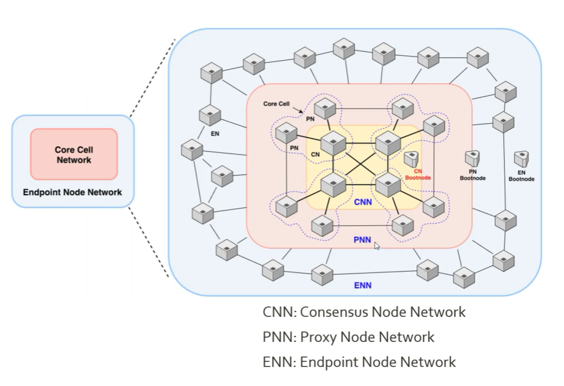
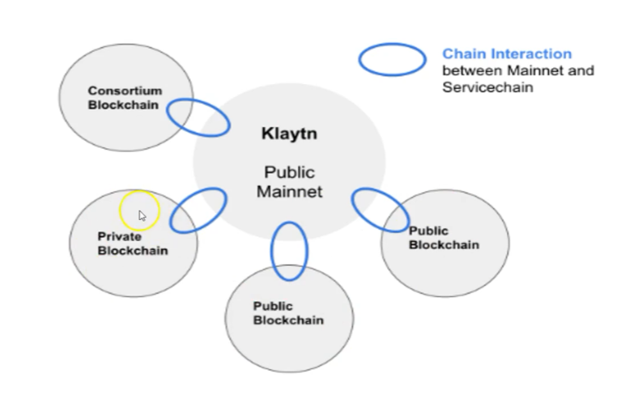

### 2021-12-04

## 클레이튼 - 기존 블록체인 플랫폼의 약점
- *참고: https://www.inflearn.com/course/%ED%81%B4%EB%A0%88%EC%9D%B4%ED%8A%BC/dashboard*
- **Scalability (확장성)**
    - TPS: Transaction Per Second
        - Visa: 1700 TPS
        - 비트코인: 2~5 TPS
        - 이더리움: 15~20 TPS
    - Block Interval: 블록 생성 간격
        - 비트코인: 10분
        - 이더리움: 15초~20초
            - ex. 이더리움이 20 tps로 15초 block interval을 가진다면, 블럭 하나에 300개의 transaction이 담김
    - ex. TPS가 10,000 & Block Interval이 10분
        - 재수없으면 내가 친구한테 돈 보내는데 10분이 걸릴 수도
    - 왜 기존의 블록체인은 느리지?
        - 참여하는 노드 많다고 빨라지지 않아
        - 모든 노드들이 같은 일을 반복... 전체 네트워크가 가장 느린놈으로 하향 평준화됨
    - 비트코인 & 이더리움
        - 많은 양의 트랜잭션 처리 X
        - 네트워크 자체 속도 느림

- **Finality (최종성)**
    - 트랜잭션이 변경 불가라는 합리적인 보장 받기까지 기다려야하는 시간
    - 블록에 담긴 TX(거래)가 바뀔 수 없다는 보증
    - 비트코인 & 이더리움은 최종성이 부족 
        - 확률론적 최종성만 제공
        - 비트코인: 블록 채굴 평균시간 - 10분, Finality까지의 평균시간 - 60분
        - 이더리움: 블록 채굴 평균시간 - 15초, Finality까지의 평균시간 - 6분

- **Fork (분기)**
    - 블록들의 연결이 2개 이상의 분기로 갈라지는 현상
    - 작업증명(PoW) 방식
        - 블록체인에 블록 추가하기 위해 문제를 품 (해시값 찾기)
        - 노드끼리 경쟁 => 2개가 비슷한 시기에 품 => 이떄 분기 발생
        - Longest Chain Rule을 통해서 유효한 블록을 검증받게 됨

## 클레이튼 - 클레이튼 이해하기
- **합의**
    - 퍼블릭 블록체인: PoW, PoS 등등
    - 프라이빗 블록체인: pBFT, Raft 등등
        - BFT: 참여 노드수 제한하여 성능을 높임, but 분산화 약화와 투명성 저하
    - 클레이튼의 합의 알고리즘 : **IBFT**    
        - 합의 달성 소수 private 노드
        - 블록 생성 결과 접근 및 검증 노드
        - 

- **블록 생성 및 전파**
    - 블록 생성 사이클 
        - 라운드라 불리며 약 1초
        - 제안자와 위원회 선택
            - 무작위 & 결정적으로 Governance Council 노드들 중 뽑음
        - 제안자의 공개키를 통해 입증 가능한 암호 증명 씀
        - 누가 제안자이고 위원회인지 파악되면 제안자가 블록 만들고 합의
    - 블록 전파
        - 프록시 노드 통해 엔드포인트 노드들에게 전달됨

- **네트워크 구조**
    - Core Cell Network & Endpoint Node Network
        - CNN: Consensus Node Network, 지들끼리 합의 빠르게 연결되어있음 (private)
        - PNN: Proxy Node Network, 코어와 엔드포인트의 중간 연결 다리
        - ENN: Endpoint Node Network
    - 

- **코어 셀**
    - 사용자가 많아져서 확장이 필요할 떄...
        - 일반적: 서버 증설하고 Request 분할하여 처리
        - 클레이튼: 노드 자체의 성능을 늘림 (CPU, RAM 등)
    - 클레이튼 **CN** 합의 노드 참여조건
        - core 40개 이상, 256gb RAM, 1년치의 데이터 약 14TB 저장, 10G 네트워크
        - 얘는 합의를 담당하는 노드라서 병목이 되어선 안돼!
        - 여러대의 PN을 둠으로써 그 부하 분산을 해낼 수 있음

- **서비스 체인**
    - 메인넷과 연결된, 독립적으로 운영되는 블록체인
    - 
    - 쓰이는 경우
        - 특별한 노드 환경
        - 보안 수준 맞춤형
        - 많은 처리량 요구, 메인넷 배포시 경제성 낮은 경우

- **이더리움 vs 클레이튼**
    - 이더리움
        - 단일 네트워크
        - 가장 먼저 블록 만들고 많이 전파해야함
        - Proof-of-work
        - 그 누가 블록에 write 할지 모르니, 블록 전파에 힘써야 함
    - 클레이튼
        - 두개의 레이어 신뢰모델 (Core Cell, Endpoint)
        - 매 라운드마다 합의 노드들 중 하나가 뽑혀 블록을 씀
        - Endpoint가 CoreCell에 접근하여 빠르게 CR 할 수있는 구조
