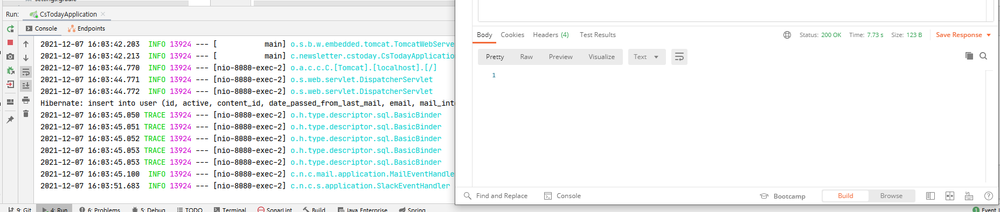
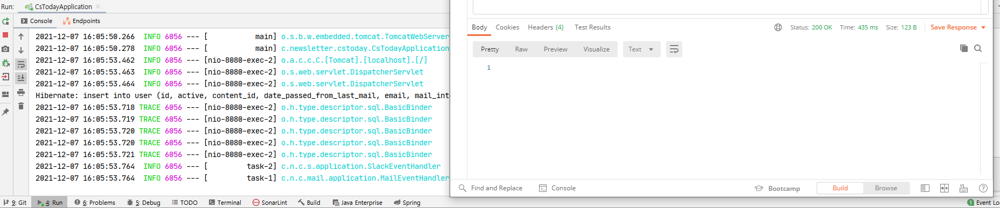

### 2021-12-07

## HTML 파일의 내용을 그냥 DB에 저장하면 안될까?
- **생각한 옵션 두개**
    1. HTML 파일을 서버에 파일 형식으로 저장. DB에는 해당 파일의 경로를 읽어오게함
    2. DB에 그냥 HTML 파일 내용을 통째로 String으로 변환하고, 이를 넣어버림

- **1번의 장점**
    - Easy Deploy에서 채택하고 있는 방식
    - 나름 이게 국룰인듯 (Best Practice)
    - 파일들을 따로 모아두고 있기 때문에 쉽게 다른 용도로 활용할 수 있음

- **2번의 장점**
    - Scale Up이 오히려 쉬울것 같아
        - 도커같은걸로 서버를 띄워도 그냥 뚝딱 DB 연결만 해주면돼
        - 도커에서 호스트 파일 접근하는 프로세스 이런거 복잡하자나
        - 그냥 DB에서 Text 형식으로 뽑아오기만 하면 되는거라서말이지.
    - 수정도 쉬울수도 (파일 지지고 볶고 하는거보다 그냥 뚝딱 Text만 바꿔주기)
        - 다만 너무 DB 의존적여질 것 같기도
    - 테스트하기 더 쉬워져! 외부 path에 의존하지 않아도돼!

- **참고 자료**
    - *참고: https://stackoverflow.com/questions/14605935/database-for-content-ok-to-store-html*
    - HTML을 직접 DB에 저장하는 것은 모범 사례는 아니다
        - 관심사의 분리를 생각해보면...
    - DB에 저장하는게 또 아주 나쁘진 않은데, 나중에 웹사이트 디자인 바뀌면 골때릴수있다.
    - DB에 HTML 저장하는 건 전혀 위험하지 않다.

## Spring Event + Async
- *참고 1: https://supawer0728.github.io/2018/03/24/spring-event/*
- *참고 2: https://javacan.tistory.com/entry/Handle-DomainEvent-with-Spring-ApplicationEventPublisher-EventListener-TransactionalEventListener*
- **Event 사용하기**
    - TransactionalEventListener를 통해서 어느 시점에 로직을 실행할 지 정할 수 있음
        - 트랜잭션 커밋 전, 롤백 이후, 커밋 이후 등 시점 설정 가능
    ```java
    public class Service {
        private ApplicationEventPublisher eventPublisher;
    
        public Member join(Member member) {
            memberMapper.insert(member);
            eventPublisher.publishEvent(new MemberJoinedEvent(member));
            return member
        }
    }
    
    public class MemberJoinedEventListener {
        @TransactionalEventListener(phase = TransactionPhase.AFTER_COMMIT)
        public void handle(MemverJoinedEvent event) {
            Member member = event.getMember();
            emailService.sendEmail(member.getEmail());
        }
    }
    ```

- **Event 비동기 처리**
    ```java
    @EnableAsync
    @SpringBootApplication
    public class CsTodayApplication {
        public static void main(String[] args) {
            SpringApplication.run(CsTodayApplication.class, args);
        }
    }
  
    public class MemberJoinedEventListener {
        @Async
        @TransactionalEventListener(phase = TransactionPhase.AFTER_COMMIT)
        public void handle(MemverJoinedEvent event) {
            Member member = event.getMember();
            emailService.sendEmail(member.getEmail());
        }
    }
    ```
    - 해당 이벤트를 발행하는 친구가 `@Transactional` 어노테이션이 있어야해
        - 아마 트랜잭션 종료시점에 applicationContext가 뚝딱 처리하는데 `@Transcational` 이 없으면 그 타이밍을 감지 못하는거 아닐까?   

- **비동기 처리 이후 단축된 시간**
    - 
    - 원래 약 7초가 넘어가는 동기적 처리 : 가입 -> DB 저장 -> 메일 발송 -> 슬랙 전송
    - 
    - 약 500ms 안쪽으로 들어오는 비동기적 처리