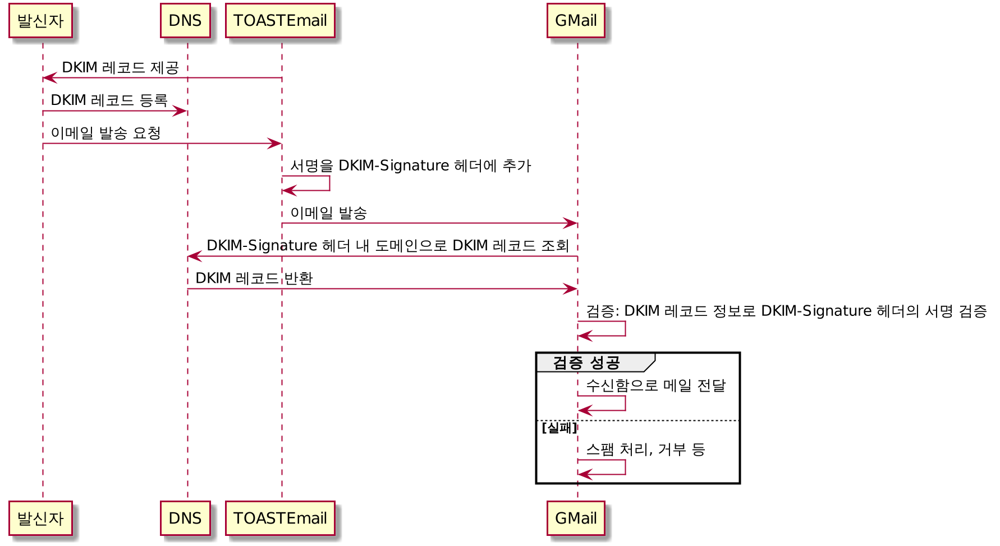
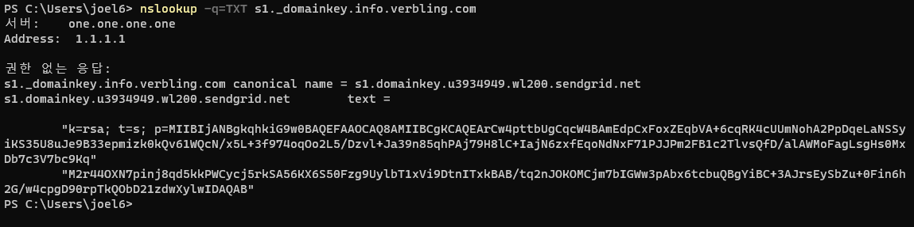

### 2021-12-21

## DKIM 적용하기
- *참고: https://hiseon.me/linux/ubuntu/dkim-settings/*
- *참고: https://meetup.toast.com/posts/248*
- *참고: https://www.cisco.com/c/ko_kr/support/docs/security/email-security-appliance/215360-best-practice-for-email-authentication.html*
- **DKIM 이란?**
    - 메일 발송자의 도메인과 메일의 무결성을 검증할 수 있는 기술
    - 보낸사람 주소가 위조된 경우 메일 탐지
    - Verbling DKIM signature
    ```
    DKIM-Signature: v=1; a=rsa-sha256; c=relaxed/relaxed; d=info.verbling.com; 
    h=content-type:from:mime-version:subject:reply-to:x-feedback-id:to; 
    s=s1; bh=yurMcrg5W97a0bnM840AyZYyEnx4j8QZcGCRwB4r6eM=; 
    b=qEiTpG63wwKCYlEPQ05DfLtq5OzIgvT5qgKwhqn0h6IN/3khkA7pfD5C33a9phS+MBTH 
    cGIUgYoeUBeFHB1xluq/zxi9D/qyxfznfl++2GsJY5FK6emKhrCPpuMBCrjFyspyuMfClZ 
    EFqT33dTpty4jKzhbe2YMJUfFKfP1AZ8ENQN/+GvjDufjguwBUJ0PhEZrH8NCnsheszPw9 
    gu9Sb5abx5WsCbvoUBJtDaXgwyLDpAwwgK6H6NgPw1Zt96a531KjM7053omFk2zu872lnG 
    uk74LtvEc5MUglVqbvHevFk74CUsxHUCaoTlKNq14UQCtVdZ3jT/R2NQwbQ3nZeg==
    ```
    - DKIM 검증 흐름
        - 

- **OpenDKIM 설치**
    - `$ sudo apt-get install opendkim opendkim-tools`

- **DKIM 이론**
    - 발신자가 발신 메시지에 암호로 서명하고, 다른 확인 메타데이터와 함께 DKIM-Signature에 포함시켜 전송
    - 발신자는 DNS에 공개키를 게시
    - DKIM을 구현하기 위해 전송조직은 하나의 공개키쌍을 생성하고, DNS에 공개키를 TXT레코드로 게시
        - 각 키쌍은 "selector"에서 참조
    - 다음과 같이 서명
        - a: 서명에 사용될 알고리즘
        - c: 정규화 체계 지정
        - s: 선택키 또는 키 참조
        - d: 서명 도메인
        - h: 서명된 헤더를 나열
        - i: 서명 사용자 id
        ```
        DKIM-Signature: v=1; a=rsa-sha256; c=relaxed/relaxed; d=info.verbling.com;
        h=content-type:from:mime-version:subject:reply-to:x-feedback-id:to;
        s=s1; bh=yurMcrg5W97a0bnM840AyZYyEnx4j8QZcGCRwB4r6eM=;
        b=qEiTpG63wwKCYlEPQ05DfLtq5OzIgvT5qgKwhqn0h6IN/3khkA7pfD5C33a9phS+MBTH
        cGIUgYoeUBeFHB1xluq/zxi9D/qyxfznfl++2GsJY5FK6emKhrCPpuMBCrjFyspyuMfClZ
        EFqT33dTpty4jKzhbe2YMJUfFKfP1AZ8ENQN/+GvjDufjguwBUJ0PhEZrH8NCnsheszPw9
        gu9Sb5abx5WsCbvoUBJtDaXgwyLDpAwwgK6H6NgPw1Zt96a531KjM7053omFk2zu872lnG
        uk74LtvEc5MUglVqbvHevFk74CUsxHUCaoTlKNq14UQCtVdZ3jT/R2NQwbQ3nZeg==
        ```
    - DKIM 서명 메시지를 수신하면 다음 DNS 쿼리를 구성해 공개키 조회
        - selector._domainkey.cstoday.me
        - 버블링 예시: s1._domainkey.info.verbling.com
        - 
