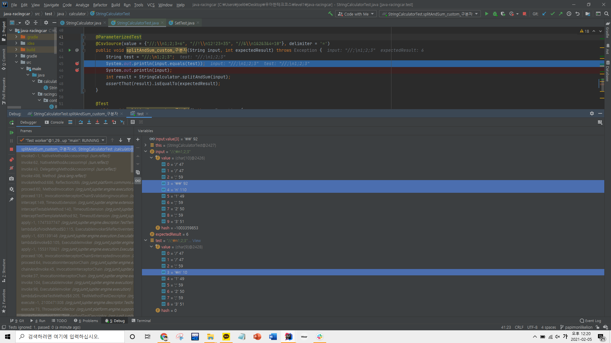

### 2021-02-04

## __오늘의 코딩__
- __IntelliJ 디버깅__
    - 빨간 점 만들어 놓고 Debug로 돌리면 단계별 검증 가능
    - @CsvSource(value = {"//;\\\n1;2;3=6"}, delimiter = '=')에서 파라미터로 넘겨주는 String과 String test = "//;\n1;2;3"; 가 다름을 발견
        - @CsvSource가 어찌 동작하길래 그러지?
        - Stream과 관련이 있을까?
        - 해당 Annotation에서 \n 이 가지는 의미는 무엇인가?
        


- __함수를 변수처럼 사용할 수 있을까?__
    - 함수를 배열에 담아 변수에 접근하듯이 사용하고 싶다. 
    - 아래 코드를 리팩터링 할 수 있는 다른 방법이 있지 않을까?
    
``` JAVA
    private static int number;

    public static int splitAndSum(String text) throws RuntimeException {
        if (checkNullOrEmpty(text)) {
            return 0;
        }
        if ((number = parseByCustomDelimiter(text)) != -1) {
            return number;
        }
        if ((number = parseBySplitRegex(text)) != -1) {
            return number;
        }
        return parseSingleTextToInt(text);
    }
```
