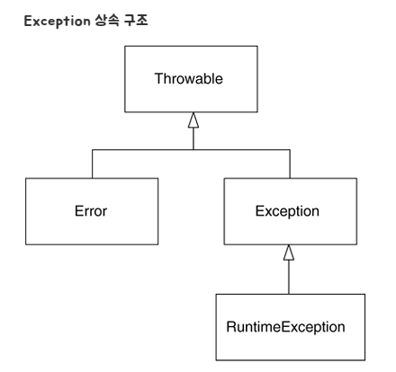
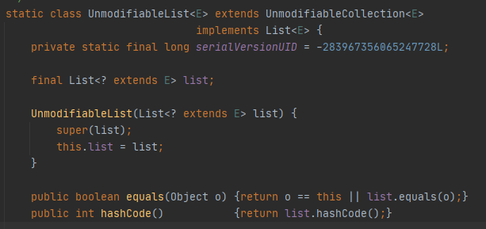
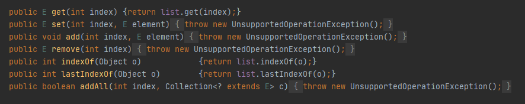

### 2021-02-24

## 자바 Exception
- 참고 1: https://cheese10yun.github.io/checked-exception/
- 참고 2: https://woowacourse.github.io/javable/post/2020-08-17-custom-exception/
- 참고 3: https://jamie95.tistory.com/entry/Java-StackTrace-%EC%9D%BD%EA%B8%B0

- __정의__
    - 프로그램이 실행 중 어떤 원인에 의해서 오작동을 하거나, 비정상적으로 종료되는 경우

- __역사__
    - 에러를 처리하는 두 가지 방법
        1. 반환값으로 실패를 전달해, 호출처에서 반환값을 체크하여 에러 처리 진행 *(C언어 등)*
            - 반환값 확인을 잊어버리면 말짱 도루묵
            - 2번이 더 발전된 방식으로 채택
        2. 호출처에서 호출하기 전에 에러 처리 코드를 등록, 실패 시 에러 처리 코드로 점프 *(현재 예외 처리 방식)*
    
    - 에러가 발생했을 떄 "점프할 장소를 사전에 등록"해두는 방법이 발전하여 예외 처리가 됨
        - 문제는 "짝을 이루는 처리"(lock/unlock, file open/close 등) 처리가 어려움
        - 함수가 어떤 예외 던질 지 확인이 힘듦
    
    - Java를 포함, 대부분의 예외 처리는 예외가 호출처로 전파됨
        - 다만, 호출처에서 부르는 모든 함수에 대한 예외 상황을 검토해야해 설계에 단점이 될 수도
        - 또한, 처리가 귀찮음. try/catch 쪽수 많아짐... 다른 언어에서는 잘 안쓰임

- __구조__
    - Error: 프로그램 코드에 의해서 수습될 수 없는 심각한 오류
    
    - Exception: 프로그램 코드에 의해서 수습될 수 있는 다소 미약한 오류
        - Exception 클래스들: 사용자의 실수와 같은 외적인 요인들에 의해 발생하는 예외
        - RuntimeException 클래스들: 프로그래머의 실수로 발생하는 예외
    
- __Checked Exception, Unchecked Exception__
    - Checked Exception(Exception 상속)
        - Compile Time Exception
        - 컴파일 시점에 Exception에 대한 처리(try/catch)가 없다면 "컴파일 에러"
        - Exception이 발생하는 메서드에서 "throws" 예약어를 활용해 Exception을 호출 메서드에게 필수 전달
        
    - Unchecked Exception(RuntimeException 상속)
        - Runtime Time Exception
        - 컴파일 시점에 Exception을 catch하는 지 확인 안 함.
        - Exception이 발생하는 메서드에서 "throws" 예약어를 활용해 Exception을 호출 메서드에게 필수 전달할 필요 X
            - 하지만 해도 무방
   
- __Exception vs RuntimeException__
    - Exception
        - 호출하는 메서드가 Exception을 활용해 무엇인가 의미 있는 작업을 할 수 있는 경우
    
    - RuntimeException
        - 호출하는 메서드가 Exception을 catch해 예외 상황 해결이 가능한 경우
        - 문제를 해결할 수 없는 경우

- __기존 Exception vs Custom Exception__
    - 기존 Exception
        1. 예외 메시지로도 충분히 의미 전달 가능
        2. 표준 예외를 통해 가독성 향상
        3. 일일히 예외 클래스 만들면, 커스텀 예외 너무 많아짐
            - 해당 패키지와 클래스 관리
            - 너무 많아진다면 메모리 문제까지!

    - Custom Exception
        1. 이름만으로도 정보 전달이 가능
        2. 상세한 예외 정보를 제공할 수 있음
        3. 예외에 대한 응집도 향상
            - 예외에 필요한 메시지
            - 전달할 정보의 데이터
            - 데이터 가공 메서드 등을 한 곳에서 관리 가능
        4. 예외 발생 후처리가 용이
            - 정확히 어디서 터진 에러인지 알기 쉽다
        5. 예외 생성 비용을 절감
            - 오히려 안쓰는 stackTrace() 메서드 오버라이드
                - fillInStackTrace() @Override
            - 단순하게 메시지만 넘겨준다면, 해당 예외를 캐싱해두는 것도 방법!

    - Brown's Opinion
        - 내 도메인에 한정된 exception은 직접 만들어도 좋다!

- __용어__
    - finally: 예외의 발생여부에 상관없이 실행되어야할 코드를 포함시킴
        - C++에는 finally가 없다! 접근하는 객체의 인스턴스를 만들어서 "소멸자"를 호출하는 방식으로 닫는다!
    
    - throw: 프로그래머가 고의로 예외를 발생시키는 것
    
    - stackTrace: Application이 시작된 시점부터 프로그램 내에서 현재 실행 위치까지의 메서드 호출 목록
        - 예외 발생시, JVM에 의해 자동 생성
    
- __문법__
    - 하나의 try 블럭 다음에는 여러 종류의 예외를 처리할 수 있도록 하나 이상의 catch 블럭을 둘 수 있다
        - BUT! 이 중 발생한 예외의 종류와 일치하는 단 "한 개"의 catch 블럭만 수행된다!
    
    - 예외가 발생하면, 발생한 예외에 해당하는 클래스의 인스턴스가 만들어짐
        - 첫 번째 catch 부터 차근 차근 내려가며 instanceof 연산자 통한 검사!
   
   
## 로또 1차 피드백 정리
- 에러 메시지와 예외 처리 코드가 일치할 것

- 매직 넘버를 제거할 때에는 적절한 네이밍이 필수!

- 상수를 에러 메시지 생성에도 사용하자

- 중복되는 의미를 가진 두 단어를 겹쳐 네이밍에 사용하지 말자
    - LOTTO_NUMBERS_SIZE(X) vs SIZE(O)

- 인스턴스 변수의 초기화는 하나의 생성자에서 하자

- 스트림에 쓰일 람다를 공부해 봐라

- 테스트 코드 작성 시, @DisplayName을 이용해 의미 전달을 했다면, 한글로 메서드 명 작성 X

- DTO의 장,단점?
    - DTO: 계층 간 데이터 교환을 위한 객체
        - 로직이 없는 순수한 데이터 객체로, Getter와 Setter를 주로 가짐
    - 원격 호출은 항상 비싼 작업이니, 한 번 호출에 최대한 많은 것을 뽑아와야함
    - Entity 클래스들 *(아마 domain에 속하는 클래스 인듯 하다)* 이 View영역 까지 넘어가서 사용된다?
        - Web MVC에서는 어색한 패턴
        - Entity에 view를 위한 로직이 추가되어야 함
        - 영속화 상태란 걸 보장할 수 없음
        - API 스펙과 Entity 사이에 의존성이 생김 *(뭔소리여 이건?)*
        - Entity 변경에 따른 사이드 이펙트 추적 불가
    - 아하 그러니까, 
        - 영속화 상태라는 것을 보장할 수 있고 (Collections.unmodifiable), 
        - view만을 위한 로직이 추가 될 필요가 없다면 (가령 toString 같은 거), 
        - 그러면 불변 객체를 통한 데이터 운반이 괜찮은 방법일수도!

- BigDecimal은 값 객체로, DTO 대신 사용이 가능하다 왜 그럴까?
    - BigDeciaml은 불변 객체!
    - 따로 view만을 위한 로직을 추가할 필요도 없다
    - 그럼 그냥 써도 괜찮지 않을까?
    
- 함수는 한 가지 일만 하도록 한다. 

- 굉장히 강하게 결합되어 있다면, 해당 클래스를 합치는 걸 고려해 볼 것

- "분리될 만큼의 책임"을 갖고 있는가 검토해 볼 것
    - 단지 값 보관의 용도라면, 분리가 의미가 없을 수도
    - 충분히 비즈니스 로직이 필요할 때, 즉 "역할"이 주어저야 할 때 객체로 분리시키는 게 맞음
    
- 사용자의 입력을 받을 때, 어느 곳에서 검증의 책임을 가질지 고민해볼 것
    - 입력을 파싱하는 책임은 view단이 어울림
    - 실제로 알맞은 값을 입력받았는지는 domain단이 어울림

- 읽는 순서대로 메서드를 배치하자

- 정적 팩터리 메서드의 장점?
    - 장점
        1. 이름이 있으므로 생성자에 비해 가독성이 좋음
        2. 호출할 때 마다 새로운 객체 생성할 필요 없음
        3. 하위 자료형 객체 반환 가능
        4. 형인자 자료형 만들 때 유용
    - 해당 장점을 충분히 살릴 수 없다면 그냥 생성자 써라!
  
- Bool 변수 이름 제대로 짓기 연습
    - 참고: https://soojin.ro/blog/naming-boolean-variables
    - is 용법
        - is + 명사: (무엇)인가?
        - is + ~ing: ~를 하는 중인가?
        - is + 형용사: 해당 특성이 있는가?
    - can 용법
        - can + 동사원형: ~를 할 수 있는가?
    - has 용법
        - has + 명사: ~를 가지고 있는가?
    - 동사원형 용법
        - 3인칭 단수: 
        
- Stream의 for-each VS for-loop
    - 참고: https://woowacourse.github.io/javable/post/2020-05-14-foreach-vs-forloop/
    - 자바에서 Stream은 컬렉션의 요소를 하나씩 참조해, "함수형 인터페이스"를 통해 "반복적인 작업의 처리"를 가능하게 해줌
    - forEach()는 최종연산이라서, 안에 쓰는 람다식에 조건을 추가하는 건 뻘짓
    - 이펙티브 자바: forEach연산은 최종 연산 중 가장 기능이 적고 덜 스트림 적. 그냥 print 할 때만 써라
    - forEach 내부에 로직이 하나라도 추가되면 동시성 보장 어려워짐, 가독성도 떨어짐
        - 애초에 최종연산 같은 경우 로직을 수행하는 의도가 아님
        - 로직을 통한 데이터 가공은 중간연산에서 하는 게 맞음
        
    
## 리팩토링하며 궁금했던 것들 정리    
- Java의 scanner는 대체 무엇이며, 어디서 어떻게 써야하는가?
    - Scanner 클래스의 특징
        1. 기본적인 데이터 타입들을 Scanner의 메서도를 사용하여 입력받을 수 있다.
            - String으로 입력받고 싶으면 nextLine(), int로 입력받고 싶다면 nextInt()를 사용하여 입력 받음
        2. Scanner을 사용할 시 util 패키지 경로의 Scanner 클래스를 호출하자
            - Scanner의 경우 java.util에 존재
        3. 공백, 개행을 기준으로 읽음
            - ('','\t','\r', '\n')을 기준으로 읽는다
    - 나중에 꼭 읽어보기 1 : https://st-lab.tistory.com/41
    - 나중에 꼭 읽어보기 2 : https://st-lab.tistory.com/92

- !!!!! Stream은 어떻게 돌아가는가?
    - 스트림 생성 과정은 어떤가?
        
    - 스트림의 장단점은 무엇인가?
    
    - 스트림의 오버헤드는 무엇이 있는가?
    
- Collections.unmodifiable에 대한 고민
    - 참조는 끊는가?

        
        - 아니다. 원래 unmodifiable는 본래 참조를 들고 있다. 
        - 따라서 애초에 생성자로 넘어간 list에 원소를 추가하면, 같이 추가 된다
        - hashCode, equals를 오버라이딩 해놔서 본래 list와 unmodifiableList는 같다고 판단하게 됨
        
    - CRUD 로직 중 어찌 R만 남겨놓는가
        
        
        - 조회 기능(get, indexOf, lastIndexOf)을 제외한 모든 로직은 에러를 던진다
