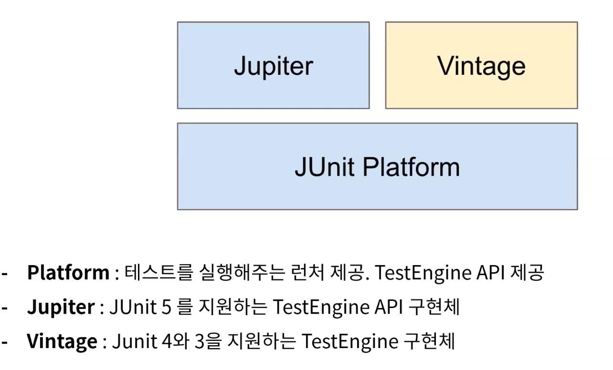

### 2021-03-20

## Web 요청과 응답 과정
- __핵심 개념__
    - Internet
        - 컴퓨터 네트워크들 *(LAN, MAN, WAN 등)* 을 서로 연결 지어주는 범지구적 네트워크
        - 이렇게 구축된 인터넷이라는 거대한 네트워크에서 우리가 사용하는 다양한 서비스들이 동작
            - Web도 Internet 위에서 동작하는 서비스들 중 하나!
    
    - Web
        - 정보 자원의 공유를 위해 탄생
        - 수많은 요청과 응답 사이클의 연속으로 이루어짐
        - 서버 & 클라이언트
            - HTTP라는 규약으로 요청과 응답 주고 받음
    
    - HTTP
        - 비연결성: 서버 응답 마치면 연결 끊음
            - HTTP/1.1 Keep-Alive 에서 극복
        - 무상태: 하나의 요청이 진행되는 동안만 서로를 인지
            - 쿠키/세션/토큰 등의 상태를 기억하는 기능으로 극복
            
- __Web 요청과 응답 과정__
    1. URL 찾기
        - 정의: 네트워크상 자원의 위치 주소
        - 구조: protocol + domain + directory + file
    
    2. 요청을 서버로 전송
        - HTTP Request 서버로 전송 (GET, POST, PUT, PATCH, DELETE)

    3. 서버가 클라이언트로 부터 요청 받고 처리
        - Request Headers 확인
            - 요청 정보 (URI, Method)
            - 클라이언트 정보 (accept, user-agent, cookie)
        - 요청에 상응하는 로직 수행

    4. 서버가 클라이언트에게 응답
        - HTTP Response

    5. 클라이언트가 응답을 받은 후 필요한 리소스들을 추가 요청 & 응답 받기
    
    6. 클라이언트가 모든 리소스 요청에 대한 응답을 받음
        - 이제 육안으로 볼 수 있는 페이지!

## 빌드와 배포
- __컴파일__
    - 소스 코드를 기계가 읽을 수 있는 바이너리 코드로 변경하는 절차
    - C++는 exe까지, Java는 class까지 컴파일
        - Java class 파일을 JVM에서 읽어, Java Byte Code를 OS에 맞게 실행하게 한다

- __빌드__
    - 소스 코드를 실행 가능한 독립적인 소프트웨어 산출물로 만드는 과정
        - JAR, WAR의 산출물로 만듬
            - JAR: 자바에서 사용되는 압축 양식으로 클래스 + 리소스파일로 구성
            - WAR: 웹 어플리케이션을 압축하고 배포하는데 사용되는 파일 형태
    - [빌드 과정] 
        - 컴파일 -> 링크 -> 패키징 -> 테스트

- __빌드 도구__
    - ANT, MAVEN, GRADLE 이 존재
    - GRADLE을 살펴보자
        - JVM 위의 기반 Groovy 언어로 작성
        - Java 문법과 비슷해 익히기 쉬움
        
- __GRADLE 훑어보기__
    - settings.gradle: 프로젝트 빌드 정보 저장
    - build.gradle: 프로젝트 빌드 정보 및 구성에 대해서 표현
    - .gradlew / .gradle.bt: gradle wrapper의 약자로, gradle 설치 없이도 빌드 가능하게 함

- __배포__
    - JAR, WAR를 일반 사용자가 사용할 수 있도록 소프트웨어를 제공하는 과정

- __CI(Contiguous Integration)__
    - 정의
        - 지속적 통합이라는 뜻으로, 코드 변경 사항마다 빌드/테스트까지 자동 진행. 결과물을 보고 하며 리포지토리에 자동 통합
    - 특징
        - 변경 사항이 클래스, 기능, 어플리케이션에서의 테스트 수월하게 진행
        - 신규 코드와 기존 코드 충돌 빠르게 수정 가능
        - 협업 시 어플리케이션 최신 상태 유지 가능
    - 대표 CI
        - Travis
        - Jenkins

- __CD(Contiguous Deployment)__
    - 정의
        - 개발자들이 코드에 변경 사항을 줄 경우, 파이프 라인을 통해 이동하여 프로덕션 단계까지 자동 배포
    - 특징
        - 어플리케이션 프로덕션으로 빠르고 쉽게 배포
        - 소비자들의 요구를 빠르게 만족시키는 서비스 출시 가능
        - 개발팀과 운영팀의 간극 메워줄 생산성 향상

- DevOps: Development + Operation... 개발과 운영이 연계하여 서비스를 이끌어 나가는 방법론

## JUnit5 사용법
- __JUnit__
    - 단위 테스트 프레임 워크

- __JUnit5__
    
    - Junit5 부터는 스스로 모듈화가 되어있음

- __Annotations__
    - @Test: 테스트 메서드라는 것을 나타냄
    
    - @BeforeAll: 클래스 내의 모든 테스트 메서드 실행 전에 "전체적으로 한 번" 실행되는 메서드
    - @BeforeEach: 클래스 내의 모든 테스트 메서드 실행 전에 "각각" 실행되는 메서드
    
    - @AfterAll: 클래스 내의 모든 테스트 메서드 실행 후에 "전체적으로 한 번" 실행되는 메서드
    - @AfterEach: 클래스 내의 모든 테스트 메서드 실행 후에 "각각" 실행되는 메서드
    
    - @Disabled: 테스트를 하고 싶지 않은 클래스나 메서드에 붙임
    
    - @DisplayName: 테스트 이름을 지정하도록 함

    - @RepeatedTest: 특정 테스트를 반복해 테스트
    
    - @ParameterizedTest: 테스트에 여러 다른 매개변수를 대입해가며 반복 실행할 때 사용
    
    - @Nested: 테스트 클래스 안에서 내부 클래스를 정의해 테스트를 계층화할 때 사용

- __Assertions__
    - assertAll: 매개변수로 받는 모든 테스트코드를 한 번에 실행, 중간에 실패해도 끝까지 ㄱㄱ
    ``` Java
    assertAll(
        () -> assertNotNull(study),
        () -> assertEquals(Status.STARTED, study.getStatus())
    );
    ```
    - assertThrows: 예외 발생을 확인하는 테스트, expectedType 반환하는지 검증
    - assertTimeout: 시간 내에 통과하는지 확인

## 엘레강트 오브젝트 1
- __1. 인자의 값으로 null을 보내지 말자__
    - 존중 없는 코드의 끝판왕!
        - 메시지를 보내서 확인하는 것을 최대한 채택하자!
    - 원시값/문자열 포장하면 예방 가능하다

- __2. final이거나 abstract이거나__
    - 상속의 관계를 간결하게 하자!

- __3. -er로 끝나는 이름을 사용하지 말자__
    - 클래스는 객체의 factory/능동적인 관리자이다
        - 객체를 만들고, 추적하고, 적절한 시점에 파괴하자
    - 클래스를 명명할 때에는...
        - What it does (X)
        - What it is   (O)

- __4. 메서드 이름을 신중하게 선택할 것__
    - 빌더(Builder)
        - 뭔가를 만들고 새로운 객체를 반환해야함
        - Type 형을 반환
        - (형용사) + 명사 로 명명하자
    - 조정자(Manipulator)
        - 실세계 Entity를 수정하는 메서드
        - Void 형을 반환
        - 동사로 명명하자
        
- __5. Procedure와 Method를 분리하자__
    - 객체를 존중하는 방식을 채택하자!
    - 돈까스 주문했으면 내비둬!

- __6. 생성자 하나를 주생성자로 만들 것__
    - 클래스에는...
        - 5~10개의 Constructor
        - 2~3개의 Method
            - Method가 많으면 SRP 위반 가능성 UP!

- __7. 문서를 작성하는 대신 테스트를 작성하자__
    - 클린 코드를 작성하는 것은 Production 코드와 Test 코드를 포함한다

- __8. 생성자에 코드를 넣지 말자__
    - 생성자에는 코드가 없고, 오직 할당문만 있어야 한다
    - 생성자에 코드가 있다면, 객체 변환과 관련된 실행여부 제어 불가능
    - 생성자에서 코드를 없애면, 사용자가 쉽게 제어하는 투명한 객체를 만들 수 있다. 
        - 객체를 이해하고, 재사용하기도 쉬워짐
