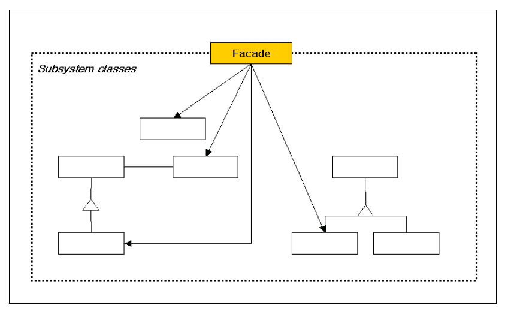
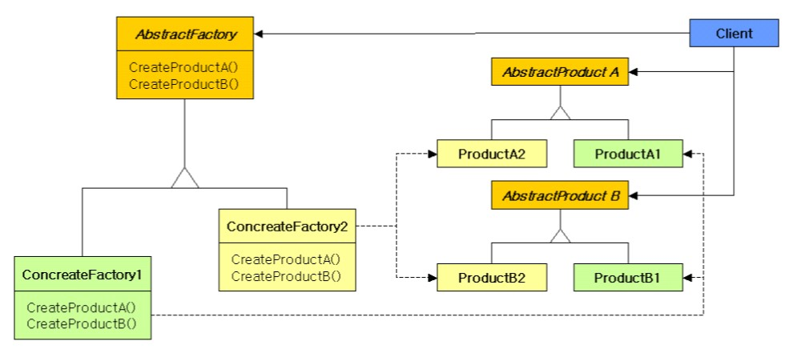

### 2021-03-22

## 파사드 패턴

- __정의__
    - 서브 시스템에 있는 인터페이스 집합에 대해서 하나의 통합된 인터페이스를 제공
        - 서브 시스템을 조금 더 사용하기 편하게 하기 위해 높은 수준의 인터페이스를 정의
    - 코드 중복과 직접적인 의존을 해결하는데 도움을 주는 패턴

- __참여 객체__
    - Facade
        - 단순하고 일관된 통합 인터페이스를 제공
        - 서브 시스템을 구현하는 어떤 클래스가 어떤 요청을 처리해야 하는지를 알고있음
            - 클라이언트의 요청을 서브시스템 객체에게 전달
    - Subsystem Classes
        - 서브 시스템의 기능을 구현
        - Facade 객체에 의해 할당된 작업을 실제로 처리
            - but, Facade의 존재를 모름

- __장점__
    - Facade에게 얻고자 하는 정보에 대한 요청을 보내면 되니, 클라이언트의 코드가 간결해진다
    - 클라이언트와 서브 시스템 간의 직접적인 의존을 제거한다
        - 이는 클라이언트의 변경 없이 서브 시스템의 변경을 가능케 한다
        
## 추상 팩토리 패턴

- __정의__
    - 구체적인 클래스를 지정하지 않고, 관련성을 갖는 객체들의 집합을 새로 생성하거나, 서로 독립적인 객체들의 집합을 생성할 수 있는 인터페이스를 제공
    - 다양한 구성 요소 별로 "객체의 집합"을 생성해야 할 때 유용
    
- __장점__
    - 클라이언트에게 영향을 주지 않으면서 사용할 제품(객체)군을 교체할 수 있음

- __프로토타입 방식의 팩토리__
    - 팩토리가 생성하는 객체가 늘 동일한 상태를 가진다면, 프로토타입 방식의 팩토리를 사용해보자
    - 프로토타입이란?
        - 생성할 객체들의 타입이 프로토타입인 인스턴스로부터 결정되도록 하며, 인스턴스는 새 객체를 만들기 위해 자신을 복제
    - Object.clone()
        - 객체가 유지하고 있는 상태값들을 그대로 복사
    ``` Java
    public class ProtoFactory {
        private Product productProto;
        
        public ProtoFactory(Product proto) {
            productProto = proto;
        }
  
        public Product create() {
            return (Product) productProto.clone();
        }
    }
    ```
  
## Null 객체 패턴
- __정의__
    - Null 검사 코드 누락에 따른 문제를 없애 주는 패턴
    - Null을 리턴하는 것이 아닌, Null을 대신할 객체를 리턴한다

- __방법__
    - null 대신 사용할 클래스를 구현. 상위 타입을 상속받고, 아무 기능도 수행 안 함
    - null 리턴 대신, null 대체할 클래스의 객체를 리턴

## 설계원칙 SOLID
- __1. 단일 책임 원칙 (Single Responsibility Principle)__
    - [정의]
        - 클래스는 단 한 개의 책임을 가져야 한다
        - 클래스를 변경하는 이유도 단 한 개여야 한다
        - What is "한 개의 책임?"
            - 메서드를 실행하는 것이 누구인지?
    - [특징]
        - 책임의 갯수가 많아질수록 한 책임의 기능 변화가 다른 책임에 주는 영향은 비례해서 증가
            - 코드를 절차 지향적으로 만든다
            - 다른 클래스가 변하면, 망가지는 가능성이 높음
        - 재사용에도 용이
    
- __2. 개방 폐쇄 원칙 (Open Closed Principle)__
    - [정의]    
        - 확장에는 열려 있되, 변경에는 닫혀 있어라
        - 기능을 변경하거나 확장 할 수 있어야 한다
            - Interface를 주입하는 방식 (전략 패턴)
            - Interface를 필드로 가지는 방식 (상태 패턴)
        - 그 기능을 사용하는 코드는 수정하지 않는다
        - 방법
            - 변화되는 부분 *(확장되는 부분)* 을 추상화해서 표현하기
            - 상속을 이용하기
                - 상위 클래스 기능 이용하면서, 하위 클래스에서 일부 구현을 오버라이딩
    - [OCP 위반 신호]
        - 다운 캐스팅 & isInstanceOf
            - 특정 타입에 대해 별도 처리를 하도록 메서드를 구현한다면, 부모 클래스의 확장시, 함께 수정됨
                - 변경에 닫혀있지 않음 == 기능을 사용하는 코드에 수정이 필수적임
        - 비슷한 if-else 블록 존재
    - [특징]
        - OCP는 "유연함"에 대한 원칙
        - 새로운 기능 추가에 부담이 없어야해
        - 변화가 예상이 되는 것을 추상화하여, 변경의 유연함을 얻도록 해줌
            - 변화되는 부분을 추상화하지 못하면, OCP가 위배되어, 시간 지날 수록 기능 변경/확장 힘듦
    - 변화 요구가 발생하면, 변화 관련 구현을 추상화 하여 OCP에 맞게 수정할 수 있게 습관화하자
    
- __3. 리스코프 치환 원칙(Liskov Substitution Principle)__
    - OCP... *(확장에는 열리고 / 변경에는 닫히고)* 를 뒷받침하는 "다형성"에 관한 원칙
    - [정의]
        - 상위 타입의 객체를 하위 타입의 객체로 치환해도, 상위 타입을 사용하는 프로그램은 정상적으로 동작해야 한다
        ``` Java
        public void someMethod(SuperClass sc) {
            sc.someMothod();
        }
        someMethod(new SubClass()); //해당 코드가 정상 작동해야함
        ```
        - 해당 클래스가 명확한 is-a 관계일 경우에만 상속할 것
            - 상속은 정제이지, 확장이면 안된다. 
            - 클래스의 메서드를 상속받아 구현하기 위해 사용할 것
        - 상위 타입에서 지정한 리턴 값의 범위에 해당되지 않는 값을 리턴하는 것
            - -1 을 반환해야 loop 탈출
            - 그러고 부른 함수가 최하 0을 반환
            - 그냥 무한루프행
    - [LCP 위반 신호]
        - 하위 타입이 명세에서 벗어난 동작을 하면, 상위 타입이 비정상적으로 동작할 수 있다. 
            - 명시된 명세에서 벗어난 값을 리턴
            - 명시된 명세에서 벗어난 익셉션 발생
            - 명시된 명세에서 벗어난 기능 수행
        - 하위 타입은 상위 타입에서 정의한 명세를 벗어나지 말자!            
    - [특징]
        - LSP는 기능의 명세/계약에 대한 것
        - isInstanceOf는 전형적인 LCP 위반 증상
            - 상위 타입이 하위 타입의 인스턴스인지 검사하는 것 자체가, 상위 타입으로 프로그램을 정상적으로 동작시킬 수 없다는 것
            - LSP를 안지키면, 향후 기능 변경/확장에 더 많은 코드를 수정할 가능성이 UP
        - 이를 해결하려면, 상위 타입을 더 "추상화" 시켜보자
            - 추상화
                - 한단계 더 흐리게 만드는 작업. 구체적~흐리멍텅 사이
                - "변화하는 기능"을 상위타입에 추가하자!
                    - "구체적 구현에 따라 변화하는 기능"이니까,
                    - 상위 클래스에서 적어 놓는 것은 __한 단계 흐리게 만드는 작업__ 이라는 표현이 등장
            
