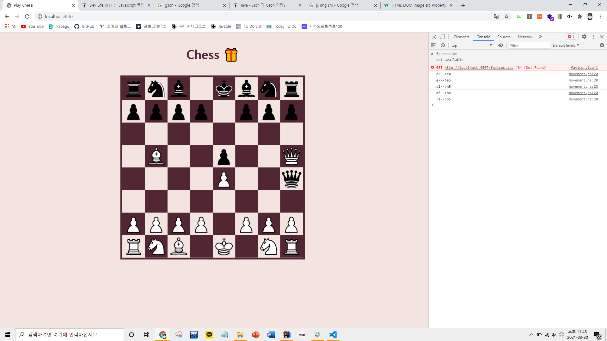

### 2021-03-30

## 체스에 fetch 적용
``` javascript
function serverMoveRequest(startPoint, destPoint) {
    const moveRequest = {
        start: startPoint,
        destination: destPoint
    }

    const postOption = {
        method: 'POST',
        headers: {
            'Content-Type': 'application/json'
        },
        body: JSON.stringify(moveRequest)
    }

    fetch("/", postOption)
        .then(response => {
            if(!response.ok) {
                throw new Error(response.status);
            }
            return response.json();
        })
        .then(data => {
            movePieceUI(data.start, data.destination);
        })
        .catch(error => {
            console.log(error)
            alert("움직일 수 없는 경로입니다.");
        })
}
```
- POST 방식을 활용하여 서버에 요청을 보냄
- 서버에서 가능한 경로인지를 판별 후,
    - 성공이면 status 200
    - 실패면 status 404를 보냄


- 움직이긴 한다
    - 하지만 게임 데이터를 가지고있는 chessGame 객체가 서버에서 요청 받는 대로 변화됨...
        - 게임하다가 새로고침하면 서버는 chessGame위치대로 되어있고, 내 UI는 초기 기물 위치로 설정해놔서 둘이 안맞음
    - 첫 화면을 띄울때 chessGame을 생성해야 되는것 같기도 하고...

## GSON
- 참고: https://galid1.tistory.com/501
- __정의__
    - json 구조를 띄는 직렬화된 데이터를 자바의 객체로 역직렬화/직렬화 해주는 자바 라이브러리
    - JSON Obj <-> JAVA Obj
    
- __사용법__
    - 의존성 추가
    - compile ('com.google.code.gson:gson:2.2.4')
    - JSON을 변경해 줄 Java 클래스 생성
    - gson.fromJson(jsonObj, javaObj.class); 를 통해 json -> java
    - gson.toJson(javaObj); 를 통해 java -> json
