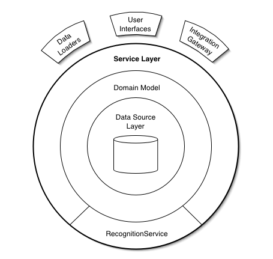

### 2021-04-06

## 서비스 레이어?

- *참고 1: https://umbum.dev/1066*
- __정의__
    - A Service Layer defines an application's boundary [Cockburn PloP] and its set of available operations from the perspective of interfacing client layers.  
    - It encapsulates the application's business logic, controlling transactions and coor-dinating responses in the implementation of its operations.
      
- __애초에 Layer가 왜 필요해?__
    - Layer를 통해 추상화를 할 수 있다
    - 다른 계층끼리 부품을 갈아 끼우듯 변경할 수 있음
    - 컴포넌트들의 서로 의존 계층 관계를 깔끔히 유지할 수 있다!
    
- __무슨 Layer가 있는데?__
    - \<Presentation Layer>
        - UI Layer
    - \<Service Layer>
        - Application Layer
        - Domain 모델을 묶어서 SW에서 사용 가능한 핵심 작업 집합을 설정
        - 핵심에 가까운 API를 제공하는 계층
    - \<Business Layer>
        - Data와 그와 관련된 비즈니스 로직을 가지고 있는 객체
        - "책임"과 "응집도"를 고려하여 Model Class에서 로직을 가지고 있도록 하자
    - \<Persistence Layer>
        - Data Source 추상화
        - 요청/응답 데이터를 비즈니스 로직에서 필요한 데이터로 가공하여 비즈니스 레이어로 넘겨줘야 함

## 체스 피드백
- 멀티쓰레드로 동작하게 하려면, WebChessController가 특정한 상태를 유지하지 않도록 해야한다
    - 멀리쓰레드로 동작하게 한다는게 무슨뜻 일까?
- Controller, Service Layer, DAO는 Stateless하게 구성하면 좋을 것이다!
    - stateless, 즉 인스턴스 변수가 없다면 thread safe하다!
    
    ```java
    역시 가장 쉬운 건 ID 라고 생각해요
    각 체스게임의 식별 번호를 안다면 (room_id) 해당 식별 번호를 통해서 게임들을 식별 할 수 있을 것 같아요
    그럼 엔드포인트에 변화가 좀 생길것 같은데
    /room/{id}/move
    와 같은 형태가 될 수 있겠죠 ㅎㅎ
    
    지금은 단일 게임을 진행하는게 목표이니까. 게임이 하나만 실행되더라도
    확장성을 고려하게 stateless 로 변경하면 좋을 것 같아요
    POST /start
    201 Created
    Location /room/1
    과 같이 게임을 생성 할 수 있을 것 같구용
    ```
