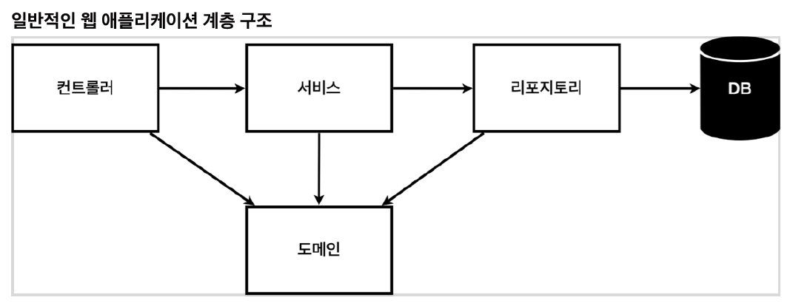

### 2021-04-18

## REST API란?
- *출처: https://meetup.toast.com/posts/92*
- __REST API 탄생__
    - HTTP 설계를 제대로 잘 활용하는 네트워크 아키텍쳐 *(자원에 대한 주소를 지정하는 방법)*

- __REST 구성__
    - 자원(Resource): URI
    - 행위(Verb): HTTP Method
    - 표현(Representations)
    
- __REST 특징__
    1. Uniform
        - URI로 지정한 리소스에 대한 조작을 통일되고 한정적인 인터페이스로 수행
    2. Stateless
        - 무상태성
        - 작업을 위한 상태정보를 따로 저장X, 관리X
            - 세션, 쿠키 정보 없음
        - 그냥 단순히 들어오는 요청을 처리하는 것
    3. Cacheable
        - HTTP의 웹표준을 그대로 사용
            - 웹 인프라를 그대로 활용가능
            - HTTP 캐싱 기능 적용 가능
    4. Self-descriptiveness
        - REST API 메시지만 보고도 쉽게 이해해야 함
    5. Client-Server 구조
        - Client: 사용자 인증, 세션/로그인 정보 관리
        - Server: API 제공
        - 둘의 의존성 DOWN
    6. 계층형 구조
        - 다중 계층으로 구성 가능
            - 보안, 로드 밸런싱, 암호화 계층을 추가해 유연한 구조 설계 가능

- __REST API 디자인 가이드__  
    1. __URI는 "정보의 자원"을 표현할 것__  
    2. __자원의 행위는 HTTP Method(GET, POST, PUT, DELETE)로 표현할 것__
    ```
    GET  /members/show/1    (X)
    GET  /members/1         (O)
    
    GET  /members/insert/2  (X)
    POST /members/2         (O)
    ```
    - 작성 규칙
        - "/"는 계층 관계를 나타낼 때 쓰자
        - URI 마지막에 "/" 쓰지말자
        - "-"를 통해 가독성 높이자
        - "_"는 URI에 쓰지말자
        - URI는 소문자로 쓰자
        - 파일 확장자는 URI에 쓰지말자
    - 리소스 끼리 연관 관계가 있다면...
        ```
        /리소스명/리소스 ID/관계있는 다른 리소스명
        GET : /users/{userid}/devices
        ```
    - Collection(집합)과 Document(객체)
        ```
        /sports/soccer
        /sports/soccer/players/13
        ```

## 김영한님 Spring 입문 강의 복습
- *참고: https://www.inflearn.com/course/%EC%8A%A4%ED%94%84%EB%A7%81-%EC%9E%85%EB%AC%B8-%EC%8A%A4%ED%94%84%EB%A7%81%EB%B6%80%ED%8A%B8/dashboard*
- __template내의 html 호출법__
    - localhost:8080/hello --> [[helloController -model(data:hello)-> viewResolver]] --> hello.html
        - 컨트롤러에서 리턴값으로 String을 반환하면, viewResolver가 resources/template 내의 같은 이름 찾아서 처리

- __@ResponseBody__

    - 이거 붙이면 viewResolver 사용 X
        - HttpMessageConverter 사용 O
    - HTTP BODY에...
        - String이면, 문자 내용 반환 (StringHttpMessageConverter)
        - Object면, JSON 변환 반환 (MappingJackson2HttpMessageConverter)

- __웹 애플리케이션 계층 구조__

    - 컨트롤러: 웹 MVC 컨트롤러 역할
    - 서비스: 핵심 비즈니스 로직 구현
    - 리포지토리: DB에 접근, 도메인 객체를 DB에 저장하고 관리
    - 도메인: 비즈니스 도메인 객체

- __스프링 빈과 의존관계__
    1. 컴포넌트 스캔과 자동 의존관계 설정
        - 생성자에 @AutoWired가 있으면 Spring에서 연관된 객체를 Spring Container에서 찾아서 넣어줌
        - 스프링 빈으로 등록하기 => @Bean, @Component, @Controller, @Repository, @Service
            - @Bean VS @Component *(참고: https://jojoldu.tistory.com/27)*
                - @Bean: 개발자가 컨트롤이 불가능한 외부 라이브러리 등록할 때 사용
                - @Component: 개발자가 컨트롤이 가능한 클래스의 경우
        - 스프링이 스프링 컨테이너에 스프링 빈 등록할 때, 싱글톤으로 등록
        - 같은 스프링 빈 == 같은 인스턴스
    2. 자바 코드로 직접 스프링 빈 등록하기
        - @Component, @Controller, @Repository, @Service, @Autowired 다 빼봐
        ```java
        @Configuration
        public class SpringConfig {
            @Bean
            public MemberService memberService() {
               return new MemberService(memberRepository());
            }
        
           @Bean
           public MemberRepository memberRepository() {
               return new MemoryMemberRepository();
           }
        }
        ```

- __발전해나가는 DB접근 방식__
    - 순수 JDBC
        - Connection, PreparedStatement, ResultSet 생성 반환
        - 중복 코드 다수
    - JdbcTemplate
        - JDBC API의 반복코드를 제거
        - SQL문은 직접 작성할 것
    - JPA
        - 반복코드, SQL JPA가 다 해줌
        - SQL, 데이터 중심의 설계가 ==> 객체 중심으로 전환!
    - Spring Data JPA
        - 리포지토리에 구현 클래스도 필요없어짐
        - CRUD 모두 JPA가 제공

- __통합 테스트 VS 단위 테스트__
    - 통합 테스트: 모듈 간의 인터페이스가 올바르게 작동하는가?
    - 단위 테스트: 테스트가 가능한 최소 단위로 나누어 SW내의 결함 발견하기!
    
- __AOP__
    - 공통된 로직이 여러 클래스에 적용이 필요하다면?
    - 공통 관심 사항 분리
    - 프록시 컨테이너...?

## 리팩토링 질문
- 서비스랑 리포지토리가 있다더라
    - 나는 서비스에서 DB 접근해주고, 비즈니스 로직도 구현해주는데... 솔직히 지금은 분리가 될 필요 없어보인다. 
    - 언제 그러면 분리?

- 새로운 게임 시작하는거
    - 어쨌든 DB에 새로운 게임을 생성하는건데... POST방식이 어울리는건가?
    - 어감은 GET이 더 자연스러운데?