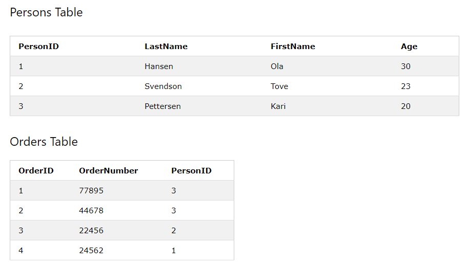

### 2021-04-21

## SQL 첫걸음
- __6장. 데이터베이스 객체 작성과 삭제__
    - 객체: DB 내에 실체를 가지는 어떤 것
    - DELETE는 행단위로 내부처리하니까, 다 삭제할라면 TRUNCATE TABLE 써보렴
    - 기본키: 테이블의 행 한 개를 특정할 수 있는 검색키
    - 기본키 제약: 열을 기본키로 지정해 유일한 값을 가지도록 함
        - 참고로 열이 복수로 기본키를 구성시킬 수 있음
    - 인덱스: 테이블에 붙여진 색인
        - 검색 속도 향상 가능 with Binary Search
        - 작성한 인덱스의 열을 WHERE 구로 조건을 지정하여 SELECT 명령으로 처리하면 처리속도 향상
        - 테이블에 인덱스를 작성하면, 테이블 데이터와 별개로 인덱스용 데이터가 저장장치에 만들어짐
    - 뷰: 데이터베이스 객체로 등록할 수 없는 SELECT 명령을, 객체로서 이름 붙여 관리하도록 한 것
        - 이름과 SELECT 명령 지정하여 정의
        - SELECT 구문은 단독으로도 실행 할 수 있어야 함
        
- __7장. 복수의 테이블 다루기__
    - UNION: 두 개의 SELECT 명령을 하나로 연계해 질의 결과를 얻을 수 있다
    - INNER JOIN: 두 개의 테이블을 가로로 결합 가능
    - 관계형 데이터베이스: 관계형 모델을 기반으로 작성된 데이터 베이스
        - 관계형 모델이 뭔뎨?
        - 관계형 모델: 릴레이션 == 튜플의 집합, 릴레이션에 대한 연산이 집합에 대한 연산에 대응
            - 하나 이상의 관계를 바탕으로 연산
            - 연산한 결과, 반환되는 것 또한 관계
            - 연산을 중첩 구조로 실행해도 상관 없음
        - 솔직히 뭔지 잘 모르겠네?

- __8장. 데이터베이스 설계__
    - 정규화: 데이터베이스의 테이블을 규정된 올바른 형태로 개선해나가는 것
        - 제1정규형
            - 반복되는 부분을 세로(행) 방향으로 늘려나가는 것
            - 중복을 제거하는 테이블의 분할
            - 테이블의 분할과 기본키 지정!
        - 제2정규형
            - 데이터가 중복하는 부분을 찾아 테이블로 분할
            - 함수 종속성을 찾아 테이블을 분할
            - ex) 주문번호/상품코드/상품명/갯수 ==> 주문번호/상품코드/갯수 && 상품코드/상품명
        - 제3정규형
            - 기본키 이외의 부분에서 중복이 없는가?
        - Why 정규화?
            - "하나의 데이터가 한 곳에 저장되도록 하기 위함!!"
    - 트랜잭션: 몇 단계로 처리를 나누어 SQL 명령을 실행하는 경우 사용하자!
        - 트랜잭션을 통해 데이터 추가하면, 에러가 발생해도 트랜잭션을 롤백해 종료할 수 있음
        - 롤백하면 트랜잭션 내에서 행해진 모든 변경사항 없던것으로 할 수 있어
            - 물론 에러 안나면, 변경 적용하고 트랜잭션 종료하는데, 이때 "커밋"을 사용
    - 트랜잭션 사용할라면 다음과 같은 명령어를 해주자
        - START TRANSACTION: 트랜잭션 시작
        - COMMIT: 트랜잭션 내에서 실행한 명령을 적용한 후 종료
        - ROLLBACK: 트랜잭션 내에서 실행한 명령을 파기한 후 종료
        - @TRANSACTIONAL 어노테이션은 그러면 1,3번을 적용한건가?
        
## Foreign Key
- *참고: https://www.w3schools.com/sql/sql_foreignkey.asp*

- Foreign Key는 하나의 테이블의 필드로써, 다른 테이블의 Primary key를 지칭함
    - Foreign Key를 포함하는 테이블은 child table이라고 부름
    - Primary Key를 포함하는 테이블은 parent table이겠죠?
    
- Foreign Key 제약을 통해 invalid한 데이터가 foreign key column에 추가되는 것을 방지한다
    - Parent Table의 하나의 값과 무조건 일치해야함

- __예시__

    - "PersonID"는 "Persons" 테이블에서 Primary Key이다
    - "PersonID"는 "Orders" 테이블에서 Foreign Key이다
    
```sql
CREATE TABLE Orders (
    OrderID int NOT NULL,
    OrderNumber int NOT NULL,
    PersonID int,
    PRIMARY KEY (OrderID),
    FOREIGN KEY (PersonID) REFERENCES Persons(PersonID)
);
```