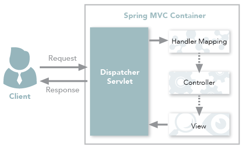
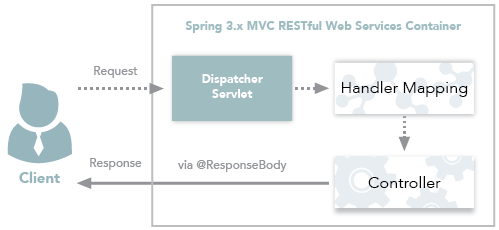

### 2021-04-26

## 체스 미션에서 배운 것
- __Spring__
    - @SpringBootApplication
        - *참고: https://velog.io/@yhh1056/%EC%8A%A4%ED%94%84%EB%A7%81-%EB%B6%80%ED%8A%B8-SpringBootApplication*
        - @ComponentScan: 자동 Scan 후 내가 만든 빈 등록
        - @SpringBootConfiguration: 빈에 대해 Context 추가, 특정 클래스 참조
        - @EnableAutoConfiguration: 읽어 온 빈들을 다시 등록 + 외부에 있는 빈 주입
            - Spring Boot의 메타 데이터를 빈으로 등록
            - 이거 없으면 "to missing ServletWebServerFactoryBean" 에러
    - @RestController VS @Controller?
        - *참고: https://mangkyu.tistory.com/49*
        - 둘의 가장 큰 차이점은 HTTP Response Body가 생성되는 방식
        - @Controller
            1. View 반환하기
                - 
                - View를 반환하기 위해 사용
                - ViewResolver를 사용하여 View를 반환
                    - ViewResolver 설정에 맞게 View를 찾아 렌더링하게 됨
            2. Data 반환하기
                - 
                - @ResponseBody 어노테이션을 통해 Data 반환(JSON)을 할 수 있음
                - HttpMessageConverter를 사용하여 Data를 반환
                    - String 반환 시: StringHttpMessageConverter
                    - 객체 반환 시: MappingJackson2HttpMessageConverter
    - @RequestBody & @ResponseBody
        - *참고: https://devbox.tistory.com/entry/Spring-RequestBody-%EC%96%B4%EB%85%B8%ED%85%8C%EC%9D%B4%EC%85%98%EA%B3%BC-ReponseBody-%EC%96%B4%EB%85%B8%ED%85%8C%EC%9D%B4%EC%85%98%EC%9D%98-%EC%82%AC%EC%9A%A9*
        - 각각 HTTP 요청 몸체 <-> 자바 객체 역할
        - HttpMessageConverter로 변환 수행
            - ByteArrayHttpMessageConverter
                - Http 메시지 --> byte 배열
            - StringHttpMessageConverter
                - Http 메시지 --> String
            - FormHttpMessageConverter
                - HTML Form --> MultiValueMap
            - SourceHttpMessageConverter
                - Http 메시지 --> javax.xml.transform.Source
            - MarshallingHttpMessageConverter
                - XML Http 메시지 --> 자바 객체
            - MappingJacksonHttpMessageConverter
                - Jackson 라이브러리로 Json --> 자바 객체
        - 적당한 HttpMessageConverter는 HTTP의 Content-Type과 Accpet 헤더 기반으로 적당한 HttpMessageConverter 구현체를 선택해 변환한다
    - @RequestParam vs @PathVariable 
        - *참고: https://velog.io/@shson/%EC%8A%A4%ED%94%84%EB%A7%81-controller%EC%97%90%EC%84%9C-%ED%8C%8C%EB%9D%BC%EB%AF%B8%ED%84%B0%EB%A5%BC-%EB%B0%9B%EB%8A%94-%EB%8B%A4%EC%96%91%ED%95%9C-%EB%B0%A9%EB%B2%95-RequestParam-RequestBody-PathVariable*
        - @RequestParam
            - GET 방식으로 넘어온 URI의 queryString을 받기 좋음
            ```java
            // 요청: http://localhost:8080/reservation/api/reservations?reservationEmail=test@naver.com
            @RestController
            @RequestMapping(path = "/api")
            public class ReservationsApiController {
                @GetMapping(path = "/reservations")
                public Response<List<String>> getReservations(
                        @RequestParam(value = "reservationEmail",required = false) String reservationEmail) {
             
                    return reservationService.getReservationByEmail(reservationEmail);
                }
            }
            ```
        - @PathVariable
            - URI의 일부를 변수로 전달할 수 있음 
            ```java
            // 요청: http://localhost:8080/reservation/api/reservations/2
            @RestController
            @RequestMapping(path = "/api")
            public class ReservationsApiController {
                @PutMapping(path = "/reservations/{reservationId}")
                public Reservations cancleReservations(@PathVariable(name = "reservationId") Integer reservationInfoId) {
             
                    return reservationService.cancelReservationById(reservationInfoId);
                }
            }
            ```

- __Jackson 라이브러리__
    - *참고: https://mommoo.tistory.com/83*
    - Jackson?
        - JSON 데이터 구조를 처리해주는 라이브러리
    - 어떻게 매핑되는지?
        - MappingJacksonHttpMessageConverter를 등록한다면, 컨트롤러가 리턴하는 객체를 리플렉션(?)을 통해 JSON 데이터를 만듦
    - Jackson vs GSON?
        - Spring에서는 Jackson과 관련된 API를 제공해 직접 Key/Value 세팅하던 GSON에서 한 단계 더 발전한 자동화 가능
    
- __DB 접근__
    - Persistence Layer?
        - *참고: https://stackoverflow.com/questions/16016023/what-is-the-use-of-a-persistence-layer-in-any-application*
        - 데이터 처리를 담당하는 계층
            - 데이터의 CRUD 연산 수행
            - DB에서 처리됨
        - DB 엔진과 비즈니스 로직간의 다리 역할
            - Data migration이 쉬움
            - 비즈니스 로직을 "특정한 데이터 소스"와 묶으면 안대! 멈춰!
            - 이제 퍼시스턴스 레이어에서 Data specific 한 코드를 작성
                - 만약 MySQL 쓰고 있으면, 그거에 대응하는 거 쓰시고, 
                - 나중에 MongoDB 쓸라하면, 비즈니스 로직 건드는게 아니라, 퍼시스턴스 레이어에서 MongoDB 관련한 코드 작성하고 갈아끼우도록!
    - Dao란?
        - *참고: https://ko.wikipedia.org/wiki/%EB%8D%B0%EC%9D%B4%ED%84%B0_%EC%A0%91%EA%B7%BC_%EA%B0%9D%EC%B2%B4*
        - DB에 접근 로직을 추상화한 인터페이스
        - Specific Data Operation without exposing details of DB
        - Data persistence의 추상화
        - DB와 밀접한 관련, Table 중심
    - Repository란?
        - Storage, Retrieval, Search Behavior 등을 캡슐화한 메커니즘
        - 객체의 모음을 담당
        - 도메인과 밀접한 관계
        - Dao의 모음으로 구현될 수 있음
        - Get(id), Find(), Add() 등의 연산으로 객체를 찾고 추가 할 수 있어야 함
        - Update는 오히려 Dao에 더 잘어울림
    - Dao VS Repository?
        - https://stackoverflow.com/questions/8550124/what-is-the-difference-between-dao-and-repository-patterns

- __웹 어플리케이션 계층 구조__
    - *참고: https://www.altexsoft.com/blog/engineering/web-application-architecture-how-the-web-works/*
    1. Presentation Layer
        - 사용자가 브라우저로 접근 가능
        - 사용자 UI 제공
        - HTML/CSS/JS
    2. Business Layer
        - 사용자의 리케스트를 받고, 처리하는 곳
        - 핵심 업무를 어찌 처리하는지 방법 기술
        - 애플리케이션에서 가장 재사용될 곳
    3. Persistence Layer
        - 데이터 CRUD 담당
        - 자신의 HW나 클라우드에 데이터를 저장하는 곳


- __테스트 관련__
    - MockMvc
        - *참고: https://shinsunyoung.tistory.com/52*
        - 서버에 배포 하지 않고도 스프링 MVC의 동작을 재현할 수 있음
        - get,post,put,delete 요청 수행 가능
        - perform()
            - 요청 전송
        - get()/post()/put()/delete()
            - HTTP 메소드 결정
        - params(info)
            - key=value 전달 가능
        - andExpect()
            - 응답 검증
    - @MockBean 
        - *참고: https://jojoldu.tistory.com/226*
        - 기존 통합테스트는 여러 레파지토리와 비즈니스 로직이 함께 있음
            - 불필요한 데이터 생성 많음
            - 테스트 대상 범위 너무 넓어짐
            - 피드백 느림
            - "테스트 대상과 무관한 객체와 필드가 너무 많음"
        - 테스트 더블
            - "목적에 따라 비슷한 듯 하면서도 다른 객체를 사용하는 모든 행위"
            - 테스트 대상 코드 격리
            - 테스트 속도 개선
        - @MockBean
            - Bean의 껍데기만 가져오고, 내부 구현 부분은 모두 개발자에게 위임
            - 해당 어노테이션으로 기존 선언된 Bean 객체를 덮어씀
            - Spring의 ApplicationContext는 Mock 객체를 주입
            - 읽어보기: https://github.com/mockito/mockito/wiki/Mockito-features-in-Korean
    - @AutoConfigureMockMvc
        - *참고: https://docs.spring.io/spring-boot/docs/current/api/org/springframework/boot/test/autoconfigure/web/servlet/AutoConfigureMockMvc.html*
    - @SpringBootTest
        - *참고 1: https://goddaehee.tistory.com/211*
        - *참고 2: https://meetup.toast.com/posts/124*
        - 단위 테스트: (@WebMvcTest, @DataJpaTest, @RestClientTest, @JsonTest)
        - "spring-boot-starter-test" 제공
            - JUnit5
            - Spring Test & Spring Boot Test
            - AssertJ
            - Hamcrest
            - Mockito
            - JSONassert
            - JsonPath
        - 테스트에 사용할 ApplicationContext를 쉽게 생성하고 조작 가능
            - 전체 빈 중 특정 빈을 선택하여 생성
            - 특정 빈을 Mock으로 대체
            - 테스트에 사용할 프로퍼티 파일 선택, 특정 속성만 추가            
    - @Transactional
        - @SpringBootTest 상황에서 이를 붙이면, 
            - 즉, @Test + @Transactional 이라면
            - 테스트 끝날 때 Rollback 됨!
            - 다만, RANDOM_PORT나 DEFINED_PORT로 테스트를 설정하면 별도의 스레드에서 실행해서 rollback 안됨
                - 옛날에 컨트롤러 DB 반영되었던 거!
    - 기타 테스트 방법
        - *참고: https://meetup.toast.com/posts/124*
        - TestRestTemplate
            - RestTemplate의 테스트
            - 컨트롤러 테스트가 가능
            - MockMvc와 다르게 Servlet Container를 사용
                - 실제 서버가 구동되는 것 처럼 테스트 수행 가능
            - MockMvc는 API를 통해 비즈니스 로직이 잘 수행되는지
            - TestRestTemplate은 클라이언트 입장에서 RestTemplate을 사용하듯 테스트 수행 가능
        - @JsonTest
            - JSON serialization & deserialization 테스트 가능
            - ObjectMapper와 @JsonComponent 빈을 포함한 Jackson 테스트 모듈 자동 설정
        - @WebMvcTest
            - TestRestTemplate을 통해 클라이언트 사이드 API 테스트 했고, 
            - @WebMvcTest를 통해 서버 사이드 API 테스트 가능
                - MockMvc에 관한 설정을 자동으로 수행
                - @Controller, @ControllerAdvice, @JsonComponent, @Filter, WebMvcConfigurer, HandlerMethodArgumentResolver 등을 스캔
        - @JdbcTest && 테스트용 DB
            - *참고: https://docs.spring.io/spring-boot/docs/current/api/org/springframework/boot/test/autoconfigure/jdbc/JdbcTest.html*
            - 순수 JDBC 테스트 지원
            - in-memory embedded DB 설정되며, 테스트를 위한 jdbcTemplate이 생성된다 ?!
            - focuses "only" on JDBC-based components
            - apply only configuration relevant to JDBC tests
            - 기본적으로 테스트 끝나면 롤백함
                - 그리고, 임베디드 메모리 데이터 베이스 씀
