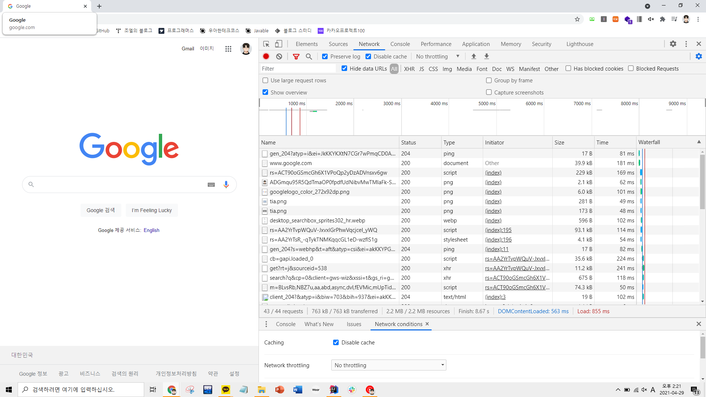
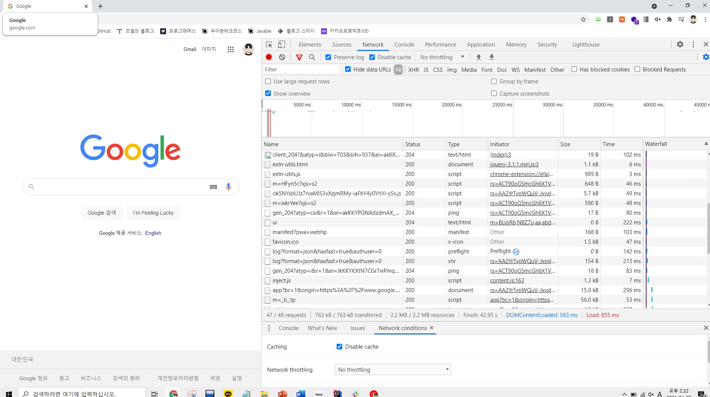
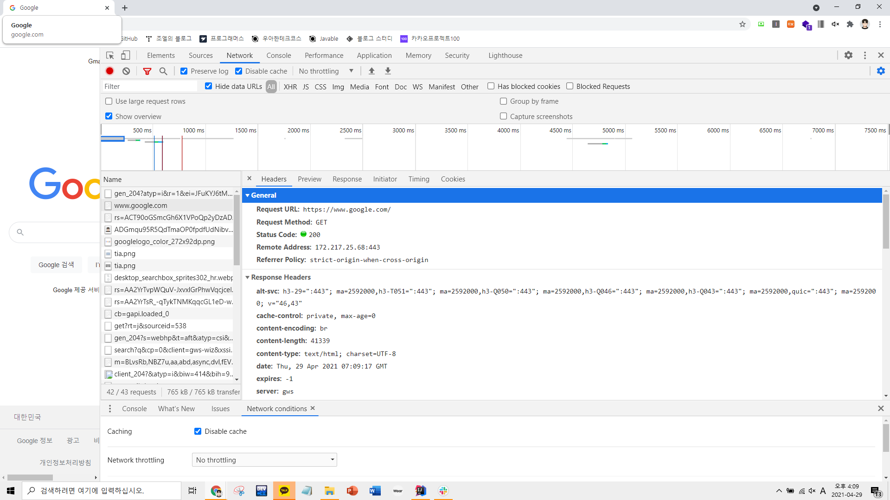
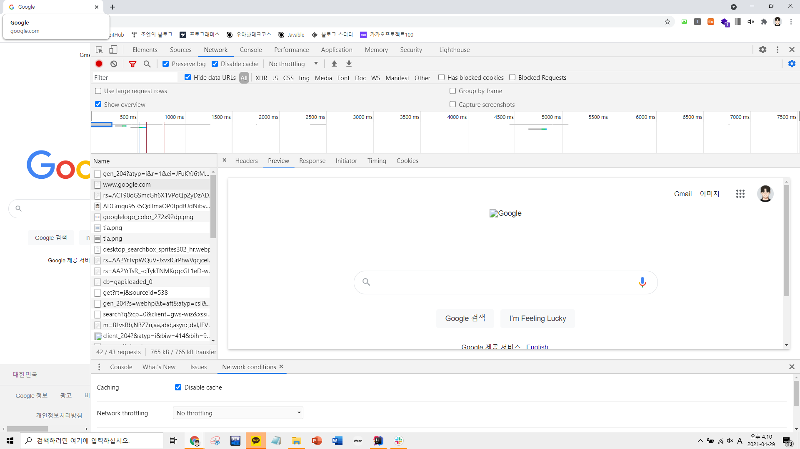
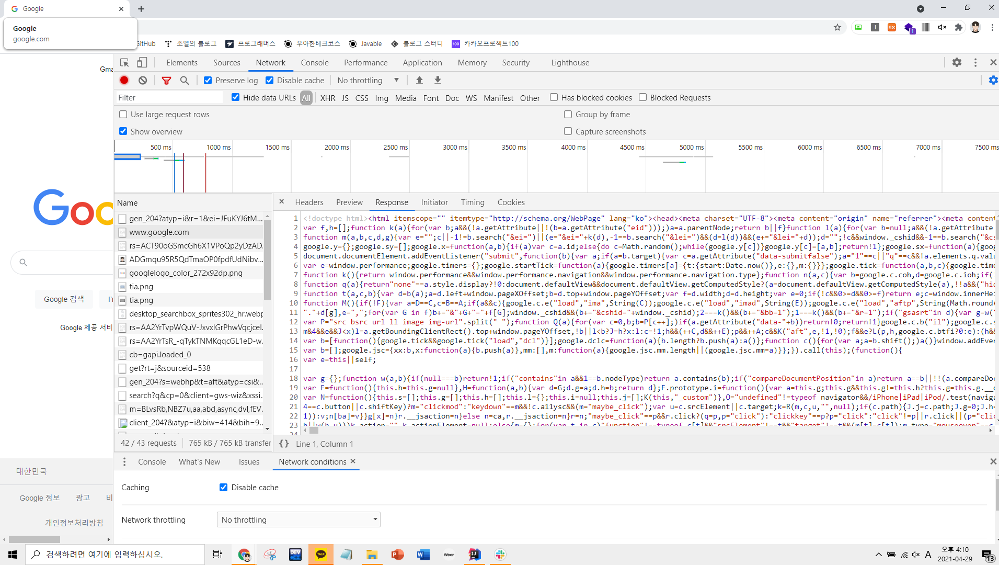
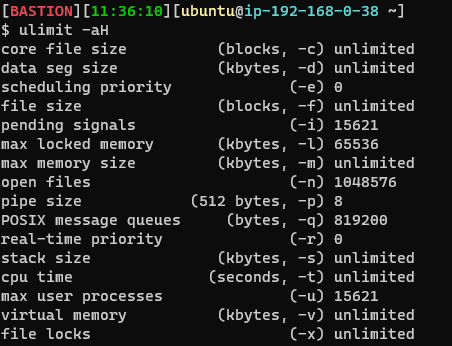
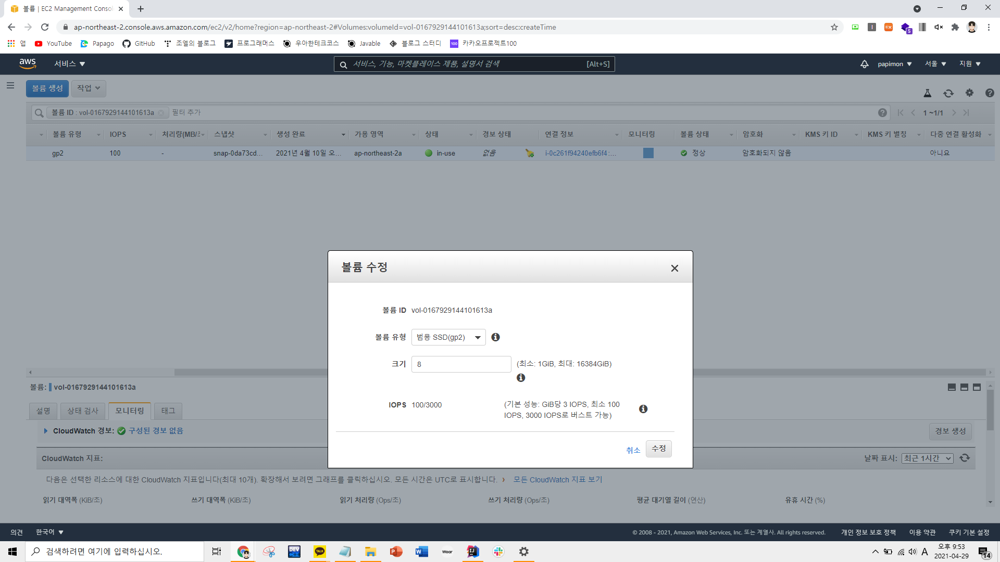
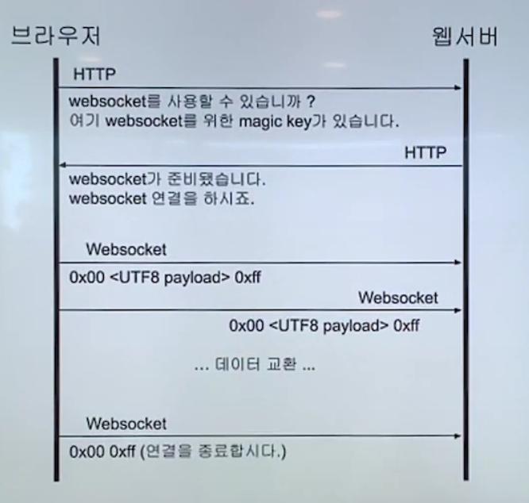

### 2021-04-29

## 배포하기 질문 답변
#### 브라우저에서 google.com를 요청할 때 통신 과정이 어떻게 이루어질까요?
- 우선 url에 google.com을 치면 다음과 같은 네트워크 통신이 이루어져요
- 
- 
    - ping, document, png, js, css, xhr, text/html 등의 요청이 들어왔어요. 
    - 브라우저는 이렇게 넘어온 정보들을 조합해서 온전한 페이지를 그려주어요. 
- 
    - Response Content Type이 text/html인 것을 알 수 있어요
- 
    - Preview로 보게되면, 익숙한 구글의 UI를 볼 수 있어요.
- 
    - 서버에서 Response Body로 넘어온 HTML 태그들과 정보들을 조합해서 구글 페이지를 그려주게 되어요. 

#### DDoS 공격에는 어떻게 대응하면 좋을까요?
- *참고 1: https://cloud.ibm.com/docs/cis?topic=cis-distributed-denial-of-service-ddos-attack-concepts&locale=ko*
- *참고 2: https://aws.amazon.com/ko/shield/ddos-attack-protection/*
- __정의__
    - DDoS 공격은 웹 사이트나 호스트에서 발생할 수 있는 가장 흔한 유형의 인터넷 공격 중 하나에요. 
    - 방대한 양의 인터넷 트래픽을 유발해, 대상과 그 주변의 인프라를 장악해요. 
        - 공격자는 대량의 패킷/요청을 생성해 궁극적으로는 대상 시스템을 마비시켜요.
        - 그에 따라 서비스 또는 네트워크의 정상 트래픽을 방해하게 되어요. 
        - 서버의 TCP 연결을 바닥내는 등 서비스 이용을 하지 못하게 하게 되어요. 
- __공격의 분류__
    - 일반적으로 DDoS 공격은 OSI 모델 중 네트워크 계층, 전송 계층, 표현 계층, 애플리케이션 계층에서 가장 많이 나타나요. 
    - 인프라 계층 (네트워크 계층/전송 계층)
        - 동기화 된 플러드 같은 벡터(?), UDP 플러드(?) 같은 반사 공격 포함 *(솔직히 잘 모르겠습니다)*
        - 네트워크 혹은 애플리케이션 서버 용량에 과부화 걸리게 하는 것 목표에요
    - 애플리케이션 계층 (표현 계층/애플리케이션 계층)
        - 애플리케이션의 고가 특정 부분을 집중적으로 공격해서 실 사용자가 사용 못하도록 만들어요
            - ex. 로그인 페이지 Http 요청 플러드 / 고가의 검색 API 등
- __방지 기법__
    - 공격 받을 대상 최소화하여 공격 대상 영역 줄이기
        - 통신이 일어나지 않을 포트, 프로토콜 닫아버리기
            - Bastion 서버를 구축하는 것이 한가지 예시
                - 22번 포트로는 서비스를 배포한 서버 컴퓨터의 쉘에 직접 접근이 가능함
                    - 따라서 22번 포트로 접근하는 권한을 제한을 둘 필요가 있음
                    - Bastion 컴퓨터에서만 서비스 컴퓨터의 22번 포트 접근이 가능하도록 설정
                    - Bastion 컴퓨터는 서비스 컴퓨터와 같은 사설망을 공유하고 있어, private ip로 접근
        - 컴퓨팅 리소스를 CDN 또는 로드 밸런서 뒤에 배치하고, DB 서버와 같은 인프라의 특정 부분에 인터넷 트래픽이 접근 못하도록 제한 가능
        - 방화벽, 액세스 제어 목록을 통해 트래픽 제어도 가능
    - 규모에 대한 대비
        - 충분한 대역폭 용량과 서버 용량을 확보하기
    - 정상 및 비정상 트래픽 파악
        - 호스트의 트래픽 발생의 수준이 증가하는 것 감지하면, AWS에서 가용성에 영향 주지 않고, 호스트가 처리할 수 있는 만큼의 트래픽만 수용토록 함
        - 패킷 자체를 분석하여, 합법적인 트래픽만 수용토록 할 수도 있음
    - 정교한 애플리케이션 공격에 대비하여 방화벽 배포
        - 웹 어플리케이션 방화벽을 사용하여 대비가능
    
#### 현재 서버에서 몇 개의 연결까지 가능한가요?
- *참고 1: https://woowabros.github.io/experience/2018/04/17/linux-maxuserprocess-openfiles.html*
- *참고 2: https://jeong-pro.tistory.com/204*
- 
- Java에서 동시에 생성 가능한 쓰레드 수는 "max user processes"를 따라간다
    - 리눅스는 프로세스와 쓰레드를 동일하게 봄
        - 리눅스 PC 코어에서 처리되는 작업이 프로세스/쓰레드 중 하나였던 것 기억남
            - Htop 열면 각각 흰색/초록색 이였던 것 같아요
        - 하나의 코어에서 하나의 프로세스/쓰레드만 처리!
    - 15,621개의 쓰레드가 해당 서버에서 생성이 가능해요
    - 넘어가면 unable to create new native thread 에러 발생
    - 즉 현재 배포한 우분투에서는 15621개의 프로세스/쓰레드를 감당할 수 있다
- Java에서 소켓 통신(HTTP API, JDBC 커넥션)은 "open file"을 따라간다
    - Open file이란 "프로세스가 가질 수 있는 소켓 포함 파일 갯수"에요.
    - 1,048,576개의 소켓 통신이 가능하다고 나와있어요. 
        - 소켓을 통해 두 프로그램 사이의 실시간/양방향 통신이 가능해요. 
- 아직 정확하진 않지만, 웹 서버는 하나의 요청에 따라 하나의 쓰레드를 생성하여 사용자의 요청을 처리한다고 들었어요. 
    - 동시에 총 약 15,000개의 요청까지 thread를 만들어 사용자의 요청을 처리할 수 있지 않을까 싶어요.
        - 해당 thread들은 context-switching을 통해 서버 컴퓨터의 core에게 할당되길 기다렸다 처리되기를 반복할 듯 해요
- 만약 socket을 통해 다른 프로그램과 통신을 하게 된다면, 약 1,000,000개의 프로그램과 통신할 수 있을 것 같아요. 

#### 생성한 EC2의 스토리지 용량을 재부팅 없이, 늘리려면 어떻게 해야할까요?
- *참고 1: https://aws.amazon.com/ko/premiumsupport/knowledge-center/ec2-instance-limit/*
- *참고 2: https://www.fizerkhan.com/blog/posts/resize-ebs-volume-without-rebooting-in-aws*
- AWS 대시보드에서 Amazon EC2 서비스 할당량 증가를 요청할 수 있어요
    - 서비스 한도 증가 선택
    - AWS 로그인 -> EC2 선택 -> Elastic Block Store -> Volumes 선택 -> Actions -> Modify Volume
- 
- 이렇게 바꾸면 볼륨이 변경되지만, 재부팅 없이 사용하려면 추가 설정이 필요해요
    - Partition을 Resize 해주기
        > $ apt install cloud-guest-utils  
        $ growpart /dev/xvda 1
    - File System을 Resize 해주기
        > $ resize2fs /dev/xvda1

## 웹 소켓 테코톡
- *참고: https://www.youtube.com/watch?v=MPQHvwPxDUw&t=621s*
1. 웹 소켓이란?
    - 두 프로그램 간의 메시지를 교환하기 위한 통신 방법 중 하나
2. 웹 소켓의 특징
    - 양방향 통신
        - "데이터 송수신을 동시에 처리"할 수 있는 통신방법
        - 클라이언트와 서버가 서로에게 원할 때 데이터 주고 받음
            - 통상적인 Http 통신은 Client가 요청을 보내는 경우에만 Server가 응답하는 단방향 통신
    - 실시간 네트워킹
        - 웹 환경에서 연속된 데이터 빠르게 노출
        - 여러 단말기에 빠르게 데이터 교환
3. 웹 소켓 이전의 실시간 통신
4. 웹 소켓 동작 방법
    - 핸드쉐이킹
        - 요청
            - http(80) or http(443)
            - GET 메서드로 연결 
            - Upgrade: websocket //다른 프로토콜로 업그레이드
            - Connection: Upgrade
            - Sec-WebSocket-Key: sdlfkj2309sdjx
        - 응답
            - Sec-WebSocket-Accept
    - Message: 여러 frame이 모여서 구성하는 하나의 논리적 메시지 단위
    - frame: 가장 작은 단위의 데이터 UTF8 인코딩
        - 0xFF
    - Close frame으로 연결 종료
    - 
5. 웹 소켓 프로토콜의 특징
    - 최초 접속에서만 http 프로토콜 위에서 handshaking을 하기에, http header를 사용
    - 웹 소켓위한 별도 포트 X, 기존 80/443 사용
    - 프레임으로 구성된 메시지라는 논리적 단위로 송수신
    - 메시지에 포함될 수 있는 교환가능한 메시지는 텍스트/바이너리
6. 웹 소켓 한계
    - 웹 소켓은 문자열들을 주고 받을 수 있게 하는 것 뿐이며, 그 이상의 일을 하지 않는다
        - 해독은 어플리케이션 담당
        - WebSocket은 Http와 달리 형식이 정해져 있지 않기 때문에 어플리케이션에서 쉽게 해석 힘듦
            - sub-protocol을 사용해 주고받는 메시지 형태 약속하는 경우가 많음 (STOMP)

## 테코톡
- __Framework / Library / API__
    - Framework: 개발의 효율성을 높이기 위해 제공한 기본 뼈대, 집 짓기 평면도
        - 공통적인 개발 환경
        - 개발 범위가 정해져있음
        - 제어의 역전이 발생
    - Library: 개발자가 사용할 수 있는 API들을 종류나 목적에 따라 정의한 API 묶음, 재사용 가능한 코드의 집합
        - 개발에 필요한 것들을 모아놓은 저장소
        - 필요할 때 호출해서 사용
        - 흐름을 제어함
        - java.utils.math 뭐 이런거
    - API: 다른 프로그램이 제공하는 기능을 제어할 수 있는 인터페이스
        - 다른 프로그램과 연결 해주는 다리 역할
        - 구현이 아닌 제어를 담당
        - API 조합해 원하는 프로그램 만들 수 있음

- __ORM vs SQL Mapper vs JDBC__
    - Persistence
        - 데이터를 생성하는 프로그램이 종료되더라도 사라지지 읺는 데이터의 특성
    - JDBC만을 이용하여...!
        - JDBC: 자바에서 데이터베이스 접근하는 API
            - DBMS의 종류에 상관 없이 DB 작업을 처리
        - getConnection, preparedStatement, close
        - 간단한 SQL 실행해도 중복 많음
    - 이제 Persistence Framework...!
        - JDBC 프로그램의 복잡함, 번거로움 없이 간단한 작업만으로 DB와 연동되는 시스템 빠르게 개발
        - SQL Mapper와 ORM으로 나뉨!
    - SQL Mapper (Persistence Framework)
        - 객체와 SQL문을 매핑해서, SQL의 질의결과와 객체의 필드를 매핑시켜 객체화 시킴
        - Spring JDBC template
        - 나머지는 알아서 JDBC 템플릿이 처리
        - MyBatis
            - 반복적인 JDBC 단순화
            - SQL 쿼리를 XML에 작성하여 코드와 SQL 분리
            - interface 두고, XML로 쿼리 작성
            - Dao와 SQL 분리하여 코드의 간결성 및 유지보수성 향상 (관심사 분리)
    - 하지만 위에 두개 문제점
        - 특정 DB에 종속적으로 사용하게 됨
        - 테이블 필드가 변경시, 이와 관련된 모든 Dao의 SQL문, 객체의 필드 등을 수정해야 함
        - SQL 의존적인 개발
            - 비즈니스 로직보다 DB 접근 로직에 더 집중
        - 객체 지향 <--> 관계형 DB 
            - 설계 잘못됐나...?!
            - 관계형 DB와 객체간의 패러다임 불일치
            - 객체지향 (추상화, 상속, 다형성)
            - RDB (데이터 중심 구조)
    - ORM
        - 객체와 관계형 DB를 매핑
        - SQL 자동을 생성, 개발자의 불편 없이 구현
        - JPA!
            - 자바 진영의 ORM API 표준 명세
            - Hybernate가 이를 구현한 프레임워크
        - 패러다임 불일치 JPA가 해결!
            - 상속
                - RDB는 객체의 상속 개념이 읎다
            - 연관관계
                - 객체는 참조를 통해 다른 객체와 연관
                - 테이블은 외래키를 사용해 다른 테이블과 연관
            - 객체 그래프 탐색
        - 장점
            - 패러다임 불일치 문제 해결
            - 생산성
            - 데이터 접근 추상화, 벤더 독립성
            - 유지보수
        - 단점
            - 복잡한 쿼리 사용이 어려움
        - 도메인과 비즈니스 로직에 더 집중할 수 있음
                
- __인텔리제이 디버깅__
    1. Debug 모드로 실행
        - breakpoint를 잡아서 실행하자
        - variables에 지역 스코프 변수 차곡차곡 쌓임
    2. Resume
        - 프로그램 정지했는데, 다음 브레이크 포인트로 넘어가자~
    3. Step Over
        - 다음 줄로 넘어가자~
    4. Step Into
        - 브레이크 포인트 안에서 실행되는 메서드
            - new DaoFactory() => 자 이제 그 생성로직안으로 들어가자~
            - 찾고자 하는 흐름을 안으로 stack 쌓아가면서 들어가자~
    5. Step Out
        - Step in으로 들어갔던 거 실행 시키고 나오자~
    6. Run to Cursor
        - 내 커서가 있는 곳으로 넘어가세요!
        - 브레이크 포인트 찍는 효과
    7. Condition
        - 브레이크 포인트 우클릭 Condition 설정해서 for문 같은거 제어시킬 수 있어
            - for문 50개 중에서 32번째 항목
            - i == 32 인 경우!
            - 다 돌고 32번 째 딱 들어감
    8. Evaluate
        - alt+F8
        - Expression ==> 현재의 상태들을 물어볼 수 있음 오호!
            - users.size(); 같은거 
            - 해당 스코프에 적용
        - 실제로 Expression으로 물어본 코드는 정말 실행됨
            - users.add() 이런거 하면 ㄹㅇ 테스트 코드에 추가된다는 점
        - shift+enter로 여러 코드 쓸수있게 해줌
    - 제어의 역전으로 인해 외부 라이브러리로 브레이크 포인트가 넘어갈때 있음
        - 뇌절함
        - evalutate를 통해 에러 로직 찾고, 어디서 멈춰줄지 한번 더 확인해보자!

## 질문 답변
- __Qs. "현재 서버에서 몇 개의 연결까지 가능한가요?" 라는 질문에서, 몇 개의 연결이라는게 무슨뜻인가요? 서로 다른 클라이언트들의 http request를 동시에 몇 개나 처리할 수 있는지를 뜻하나요?__
- An. Port Check 부분의 내용을 참고해보면 좋을거 같아요~  
  아직 여러분의 서버는 어떠한 애플리케이션도 띄우지 않은 상태예요.  
  생성한 리눅스서버가 최대 몇개의 Connection을 연결할 수 있을지, 왜 그런지, 소켓이란게 무엇인지 생각해보면 좋을거 같네요~  
  좋은 밤 보내요~  

- 잠만... 내 서버에 애플리케이션 띄운게 없다고? 뭐지...? 나 배포한거 아니야?
    - jar 파일을 백그라운드로 실행시키고 있는 건데...