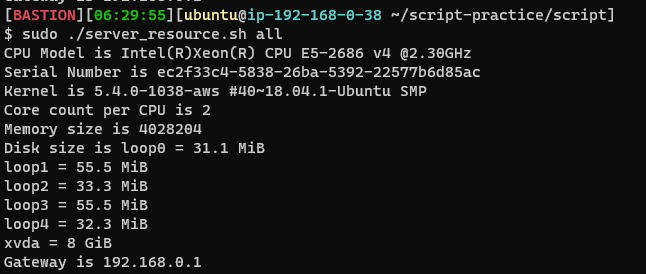
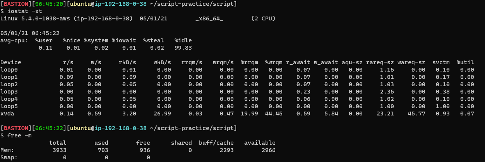
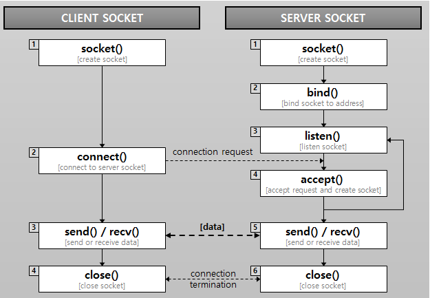

### 2021-05-01

## CU 수업 복습
### 서버 진단하기
- __피해자가 누구인지 파악하는 게 서버 장애 해결의 Key__
    - 브라우저 <-> 웹 서버 <-> 어플리케이션 호스트 <-> DB
        - 웹 서버: nginx 프록시
        - 어플리케이션 호스트: 톰캣, 스프링부트
    1. 접속 로그로 느린 응답 확인
    2. vmstat 등으로 사용률을 파악
        - CPU, Memory는 단위 시간에 평균치... 오류 발생 가능성 Up
        - 대략적인 상태만 파악하는 것
    3. ps로 스냅샷을 찍어, 용의자를 파악

- __stat 형태__
    - 요약 정보 (sar, vmstat)
        - 단위시간 정보의 합계나 평균
    - 스냅샷 (ps, top)
        - 순간의 상태를 기록하여 현재 문제가 발생하고 있지 않은지 원인 조사

- __사용률__
    - 
    - uptime으로 부하 확인
        - 부하가 몰린다: 네트워크 구간에서 부하 몰림
        - 부하가 높다: 서버에서 부하가 높음 
            - 1분, 5분, 15분 사이의 부하 평균치
            - Process가 CPU, I/O에서 대기 상태인 것 
            - 대기하고 있는 작업이 얼마나 대기중인지, 누가 병목인지, 누가 빌런인지 확인
    - oom-killer (dmesg, syslog를 통해 확인)
        - 메모리 사용률이 너무 높아지면, 리눅스 서버가 죽지 않을려고, 너무 메모리 많이 차지하는 프로세스 죽임
    - vmstat
        - OS 커널에서 취득할 수 있는 정보 확인
        - swap-in, swap-out
            - 캐시 적용이 제대로 안될 확률 high
        - block 상태에 있는 프로세스 확인해보기
    - 
        - iostat: 디스크 사용률 확인
            - read/write양
        - free: 메모리 사용률 확인

- __포화도__
    - wait: 대기하고 있는 프로세스들
    - CPU 사용률 100%는 최적화된 상태
        - 그 이상으로 요청이 오면 그게 부하

- __네트워크__
    - active: CLOSED -> SYN-SENT
    - passive: 실제 요청을 받기 시작함
    - TCP
        - TIME_WAIT (잘 모르겠음)
            - ACK 패킷이 유실 된 경우
            - 연결 끊는 쪽에서 TIME_WAIT 소켓 생성
            - 연결 해제 자연스러운 현상
            - 로컬의 포트 고갈에 따른 애플리케이션 타임아웃 발생
                - TCP connection 생성/해제 많아지면 응답속도 낮아질 수 있음
                - keepalive, connection pool등을 이용해 연결 재사용할 것
                    - 소켓을 할당할 포트가 없어
                    - 소켓을 재사용 해보자
        - CLOSE_WAIT (잘 모르겠음)
            - close()
            - 이미 장애가 발생한 경우
            - 서버가 연결을 해제하겠다는 요청 받았는데, 제대로 해제 못한 경우
                - 너무 많은 부하가 있는 경우 발생
                - 부하: 대기중인 프로세스 수
            - 부하를 낮은 상태로 유지하자
            
- __USE 방법론__
    1. 에러 확인한다
    2. 서버의 CPU, Memory, Disk, NW 사용률을 파악한다
    3. 문제를 발견했다면, 부하가 어느 정도 몰렸는지 확인해본다

### 애플리케이션 진단하기
- __Thread__
    - Thread: 프로세스 내의 시간의 흐름
        - Program Counter로 흐름 추적
    - 애플리케이션의 Thread 상에서 나타나는 문제는 대부분 Lock으로 발생
        - Thread가 BLOCKED인지?
        - 하나의 Thread가 너무 오래 Core를 점유하고 있는 거 아닌지?
    - fastthread.io로 dump 내용 웹으로 볼 수 있음

## 질문
- __프로세스__
    - *참고: https://papimon.tistory.com/39*
    - 정의: 실행 중인 프로그램
    - 메모리 배치
        - 스택: 함수 호출 시 임시 데이터 저장장소(매개변수, 복귀 주소, 지역 변수 등)
        - 힙: 프로그램 실행 중 동적 할당되는 메모리
        - 데이터: 전역 변수 저장
        - 텍스트: 실행 코드 저장
    - 프로세스 상태
        - New: 프로세스가 생성 중
        - Ready: 프로세스가 처리기에 할당되기를 기다림
        - Running: 프로세스의 명령어가 실행 중
        - Waiting: 프로세스가 어떤 이벤트(I/O, 신호 수신 등)이 일어나길 기다림
        - Terminated: 프로세스 종료
    - PCB
        - 각 프로세스는 OS에서 PCB에 의해 표현됨
        - 프로세스 시작/재시작에 필요한 정보 저장 *(Context Switch 되면서 병행 처리되는 프로세스들)*
            - Program Counter: 다음 실행 할 명령어의 주소
            - CPU Register: 인터럽트가 된다면, 필요한 레지스터 정보들을 포함시킴
            - 메모리 관리 정보: Base 레지스터, Limit 레지스터, Page Table, Segment Table
            - 회계 정보: CPU 사용시간, 경과 시간, 계정 보호, 프로세스 번호 등을 포함
    - 프로세스 생성 과정
        - 자식 프로세스를 만드는 두가지 방법
            1. 부모 자신과 병행하는 자식 프로세스 생성
            2. 자식들이 할 일 종료할 때 까지 기다리는 부모
            
- __스레드__
    - 정의: 프로세스 내에서 실행되는 시간의 흐름 단위로, 프로세스는 최소 하나 이상의 스레드 가짐
    - 특징
        - CPU 이용의 기본 단위로 명령 처리
        - 힙, 데이터, 텍스트 영역을 공유
        - 고유 threadID, PC, Register 집합, Stack으로 구성
        - 메모리 사용 효율이 높음
            - 메모리 공간을 multi-thread 프로그램은 같은 프로세스에 한해 공유함
        - Context Switch Overhead가 프로세스에 비해 낮아짐
            - 메모리 공간 전환 안해서 CPU 상의 메모리 캐시 그대로 유지 가능

- __소켓__
    - *참고: https://helloworld-88.tistory.com/215*
    - 다른 시스템의 프로세스들이 통신하는 방법 중 하나
        - 떨어져 있는 두 호스트를 연결해주는 도구!
    - 네트워크로 연결되어 있는 시스템의 프로세스가 소통을 위해 소켓 사용이 가능
        - 양 프로세스에 하나씩
        - 각 소켓은 ip + port로 구성
            - 서버는 지정된 포트의 클라이언트 요청 메시지가 전달될 때를 기다리며, listening 상태로 대기
            - 클라이언트는 서버의 ip 주소와 port 번호를 통해 서버와 연결 시도
            - 수락하면, 연결 완성!
    - 소켓 통신의 흐름
        - 
        - 서버
            - socket() 함수로 소켓 생성
            - bind() 함수로 ip와 port번호 설정
            - listen() 함수로 클라이언트의 접근 요청에 수신 대기열 만들어 몇 개 클라이언트 대기 시킬지 결정
            - accept() 함수를 사용하여 클라이언트와의 연결을 기다림
        - 클라이언트
            - socket() 함수로 소켓을 개방
            - connect() 함수를 이용해 통신할 서버에 설정된 ip와 port번호에 통신 시도
            - 통신 시도시 서버가 accept() 함수를 이용해 클라이언트의 socket descriptor 반환
        - 클라이언트 <-> 서버 서로 read(), write() 하며 통신
    - 소켓 종류
        - *참고: https://clarus.tistory.com/entry/TCPIP-%EC%86%8C%EC%BC%93%EC%9D%98-%EC%A0%95%EC%9D%98-%EB%B0%8F-%EC%A2%85%EB%A5%98*
        1. 스트림
            - 양방향으로 바이트 스트림을 전송할 수 있는 연결 지향형 소켓
                - 양쪽 어플리케이션이 모두 데이터 주고 받을 수 있음을 의미
            - 오류 수정, 전송 처리, 흐름 제어 등을 보장
            - 송신된 순서에 따른 중복되지 않은 데이터 수신
        2. 데이터그램
            - 명시적으로 연결 안 맺음
            - 대상 소켓으로 메시지 전송, 대상 소켓은 메시지 적절히 수신
            - UDP 사용하여 데이터 교환
        3. Raw
            - 패킷 가져오면 TCP/IP 스택 상의 TCP, UDP 계층 우회하여 바로 어플리케이션으로 송신
            - 원형 그대로의 패킷 볼 수 있음

- __TCP vs UDP__
    - *참고: https://www.ibm.com/docs/ko/rtw/9.0.1?topic=transports-sockets-overview*
    - 전송 계층
        - 한 컴퓨터 프로세서에서 다른 컴퓨터의 프로세스로의 데이터 전달 감시
        - 애플리케이션 계층 프로토콜과 네트워크에서 제공하는 서비스를 연결
    - TCP
        - IP에 연결 지향 기능 및 신뢰성 추가
        - 신뢰할 수 있는 스트림 전달 서비스로, 중복되거나 손실된 데이터 없이 한 호스트에서 전송한 데이터 스트림을 다른 호스트로 전달할 수 있도록 보장
    - UDP
        - 비연결형 전송 프로토콜
        - 오류 검사 거의 없음
        - 호스트 간 통신 대신 프로세스 간 통신 제공 이외에 IP 서비스에 아무것도 추가 X
        - 오버헤드 Small + Fast     
    
- __프록시 서버__
    - 클라이언트가 자신을 통해 다른 네트워크에 간접적으로 접속할 수 있게 해주는 컴퓨터 시스템이나 응용 프로그램
    - 서버와 클라이언트 사이의 중계기로서 대리로 통신 수행
    - 웹 캐시 기능이 있는 경우가 많음
    - 프록시를 통한 연결이 있으면 클라이언트의 IP가 서버에게 노출 안 될 수도 있다
    - 웹 서핑을 비롯한 인터넷 속도 향상을 위해 탄생
        
- __Connection Pool__
    - *참고: https://linked2ev.github.io/spring/2019/08/14/Spring-3-%EC%BB%A4%EB%84%A5%EC%85%98-%ED%92%80%EC%9D%B4%EB%9E%80/*
    - 정의
        - WAS가 실행되면서 DB와 미리 연결해 놓은 객체들을 pool에 저장해 두었다가, 클라이언트 요청이 오면 connection 빌려주고, 처리 끝나면 connection을 반납받아 pool에 저장하는 방식
    - 특징
        - WAS가 실행되면서 connection 객체를 미리 pool에 생성해 둠
        - HTTP 요청에 따라 pool에서 connection 객체 가져다 쓰고 반환
        - DB connection에 부하 줄이고 연결관리
        - pool에 미리 connection 생성되어 있어, 연결 시간 소비 X
    
- __Thread Dump__
    - *참고 1: https://d2.naver.com/helloworld/10963*
    - *참고 2: https://www.baeldung.com/java-thread-dump*
    - 수 십~ 수백 개의 스레드로 많은 수의 동시 사용자를 처리하는 백엔드
        - Deadlock 상황이 발생할 수 있음 -> Thread Dump 해보자!
    - Thread Dump는 자바 프로세스의 모든 스레드들의 상태의 snap shot
        - 각 스레드의 상태가 stack trace로 표시
        - plain text로 작성되어있기에, 컨텐츠를 파일로, 텍스트 에디터로 조회 가능

## 블로그 글 토픽
- TCP/IP, OSI 7 Layer