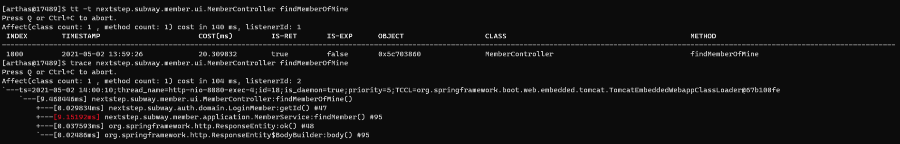
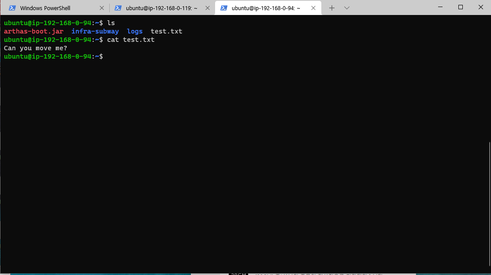
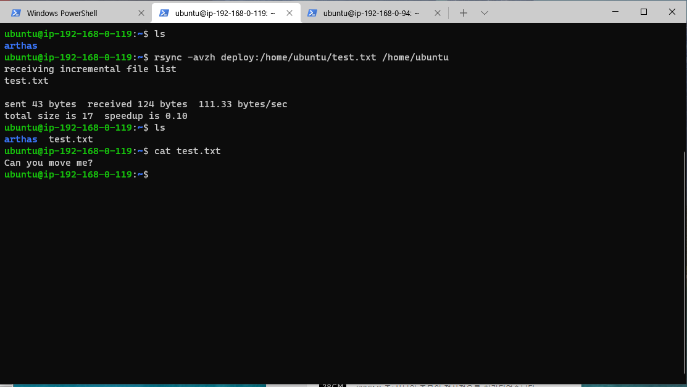
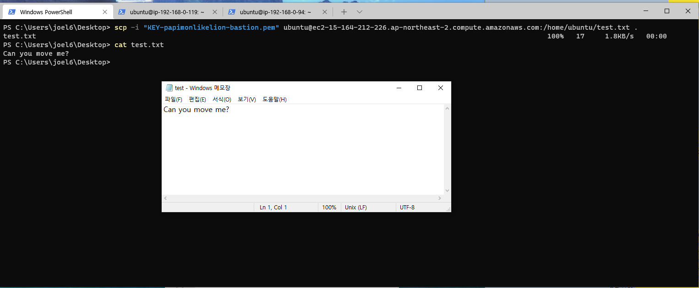

### 2021-05-02

## 인프라 2단계
- __실습__
    - 모니터링 지표, Thread dump 등을 활용한 원인 조사

- __요구 사항__
    - 로그 설정하기
        - Application Log 파일로 저장하기
            - 회원가입, 최단거리 조회 등의 이벤트에 로깅 설정
        - Nginx Access Log 설정하기
    - Cloudwatch로 모니터링
        - Cloudwatch로 로그 수집
        - Cloudwatch로 메트릭 수집

- __애플리케이션 상태 확인__
    - Arthas 설치 후 실행
        - *참고: https://github.com/alibaba/arthas*
        - 알리바바가 만든 Java 진단 툴
        - Java 어플리케이션의 production issues를 코드 변경과 재시작 이슈 없이 해결해 줌
    - 튜토리얼: *참고: https://arthas.aliyun.com/doc/arthas-tutorials.html?language=en*
        1. java -jar math-game.jar 
            - 1초에 한 번 씩 임의의 수식 만들고 계산 결과 음수면 에러 메시지 출력하는 프로그램
        2. java -jar arthas-boot.jar
            - Arthas 런쳐
            - 모든 java process 리스트
            - 사용자는 타겟 프로세스를 지정하여 진단할 수 있음
                - 시작하면 몇 번째 프로세스 진단할 지 지정할 수 있음
        3. dashboard
            - 현 시스템의 실시간 데이터 패널을 볼 수 있음
                - Thread 상태, 메모리, 시스템 전반적인 상황
                - CPU 사용량, 누적 시간이 많은 쓰레드 확인해볼 것
                - 새로운 쓰레드 계속 생성한다면, 쓰레드 풀을 사용해야 함
        4. thread 1
            - thread ID 1번의 스택을 출력
            - thread --all *(모든 쓰레드들을 출력)*
                - RUNNABLE이 높음: 정상적인 상태이나, CPU 사용량이 비정상적으로 높을 경우 확인해볼 것
                - BLOCKED가 높음: Lock 상태의 쓰레드이므로 원인 파악하기
                - WAITING/TIMED_WAITING: 문제 없음
        5. sc
            - JVM에 현재 로드되어 있는 클래스들을 출력
            - ex. sc -d *MathGame
        6. jad
            - 바이트코드를 디컴파일하는 용도
            - ex. jad demo.MathGame
        7. watch
            - 메서드의 파라미터, 리턴 값, 예외 볼 수 있음
        8. tt
            - 메서드의 파라미터, 리턴 값, 예외를 확인하기
            - watch의 복잡성 해소 가능
            - 
                - "-t": 메서드의 Calling Context 기록
        9. exit, quit
            - 나오기
            
- __로깅__
    - 주의점
        1. Avoid Side Effects
            - 로깅으로 애플리케이션 동작에 영향 있으면 X
                - NPE 발생하면 안댐
        2. Be Concise and Descriptive
            - 각 Logging에는 데이터/설명이 모두 포함되어야 함
        3. Log method arguments and return values
            - 메서드의 input과 output을 로그로 남겨 디버거를 쓰지 말자
            - AOP를 통해 구현할 수 있음
        4. Delete Personal Information
            - 사용자의 개인정보 로그에 남기지 말 것
    - 로깅 레벨
        - ERROR: 예상치 못한 "심각한" 문제로 즉시 조사 필요
        - WARN: 로직상 유효성 확인, 예상 가능한 문제로 인한 예외처리 등 남김, 서비스 운영은 가능하나 주의할 것
        - INFO: 운영에 참고할만한 사항으로, 중요한 비즈니스 프로세스
        - DEBUG/TRACE: 개발 단계에서만 사용, 운영단계에서는 X
        - 로깅 레벨을 지정하면, 상위 레벨의 로그는 모두 저장됨 

- __실습__
    - *참고: https://steady-coding.tistory.com/424*
    - rsync + scp로 파일 옮기기
        - 실제 서비스 서버에 text.txt 만들어 놓음
        - 
        - rsync 명령어로 배스쳔 서버에 가져옴
        - 
        - scp 명령어로 윈도우에 가져옴
        - 

## 질문
- curl?
    - *참고: https://blog.naver.com/jkssleeky/220838311137*
    - http 메시지를 쉘 상에서 요청하여 결과를 확인하는 명령어
    - http를 이용해 경로의 데이터를 가져옴

- nvm

- npm?
    - *참고: https://ko.wikipedia.org/wiki/Npm_(%EC%86%8C%ED%94%84%ED%8A%B8%EC%9B%A8%EC%96%B4)*
    - JS 런타임 환경 Node.js의 기본 패키지 관리자
    - *참고: https://velopert.com/1351*
    - nodejs와 npm을 최신화 하자!
    
- webpack?
    - *참고: https://ko.wikipedia.org/wiki/%EC%9B%B9%ED%8C%A9*
    - 오픈 소스 JS 모듈 번들러
    - HTML, CSS 등의 프론트 자산 변환 가능

- docker 설치
    - *참고: https://www.bsidesoft.com/7820*