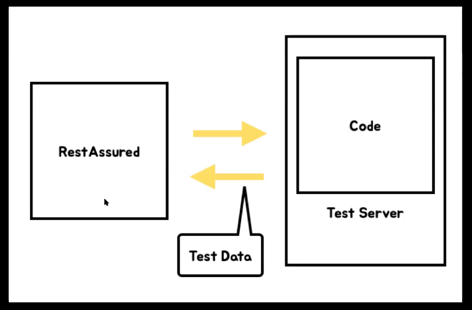

### 2021-05-04

## 브라운 수업 복습
- __Junit__
    - 테스트 제공 API
    - jupiter *(junit ver5)*
    - JUnit Platform (기반으로 동작)
        - Junit Vintage (ver4 이하)
        - Junit Jupiter (ver5)

- __스프링 테스트 도구__
    - @SpringBootTest
        - *참고: https://docs.spring.io/spring-boot/docs/current/api/org/springframework/boot/test/context/SpringBootTest.html*
        - 스프링의 자원을 사용해서 테스트한다
            - Bean
            - Embedded Tomcat
            - Webserver
        - @ContextConfiguration이 없다면, ContextLoader로 SpringBootContextLoader를 사용
        - @Configuration이 안 쓰이고 명시적으로 classes가 없다면, @SpringBootConfiguration을 사용
        - 어노테이션 타고타고 들어가서 어떤 어노테이션이 있는지 살펴봄
            - @ExtendWith?
    - WebEnvironment
        - MOCK: Mocking된 웹 환경을 제공, MockMvc 통한 테스트
            - Mocking된 Tomcat을 띄움
        - NONE: 아무런 웹 환경 구성 X
            - Tomcat 안 띄움
        - RANDOM_PORT: 실제 웹 환경 구성
            - 실제 웹 환경 구성
            - Embedded Tomcat으로 처리
        - DEFINED_PORT: 실제 웹 환경 구성, 지정한 포트 Listen
            - 실제 웹 환경 구성
            - Embedded Tomcat으로 처리
    - RestAssured
        - 
        - API 테스트

- __단위 테스트 VS 통합 테스트__
    - 단위 테스트 *(Unit Test)* 
        - 특정 테스트의 대상이 의도한대로 잘 동작하는지 확인
        - 테스트할 수 있는 가장 작은 단위
        - Fast
        - 다른 객체가 필요한 테스트 given 다수 => 협력 객체
    - 통합 테스트 *(Integration Test)*
        - 독립된 단위가 서로 연결될 때 올바르게 작동하는지 확인하는 테스트
        - 전체적인 기능 테스트 (넓은 의미)
        - 내가 짠 코드에서 특정 모듈이 잘 호출 되는지 (좁은 의미)
    - End-to-End Test
        - 끝에서 끝까지!
        - UI ~ UI
        - 요청과 처리에 따른 응답까지 테스트!

## 소켓
- __소켓이란__
    - 네트워크 상에서 동작하는 프로그램 간 통신의 종착점
    - 프로그램이 네트워크에서 데이터를 통신할 수 있도록 연결해주는 연결부
    - 데이터를 통신할 수 있도록하는 연결부라서, 소통하고자하는 두 프로그램 (Client, Server)에 모두 소켓이 생성되어야 함 
    - 네트워크 환경에 연결할 수 있게 만들어진 연결부
    - 네트워크에 연결하기 위한 소켓 또한 정해진 프로토콜에 맞게 만들어야 함 (TCP 상에서 동작하는 소켓사용)

- __소켓의 동작원리__
    - Server는 특정 포트와 연결된 소켓을 가지고 동작. Client 측의 소켓 연결 요청이 있을 때까지 기다리고 있음 (listening)
    - Client 소켓에서 연결 요청을 해서 올바른 port로 들어온다면, 소켓이 허락하여 통신 할 수 있도록 연결 됨

- __소켓 프로토콜__
    - DGRAM
        -	짧은 메시지, 순서/신뢰성 보장 X
        -	메시지 deque와 비슷
        -	UDP/IP
    - STREAM
        - 순서가 보장된, two-way byte stream(양방향)
        - 파이프처럼 동작
        - TCP/IP
    - RAW
        - 네트워크 내부와 인터페이스에 접근 가능
        - 루트 유저에게만 열림

- __소켓 연결 과정__
    - 서버의 소켓은 하나의 포트를 할당받아 클라이언트의 요청을 기다리고 있음
        - 설립된 모든 클라이언트의 커넥션은 해당 서버의 포트와 매핑된 연결
        - 설립된 커넥션은 클라이언트 IP/Port와 서버 IP/Port 매핑으로 고유하게 식별되는 연결
        - 다른 클라이언트 IP/Port 연결이라면 매핑이 가능, 서버는 시스템 리소스가 허락하는 데 까지 핸들 가능
    - 서버에서 듣고 있던 포트가 연결이 성립된다면, 동일한 로컬 포트에 바인딩된 새로운 소켓을 얻게 됨. 
    - 클라이언트는 서버와 통신하기 위해 소켓 사용 가능
    - 모든 TCP 연결은 2개의 엔드 포인트로 유일하게 식별 가능
        - 엔드포인트: IP + Port 조합
