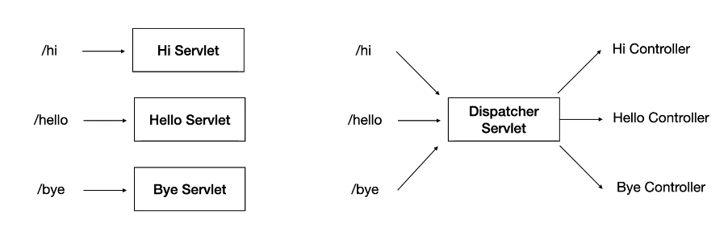
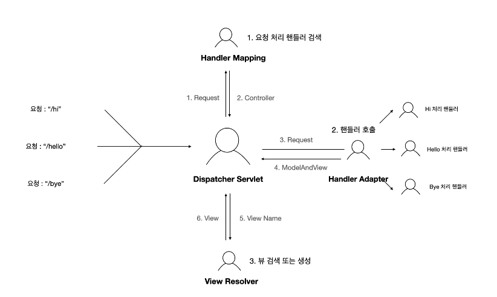

### 2021-05-12

## 개발 청춘들을 위한 어떤 아저씨의 말랑말랑 어쩌구
- __TOPIC : 잘 사는 것이란?__
- __[정의를 내려보자]__
    - 일 (Studs Terkel)
        - 빵과 함께 매일의 의미를 추구하는 행위고,  
          돈과 함께 인정을 얻기 위한 행위며,  
          무기력함이 아닌 경이로움을 찾는 행위
    - 정의를 기록해보자
    - 내용과 형식을 일치시키자
        - 내용 Philosophy/Contents/Story/Why
        - 형식 Style/Mode/Pattern
        - 둘을 붙여주는 Design

- __[커뮤니케이션 잘하는 법]__
    - 의도
    - 생각 
    - 감정
    - 흐름
        - 선 좋은거 -> 후 나쁜거 : ㄱㅊ
        - 선 나쁜거 -> 후 좋은거 : 아무짝에 소용없음
    - Feeling is the most fundamental sense
    - Feeling
        - Like
        - Dislike
    - 그 사람을 좋아하게 되면, 그 사람을 이해하게 하고, 같은 그룹이라고 지각 변경
        - 그렇게 되면, 이해되지 않는 것이 없다
    - Likability 6 Cues
        1. 접촉 빈도가 높을수록
        2. 상호 신용하면 할수록
        3. 외모 호감도 높을수록
        4. 작은 칭찬이 제공된다면
        5. 활짝 웃고, 인사한다면
        6. 유사성이 높을수록
        
- 내가 행복해지면 남을 도우려는 의지가 순간적으로 높아진다
- 효율성 VS 창의성
- 한 분야의 창조적 사고를 배운다는 것은 다른 분야에서 창조적 사고를 할 수 있는 문을 여는 것과 같다

## Spring MVC Config 학습 테스트
- Web MVC Configuration이 뭘까?

- Interceptor는 뭘까?
    - *참고: https://victorydntmd.tistory.com/176*
    - Controller에 들어오는 요청 HttpRequest와 컨트롤러가 응답하는 HttpResponse를 가로채는 역할
    - 관리자 인증 등에 사용

- Data Source는 뭘까?
    - *참고: https://opentutorials.org/module/3569/21223*
    - 기존 JDBC 프로그램 구현으로는 DB서버 연결하기 위해 Connection 객체 얻어야함
    - Connection Pool로 Connection 객체 쪽수 제한
    - DataSource에서 Connection Pool의 Connection 객체 운용
    - DataSource에 대해 정의하자면 아래와 같다.
        - 커넥션 풀의 Connection을 관리하기 위한 객체이다.
        - JNDI Server를 통해서 이용된다.
        - DataSource 객체를 통해서 필요한 Connection을 획득, 반납 등의 작업을 한다.

- Argument Resolver는 뭘까?
    - *참고: https://jaehun2841.github.io/2018/08/10/2018-08-10-spring-argument-resolver/*
    - Controller에 들어오는 파라미터를 가공/추가/수정해야 하는 경우 사용
        - 사실 Controller에서도 파라미터 가공/추가/수정 가능하긴 함
        - 근데 이거 중복 생겨
    - Argument Resolver를 사용하여 Controller 파라미터 공통 기능 제공 가능
    - Argument Resolver 동작 방식
        1. Client Request 요청
        2. Dispatcher Servlet에서 해당 요청 처리
        3. Client Request에 대한 Handler Mapping
            3-1. RequestMapping에 대한 매칭 (RequestMappingHandlerAdapter)
            3-2. Interceptor 처리
            3-3. Argument Resolver 처리
                - 메서드의 파라미터 타입, Annotation을 이용하여 적용여부 결정
            3-4. Message Converter 처리
        4. Controller 메서드 실행

- Dispatcher Servlet은 뭘까?

- Handler Mapping은 뭘까?

- MappingHandlerAdapter?

- Registry?

- View Controller?

- *참고: https://docs.spring.io/spring-framework/docs/current/reference/html/web.html#mvc-config-view-controller*
- 1.11.8 View Controllers
    - View Controller는 View를 실행하자 마자 반환하는 ParameterizableViewController를 정의하는 과정
        - 전역으로 사용 가능
        - Controller 없을 때 사용가능
    - XML로 <mvc:view-controller path="/" view-name="hone"/> 가 추가되어야 함
    - Controller에 해당 URL에 @RequestMapping이 되어있다면 안 먹음
    
- *참고: https://docs.spring.io/spring-framework/docs/current/reference/html/web.html#mvc-config-interceptors*
- 1.11.5 Interceptors
    - Java Configuration에서 들어오는 Request에 대해 interceptor를 정의할 수 있음

- *참고: https://www.baeldung.com/spring-mvc-custom-data-binder#1-custom-argument-resolver*
- 4. Binding Domain Objects
    - 데이터를 객체로 변환하고 싶은데 직접적인 방법이 없는 경우가 있다
        - ex. Session, Header, Cookie 등
- 4.1 Custom Argument Resolver
    - Parameter에 붙일 수 있는 어노테이션 정의
    
## Spring으로 Servlet을 다룬다는 것 테코톡 복습
- __1. 서블릿이란?__
    - 서블릿도 동적인 페이지를 만들기 위해 웹 서버에 붙이는 프로그램 중 하나
    - Http 요청을 텍스트로 곧이 곧대로 받아서, 이를 파싱하고, 필요한 처리하고, 다시 리스폰스 만들고, 이를 텍스트로 만들고, 전달하면 너무 힘들어
    - HttpServletRequest, HttpServletResponse로 추상화 시켜서 해당 요청을 Parsing한 API를 사용할 수 있음
        - ex. HttpServletRequest.getMethod();
    - 개발자들은 처리 로직에만 집중할 수 있음!
    - Servlet의 구현 형태
    
    ```java
    public class MyServlet extends HttpServlet { 
        public void init(ServletConfig config) throws ServletException {
            super.init();
        }   
        
        public void destroy() {
            super.destroy();
        }
    
        //요청을 처리할 때 실행되는 메서드!
        protected void service(HttpServletRequest request, HttpServletResponse response) {
            super.service(request, response);
        }
    
        //서블릿에서 GET을 어떻게 처리할지 정의한다!
        @Override
        protected void doGet(HttpServletRequest request, HttpServletResponse response) {
            System.out.println("내가 정의한 GET 방식");
        }
    }
    
    public abstract class HttpServlet extends GenericServlet {
        protected void service(HttpServletRequest request, HttpServletResponse response) {
            String method = request.getMethod();
            
            if (method.equals("GET")) {
                doGet(request, response);
            } else if (method.equals("POST")) {
                doPost(request, response);
            } else if (method.equals("PUT")) {
                doPut(request, response);
            } else if (method.equals("DELETE")) {
                doDelete(request, response);
            } else {
                throw new Exception("예외처리");
            }
        }
    }
    ```
    
- __2. 서블릿 컨테이너와 서블릿 동작 방식__
    1. Servlet Request/Servlet Response 객체 생성
    2. 설정 파일을 참고해 매핑할 Servlet을 확인
        - 다음과 같은 설정파일에 매핑할 서블릿을 지정해줌
        ```xml
        <servlet>
            <servlet-name>HelloServlet</servlet-name>
            <servlet-class>servlet.HelloServlet</servlet-class>
        </servlet>
        <servlet-mapping>
            <servlet-name>HelloServlet</servlet-name>
            <url-pattern>/hello</url-pattern>
        </servlet-mapping>
        ```
    3. 해당 서블릿 인스턴스 존재 유무를 확인하여 없으면 생성 (init())
        - 설정파일로 필요한 서블릿 읽어서, 컨테이너에 서블릿 있는지 확인
            - 있으면 그대로 사용
            - 없으면 생성하여 사용
    4. Servlet Container에 쓰레드를 생성하고, res, req를 인자로 service 실행
        ```java
        //이거 실행돼!
        //서블릿에서 GET을 어떻게 처리할지 정의한다!
        @Override
        protected void doGet(HttpServletRequest request, HttpServletResponse response) {
            System.out.println("내가 정의한 GET 방식");
        }
        ```
    5. 응답을 처리한 이후에는 req, res 객체 소멸
    - 서블릿은 싱글톤으로 관리됨
        - 같은 요청 또 처리해줘야지
    - 서블릿 컨테이너 == 서블릿 생명주기 관리해주는 객체
    - 만약 여러 요청이 들어온다면??
        - 멀티 스레드 처리
        - 이거 근데 위험해 HW 뇌절 가능
        - 프론트 컨트롤러 패턴 도입!

- __3. 프론트 컨트롤러 패턴__  
    -   
    - 여러 요청에 따라 각각 서블릿은 비효율적
        - 관리: 멀티 쓰레드 조심해야 함
        - 개발: Handler 공통 로직 중복
    - Dispatcher Servlet: 전면에 하나의 서블릿 두고 모든 처리를 다 받자!

- __4. Dispatcher Servlet의 Web 요청 처리 과정__
    - 
    - 개발자는 개별 핸들러만 신경 써주면 됨
    - 서블릿 설정 파일만 잘 작성해주면, 그 설정대로 생성된 객체가 Spring Container에서 관리되고,  
      필요한 부분에서 주입받아, Dispatcher Servlet이 알아서 사용할 수 있게 됨
