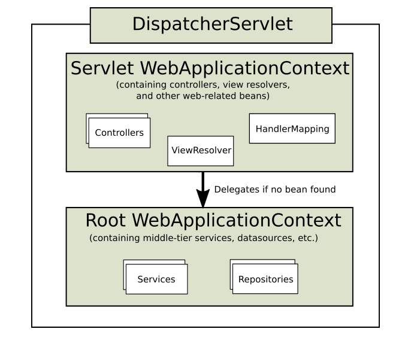

### 2021-05-18

## 스프링 웹 요청 처리과정 *(Spring Web MVC)*
- *참고 1: https://github.com/binghe819/TIL/blob/master/Spring/MVC/Spring%20MVC%20flow.md*
- *참고 2: https://velog.io/@hanblueblue/%EB%B2%88%EC%97%AD-Spring2-Spring-Web-MVC*
- *참고 3: https://tutorialspedia.com/how-java-spring-mvc-works-spring-mvc-request-flow-explained-step-by-step/*
- *참고 4: https://docs.spring.io/spring-framework/docs/current/javadoc-api/org/springframework/web/servlet/DispatcherServlet.html*
- __Spring Web MVC란?__
    - Servlet API를 기반으로 구축된 최초의 웹 프레임워크

- __DispatcherServlet 공식문서__
    - HTTP 요청 hanlder/controller를 중앙에서 관리
        - web 요청을 수행하기 위해 등록된 handler를 수행
    - JavaBean 규약을 바탕으로 함
    - 어떤 HandlerMapping 구현체라도 사용가능
        - Default: BeanNameUrlHandlerMapping 이랑 RequestMappingHandlerMapping
    - 어떤 HandlerAdapter 구현체라도 사용가능
        - Default: HttpRequestHandlerAdapter, SimpleControllerHandlerAdapter
    - 예외 처리 전략은 HandlerExceptionResolver가 담당
    - ViewResolver 구현체로 viewResolve 전략수행
    - @RequestMapping은 그에 대응하는 HandlerMapping, HandlerAdapter가 있어야 사용가능

- __DispatcherServlet?__
    - 다른 많은 웹 프레임워크처럼 프론트 컨트롤러 패턴 중심으로 설계
        - Java configuration || web.xml을 사용하여 선언되고 매핑되어야 함
        ```java
        public class MyWebApplicationInitializer implements WebApplicationInitializer {
            @Override
            public void onStartup(ServletContext servletCxt) {
        
                // Load Spring web application configuration
                AnnotationConfigWebApplicationContext ac = new AnnotationConfigWebApplicationContext();
                ac.register(AppConfig.class);
                ac.refresh();
        
                // Create and register the DispatcherServlet!!!!!!
                DispatcherServlet servlet = new DispatcherServlet(ac);
                ServletRegistration.Dynamic registration = servletCxt.addServlet("app", servlet);
                registration.setLoadOnStartup(1);
                registration.addMapping("/app/*");
            }
        }
        ```
    - Spring Configuration을 사용하여 Request Mapping, View Resolution, Exception Handle 등에 필요한 deletgate components 검색
    - 스프링 부트에서는 다른 초기화 순서를 따른다!
        - 서블릿 컨테이너의 라이프 사이클에 연결하는 대신 "스프링 configuration"을 사용해 자체 내장된 서블릿 컨테이너를 부트 스트랩
        
- __Context Hierarchy__
    - 
    - 디스패처 서블릿은 자체 구성에 WebApplicationContext를 가지고 있음
        - 서블릿 컨텍스트 + 서블릿에 대한 링크 포함
    - 하나의 WebApplicationContext가 간단하면서도 충분
        - Root WebApplicationContext: 여러 서블릿 인스턴스에서 공유해야 하는 데이터 저장소 및 비즈니스 서비스와 같은 인프라 빈

- __DispatcherServlet 처리과정__ 
    1. 프로세스에서 컨트롤러와 다른 요소가 사용할 수 있는 속성인 WebApplicationContext는 request에서 검색되고 바인딩
        - DispatcherServlet.WEB_APPLICATION_CONTEXT_ATTRIBUTE
    2. 요청 처리 시 프로세스의 요소가 로케일을 해석할 수 있도록 locale resolver가 request에 바인딩
    3. theme resolver는 뷰 같은 요소가 사용할 테마를 결정하도록 요청에 바인딩
    4. multipart file resolver를 지정하면 request는 요청에서 multiparts가 검사
    5. 적절한 핸들러가 검색됨
    6. 모델이 반환되면 뷰가 렌더링됨
    -     
        - Dispatcher Servlet: 모든 요청을 받고 분석하여 적절한 컨트롤러에 처리를 위임
        - Common Service: 모든 요청에 제공되는 로케일(?)해석, 테마해석, 멀티파트 핸들링
        - Handler Mapping: HTTP 요청 정보를 통해 핸들러(컨트롤러 클래스 내의 메서드)에 매핑
            - lookupHandlerMethod()에서 수행
                - urlLookup이라는 Map에 url 매핑 정보 존재함
                - @RequestMapping, @GetMapping등을 통해 Http 경로와 핸들러 매핑 구현체를 등록해줌
        - Handler Adapter: 결정된 Controller의 메서드를 호출하는 역할
            - DispatcherServlet은 Handler가 어떤 방식으로 구현되어 있는지 모름
        - Handler Interceptor: DispatcherServlet이 컨트롤러 호출 전과 후에 요청/응답을 가공하는 필터
        - View Resolver: 어떤 종류의 view를 사용할 것인지 선택하고 문자열 기반을 view 선택

- __한번 더 정리__
    - 
    1. 클라이언트는 URL로 요청을 보낸다
    2. 클라이언트의 request는 Front-Controller로 알려진 Dispatcher Servlet에게 들어감
        - Dispatcher Servlet은 Web.xml에 명시되어 있음
    3. Dispatcher Servlet은 URL Mapping Handler를 사용하여 요청에 대응되는 controller 클래스를 찾음
    4. 대응되는 Controller에게 client request를 넘겨줌
    5. Controller 클래스에서 http 요청에 따라 각각 처리를 하도록 함
        - Controller에서 처리 후 ModelAndView를 반환함
    6. ModelAndView를 반환받은 DispatcherServlet은 Model 객체를 View Resolver로 전달
    7. 받은 Model을 View에 대응시켜 프론트 작업 
    8. View가 리턴되어 클라이언트가 봄
        
- __HandlerMapping__ 
    - *참고: http://wonwoo.ml/index.php/post/2308*  
    - *참고: https://joont92.github.io/spring/HandlerMapping-HandlerAdapter-HandlerInterceptor/*
    - Dispatcher Servlet으로 들어온 요청 정보를 이용해 Controller를 찾아줌
        ```java
        public interface HandlerMapping{
            HandlerExecutionChain getHandler(HttpServletRequest request) throws Exception;
        }
        ```
    - 스프링이 제공 HandlerMapping
        - *BeanNameUrlHandlerMapping*
            - 이게 Default
        - *ControllerBeanBameHandlerMapping*
        - *ControllerClassNameHandlerMapping*
        - *SimpleUrlHandlerMapping*
        - *DefaultAnnotationHandlerMapping*
            - jdk1.5 이상이면 이것도 Default
            - method/parameter/header등의 정보로도 매핑 가능
            - @RequestMapping등을 사용해 매핑전략 형성
            - Spring boot 사용 시 추가로 뭐 설정할 것도 없음

- __HandlerAdapter__
    - Handler Mapping에서 결정된 핸들러 정보로 해당 메서드를 직접 호출해줌
    - Handler Mapping을 통해 찾은 컨트롤러를 직접 실행해줌
        ```java
        public interface HandlerAdapter{
            boolean supports(Object handler);
            //ModelAndView를 반환한다!
            ModelAndView handle(HttpServletRequest request, HttpServletResponse response, Object handler) throws Exception;
        
            long getLastModified(HttpServletRequest request, Object handler);
        }
        ```
    - 스프링 제공 HandlerAdapter
        - *SimpleControllerHandlerAdapter*
        - *HttpRequestHandlerAdapter*
        - *SimpleServletHandlerAdapter*
        - *AnnotationMethodHandlerAdapter*
            - DefaultAnnotationHandlerMapping과 대응되는 매핑 전략
            - 어떤 메서드를 호출할지 리플렉션을 이용하여 결정
            - 클래스와 메서드에 붙은 어노테이션/메서드 이름/파라미터/리턴타입에 대한 규칙등을 조합하고 분석해 컨트롤러 선별

- __HandlerInterceptor__
    - DispatcherServlet이 controller 호출하기 전-후로 요청/응답 가공할 수 있는 일종의 필터
    - HandlerMapping에서 인터셉터 처리하고 가공후 controller 호출

## 페어(바다)의 정리
- __Spring MVC 처리 과정__
    - *참고: https://jeong-pro.tistory.com/96*
    - *참고: https://github.com/binghe819/TIL/blob/master/Spring/MVC/Spring%20MVC%20flow.md*
    - *참고: https://galid1.tistory.com/521?category=783055*
    - *참고: *
    - *참고: *
    - MVC 처리 순서
        1. Client 요청 -> DispatcherServlet(Front Controller)가 가로 챔
        2. DispatcherServlet은 HandlerMapping에게 어떤 컨트롤러에게 요청 위임하면 좋을지 질의
        3. 요청에 매핑된 컨트롤러 있다면 @RequestMapping을 통해 처리할 메서드에 도달
        4. 컨트롤러에서 Service -> Dao -> DB 로처리
        5. 컨트롤러는 필요에 따라 Model 객체에 결과물 넣거나, 어떤 view 보여줄지 정보 담아 다시 DispatcherServlet에게
        6. DispatcherServlet은 ViewResolver에게 View 정보를 넘김
        7. View는 해당 JSP를 찾아 DispatcherServlet에게 알려줌
        8. DispatcherServlet은 응답할 View에게 Render 지시 후 View 응답 로직 처리
        9. DispatcherServlet이 클라이언트에게 렌더링된 View 응답

- __Servlet__
    - *참고: https://jeong-pro.tistory.com/222*
    - *참고: https://kohen.tistory.com/29*
    - 웹 페이지를 동적으로 생성하는 서버 측 프로그램 혹은 그 사양
        - 웹 서버 프로그래밍을 하기 위한 사양을 갖춘 자바 코드
    - HttpServlet을 상속
        - Servlet 인터페이스를 구현한 GenericServlet 추상클래스를 상속한게 HttpServlet
    - Servlet은 "Servlet Container"에 의해 관리/실행
        - HTTP Server + Servlet Container(Tomcat)... 웹 서버에 필요한 역할
        - 개발자는 Servlet을 만들어 Http 요청을 받아 처리하는 부분 구현

- __Servlet Container__
    - 웹서버와의 통신 지원 : 서블릿과 웹 서버가 쉽게 통신할 수 있게 해줌.
    - 서블릿 생명주기 관리
    - 멀티쓰레드 지원 및 관리
    - 선언적인 보안 관리
    - 여러 Servlet을 생성/관리할 수 있지만, 일반적인 경우 Spring에서는 DispatcherServlet만 등록해놓고 HandlerMapping을 통해 Controller로 매핑

- __Interceptor__
    - *참고: https://victorydntmd.tistory.com/176*
    - Controller에 들어오는 HttpRequest / HttpResponse를 가로채는 역할
        - 관리자 페이지에 접근하기 전에 관리자 인증을 하는 용도로 활용 가능
    - Filter는 Servlet Container에 등록하고 Interceptor는 Spring Container에 등록

- __Argument Resolver__
    - *참고: https://jaehun2841.github.io/2018/08/10/2018-08-10-spring-argument-resolver/*
    - Controller에 들어오는 파라미터를 가공 (ex. 암호화된 내용 복호화)
    - 파라미터를 추가하거나 수정해야 하는 경우 사용
        - Controller에서 파라미터를 가공/추가/수정할 수 있기 때문에 없어도 문제는 없다.
    - 중복을 최소화해 깔끔한 코드 작성
    - **Controller의 파라미터에 대한 공통 기능 제공**
    - HandlerMethodArgumentResolver 인터페이스 사용해 개발한다
        - supportsParameter: 컨트롤러 파라미터 검사후 customArgumentResolver 로직 수행할지 검사
        - resolveArgument: supportsParameter true라면 뭘 넣어줌?
    - 동작 방식
        1. Client Request 요청
        2. Dispatcher Servlet에서 해당 요청 처리
        3. Client Request에 대한 Handler Mapping
            1. RequestMapping에 대한 매칭 (RequestMappingHandlerAdapter)
            2. Interceptor 처리
            3. **Argument Resolver 처리**
            4. Message Converter 처리
        4. Controller Method invoke

## Servlet Container & Spring Container
- *참고: https://stackoverflow.com/questions/28040529/what-is-the-difference-between-servlet-container-and-spring-container*
- *참고: https://12bme.tistory.com/555*
- __Servlet Container__
    - 웹 컨테이너라 불리며, 대표적으로 Tomcat이 있음
        - Tomcat과 같은 WAS가 Java를 컴파일해서 Class로 만들고 메모리에 올려 Servlet 객체 만듦
        - Tomcat, Jetty 등
    - 자바 웹 어플리케이션이 실행될 수 있는 곳
    - Servlet의 생성~소멸까지의 과정을 관리
    - 요청이 들어올때마다 새로운 Java Thread 만듦
    - HTTP 요청을 받아 처리하는 기초 역할
    
- __Spring Container__
    - Spring Framework의 Core engine
    - IoC Container... Spring application lifecycle 관제
    - Spring application도 web application의 일종이니...
        - Spring Container는 Servlet Container 내부에서 살아!
    - IoC와 DI로 이루어진 Bean의 생명주기 관리처
    - BeanFactory/ApplicationContext
        
- __특징__
    - 대부분 웹 프레임워크가 제공하는 기능은 서블릿 컨테이너 위에서 동작하는 서블릿/필터/이벤트리스너 등을 적절히 구현한 것

- __Spring Boot & Servlet__
    - Spring Boot는 내부적으로 내장 톰캣 보유
        - 즉 Spring Boot 실행되면서 내부적으로 서블릿 컨테이너 실행
        - DispatcherServlet 사용
            1. DispatcherServlet이 스프링에 빈으로 등록됨
            2. Servlet Container Context에 Servlet 등록
            3. Servlet Container Filter에 등록 설정 해놓은 Filter 등록
            4. DispatcherServlet에 각종 핸들러 매핑들이 등록됨

- __DispatcherServlet 사용하고 흐름__
    - FrameworkServlet.service()
        - dispatch.doService()
            - dispatch.doDispatch() 
                - AbstractHandlerMapping에서 Handler(Controller) 가져옴
                - Interceptor, ArgumentResolver를 거쳐 Handler(Controller) 행
                    - ModelAndView 반환
                        - @RestController같은 경우 컨버터 이용해 바로 결과 값 리턴
                        - ViewResolver에 들려 뷰 객체 얻고 리턴

## WebApplicationContext
- *참고: https://linked2ev.github.io/spring/2019/09/15/Spring-5-%EC%84%9C%EB%B8%94%EB%A6%BF%EA%B3%BC-%EC%8A%A4%ED%94%84%EB%A7%81%EC%97%90%EC%84%9C-Context(%EC%BB%A8%ED%85%8D%EC%8A%A4%ED%8A%B8)%EB%9E%80/*
- 

- __WebApplicationContext?__
    - ApplicationContext를 확장한 WebApplicationContext 인터페이스의 구현체
        - 스프링 컨테이너에서 관리하고 동작함
    
- __Servlet WebApplicationContext__
    - *Containing controllers, view resolvers, and other web-related beans*
    - 주로 각각의 Servlet에서 사용하는 View 자원을 구성할 때
    - DispatcherServlet에 의해 생성되는 자식 WebApplicationContext
        - 이게 자식이야(controller)
        - 따라서 부모 참조 가능(service/dao)

- __Root WebApplicationContext__
    - *Containing middle-tier services, datasources, etc*
    - 주로 View 자원 이외에 공통적으로 사용이 가능한 infra, log등 구성
    - 서로 다른 서블릿 컨텍스트에서 공유해야할 빈들을 등록해 놓고 사용
    - Dispatcher Servlet이 여러개일 경우 공통으로 사용할 빈을 여기에 모아둠

- __SpringBoot 에서는?__    
    - 서블릿이 내장된 스프링부트...
        - spring-boot-starter 모듈에 모든 내장 컨테이너 설정 지원
        - 스프링부트 자체와 내장된 서블릿 컨테이너 구동

## 지하철 경로 조회 피드백
- __질문과 답변__
    - __Qs. ArgumentResolver는 어느 Layer 소속일까?__
        - Ans. 굳이 따지자면 Presentation Layer 또는 Web Layer 정도로 보면 되지 않을까요?
        
    - __Qs. 어떤 필드를 Token으로 만들어야 하는가? Email vs ID__
        - Ans. 따라서 제 생각엔 id를 사용하는 게 가장 적절해 보이기는 해요. 변경 가능성이 없고, 그 자체로는 특별한 의미도 없으니까요.
        - 토큰이 탈취당한 경우를 생각해보면, 현재 제 jwt 토큰은 header와 payload에 base64 encoding을 적용해놔서 손쉽게 decoding이 가능해요.
        
## JSON Web Token
- *참고 1: https://velog.io/@0307kwon/JWT%EB%8A%94-%EC%96%B4%EB%94%94%EC%97%90-%EC%A0%80%EC%9E%A5%ED%95%B4%EC%95%BC%ED%95%A0%EA%B9%8C-localStorage-vs-cookie*
- *참고 2: https://blog.outsider.ne.kr/1160?commentId=570298#comment570298*

- __JWT란?__
    - JSON 객체를 사용하고, 여기에 서명하거나 암호화를 할 수 있음
    - JWT 토큰은 다음과 같은 형식
        - *참고: https://jwt.io/*
        - Header: 토큰을 어찌 해석해야하는지 명시한 부분
        - Payload: 실제 토큰의 바디로, 토큰에 포함할 내용 넣음
        - Signature: header-payload 위변조 검증을 위한 부분. 위의 두값 "."으로 이어 붙이고 HS256 돌린값

- __JWT의 사용__
    - 토큰 자체가 데이터를 가진 것이 기존 토큰들과 가장 다른 부분
    - 일반적인 토큰
        - API 요청시 토큰이 들어옴 -> 유효한지 확인 -> DB로부터 유효한 토큰인지 확인 -> (필요시 DB 캐시 서버 둠) -> 권한 부여
    - JWT
        - 서명으로 유효한 토큰인지 검증 -> 유효한지 확인 -> Payload 디코드해서 데이터 열어봄

- __JWT 주의사항__
    - Payload는 암호화 안되는거라 중요한 데이터 넣으면 안됨
        - 최소한의 정보만 담자
    - 토큰을 강제로 만료시킬 방법이 없음
        - 토큰 발급 시 해당 토큰의 유효성이 결정됨
        - 사용자는 다썼는데, 만료 안 된 상황에서 탈취를 당한다면,,, 남은 시간은 유효한 거임

- __JWT 사용시 고려할 웹 공격__
    - XSS: Code Injection Attack, 공격자가 의도하는 악의적인 js 코드를 피해자 웹 브라우저에서 실행시키는 것
    - CSRF: 정상적인 request 가로채서, 변조된 request를 보내 악의적인 동작 수행하기

- __JWT의 저장은 어디에? *(결국 개인정보라서 잘 저장해야함)*__
    1. Local Storage
        - 장점: CSRF에 안전 *(js 코드 상으로 헤더를 제어)*
        - 단점: XSS에 취약 *(localstorage 접근 js 한줄이면 끝)*
    2. Cookie
        - 장점: XSS에 안전 *(js에서 쿠키에 접근 자체가 불가)*
        - 단점: CSRF에 취약 *(request url만 알면 링크 눌러서 위조하도록)*
