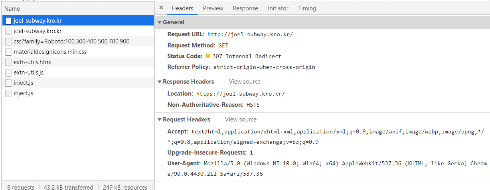
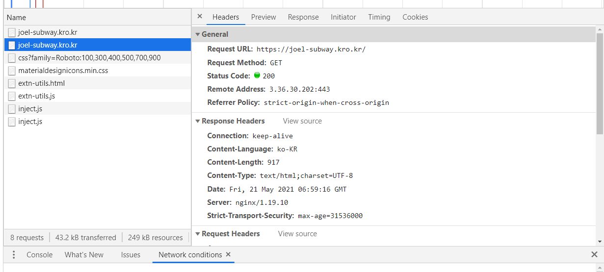

### 2021-05-21

## nginx.conf
- *참고 1: https://whatisthenext.tistory.com/123*
- *참고 2: http://nginx.org/en/docs/http/ngx_http_upstream_module.html*
- __Nginx의 역할__
    - 정적 파일을 처리하는 HTTP 서버로서의 역할
    - 응용프로그램 서버에 요청을 보내는 리버스 프록시로서의 역할

- __nginx.conf 살펴보기__
    - Nginx가 동작해야 할 방식을 설정값을 통해 지정
    ```
    events {}
    
    http {
      # 프록시된 서버들의 그룹 정의
      upstream app {
        server 192.168.0.254:8080;
      }
    
      # Redirect all traffic to HTTPS
      server {
        listen 80;
        return 301 https://$host$request_uri;
      }
    
      server {
        listen 443 ssl;
        ssl_certificate /etc/letsencrypt/live/joel-subway.kro.kr/fullchain.pem;
        ssl_certificate_key /etc/letsencrypt/live/joel-subway.kro.kr/privkey.pem;
    
        # Disable SSL
        ssl_protocols TLSv1 TLSv1.1 TLSv1.2;
    
        # 통신과정에서 사용할 암호화 알고리즘
        ssl_prefer_server_ciphers on;
        ssl_ciphers ECDH+AESGCM:ECDH+AES256:ECDH+AES128:DH+3DES:!ADH:!AECDH:!MD5;
    
        # Enable HSTS
        # client의 browser에게 http로 어떠한 것도 load 하지 말라고 규제합니다.
        # 이를 통해 http에서 https로 redirect 되는 request를 minimize 할 수 있습니다.
        add_header Strict-Transport-Security "max-age=31536000" always;
    
        # SSL sessions
        ssl_session_cache shared:SSL:10m;
        ssl_session_timeout 10m;
    
        location / {
          proxy_pass http://app;
        }
      }
    }
    ```
    - 
        - http://로 요청이 가면 https://로 리다이렉트 하도록 nginx 설정해둠
    - 
        - 이게 그 결과
        
## application.properties
- *참고 1: https://www.baeldung.com/spring-boot-yaml-vs-properties*
- **Properties Configuration**
    - 스프링 부트는 디폴트로 application.properties에 접근하여 설정을 해줄 수 있음
        - key:value 포맷으로 사용
        ```properties
        spring.datasource.url=jdbc:h2:dev
        spring.datasource.username=SA
        spring.datasource.password=password
        ```
        - 하나의 라인이 하나의 설정
    - 스프링 부트 2.4.0 부터 multi-document properties file이 가능
        - 하나의 physical file을 여러개의 logical document로 분배 가능
        
- **YAML Configuration**
    - 스프링 부트 어플리케이션에서 YAML 역시 설정 파일로 사용 가능
    - 계층 데이터 설정으로 편리함
    ```yaml
    spring:
        datasource:
            password: password
            url: jdbc:h2:dev
            username: SA
    ```
  
- **SpringBoot 내의 사용법**
    1. Value Annotation
        - `@Value("${key.something}")` 과 같이 사용가능
            - 토큰 시크릿 키 / 유효 기간을 다음과 같이 설정했었음
            ```java
            public class JwtTokenProvider {
                @Value("${security.jwt.token.secret-key}")
                private String secretKey;
                @Value("${security.jwt.token.expire-length}")
                private long validityInMilliseconds;
            }
            ```
    2. Environment Abstraction
        - Environment API를 통해 value를 가져올 수 있음
    3. ConfigurationPropertiesAnnotation
        - `@ConfigurationProperties` 어노테이션을 통해서 우리의 프로퍼티 바인딩 가능

- **실습**
    - [application-test.properties]
        - 여기에서는 embedded h2 db를 사용
        - testdb 생성해주나보다!
        ```properties
        spring.datasource.initialization-mode=always
        spring.datasource.url=jdbc:h2:mem:testdb
        spring.datasource.driverClassName=org.h2.Driver
        spring.datasource.username=sa
        spring.datasource.password=
        spring.h2.console.enabled=true
        handlebars.suffix=.html
        handlebars.enabled=true
        security.jwt.token.secret-key:my_secret_is_secret
        security.jwt.token.expire-length:3600000
        ```

    - [application-local.properties]
        - 여기에서는 도커에 mysql을 설치하여, 해당 DB를 이용
        - 로컬의 13306 포트가 도커내의 mysql 3306 포트와 매핑
        ```properties
        spring.datasource.initialization-mode=always
        spring.datasource.driver-class-name=com.mysql.jdbc.Driver
        spring.datasource.url=jdbc:mysql://localhost:13306/subwayDB?useSSL=false&serverTimezone=UTC&characterEncoding=UTF-8
        spring.datasource.username=root
        spring.datasource.password=root
        spring.h2.console.enabled=true
        handlebars.suffix=.html
        handlebars.enabled=true
        security.jwt.token.secret-key:my_secret_is_secret
        security.jwt.token.expire-length:3600000
        ```
    
    - [application-prod.properties]
        - 여기에서는 그냥 진짜 로컬 PC에 mysql을 설치하여, 해당 DB를 이용
        - 로컬의 3306 포트가 곧 서버 PC의 mysql 포트
        ```properties
        spring.datasource.initialization-mode=always
        spring.datasource.driverClassName=com.mysql.jdbc.Driver
        spring.datasource.url=jdbc:mysql://localhost/subwayDB?useSSL=false&serverTimezone=UTC&characterEncoding=UTF-8
        spring.datasource.username=joel
        spring.datasource.password=joel
        spring.h2.console.enabled=true
        handlebars.suffix=.html
        handlebars.enabled=true
        security.jwt.token.secret-key:my_secret_is_secret
        security.jwt.token.expire-length:3600000
        ```

    - 이제 하나씩 실행시키려면
        ```shell script
        $ java -jar -Dspring.profiles.active=test [jar파일명] 
        $ java -jar -Dspring.profiles.active=local [jar파일명] 
        $ java -jar -Dspring.profiles.active=prod [jar파일명] 
        ```