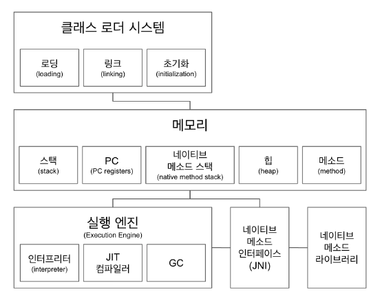

### 2021-05-23

## Java 용어 이해하기
- 
- 
- **JVM**
    - Java Bytecode를 어떻게 실행할지에 대한 표준 Spec!
        - 따라서 여러 JVM 구현체들이 많음!
            - JVM 벤더: 오라클, 아마존, Azul...
    - 플랫폼에 종속적
    - Java Bytecode는 인터프리터/JIT 컴파일러를 통해 OS에 알맞는 머신코드로 변경
- **JRE**
    - Java 어플리케이션을 "실행"할 수 있도록 구성된 배포판
        - javac 같은 컴파일러 없음
    - 저기 사진에 런타임 환경을 담당하나 보다!
        - JVM + 런타임 환경에 필요한 리소스
- **JDK**
    - JRE + 개발에 필요한 툴
        - javac 같은 컴파일러!
- **JAR**
    - 여러개의 자바 클래스 파일 + 관련 리소스 (텍스트/그림/메타데이터)를 하나의 파일로 모아 배포하기 위한 SW 패키지 

## JVM 구조
- 
- **클래스 로더**
    - .class 파일에서 바이트코드를 읽고, 메모리에 저장!
    - 로딩/링크/초기화 과정 거침
- **메모리**
    - 전체 thread 공유 자원 
        - <메소드>
            - 클래스 수준의 정보들을 저장
                - 클래스 이름 / 부모 클래스 이름 / 메서드 / 변수
        - <힙>
            - 객체를 저장, 실제 인스턴스
    - thread에서만 공유
        - <스택>
            - 쓰레드마다 런타임 스택 만들어 그 안에 "메서드 호출"을 스택 프레임이라는 블럭으로 쌓음
        - <PC>
            - 쓰레드 내 현재 실행할 스택 프레임을 가리키는 포인터
        - <네이티브 메서드 스택>
            - native method를 수행할 수 있는 스택

- **실행 엔진**
    - 인터프리터: 바이트 코드 한줄씩 읽으며 네이티브 코드로
    - JIT 컴파일러: 인터프리터 반복 코드를 미리 네이티브 코드로 바꿔줌
    - GC
        - throughput vs stop-the-world

## 자바 파일 읽기
- **getClass()**
    - *참고: https://ifuwanna.tistory.com/282*
    - 클래스에 대한 메타 속성 정보를 얻을 수 있음
        - 객체를 통해 클래스의 정보를 분석! *(리플렉션)*    
- **getResource()**
- **getPath()**

## SQL Mapper vs JDBC
- *참고: https://www.youtube.com/watch?v=VTqqZSuSdOk&t=23s*
- JDBC 만을 이용하여 영속성 계층 구현
    - **Java DataBase Connectivity**
        - 자바 애플리케이션에서 DBMS의 종류에 상관없이 하나의 JDBC API를 이용해 DB 작업 처리
    - 처리순서
        0. Load DB Driver
        1. getConnection()
        2. createStatement()
        3. SELECT: executeQuery(), INSERT/UPDATE/DELETE: executeUpdate()
        4. next(), getXXX()
        5. close()
    - 단점
        - 간단한 SQL 실행에도 중복코드 반복 사용
        - 자원 반환 신경써야함

- Persistence Framework를 통한 영속성 계층 구현
    - JDBC 프로그래밍의 복잡함이나 번거로움 없이 간단한 작업만으로 DB와 연동되는 시스템 빠르게 개발
    - **SQL Mapper**
        - SQL을 직접 작성
        - SQL문과 객체의 필드를 매핑하여 데이터를 객체화
        - JDBC Template!
    - 핵심적인 로직만 구현, 다른 자원반환, 준비, 예외처리는 JdbcTemplate한테 위임
    - 장점
        - 쿼리 수행 결과와 객체의 필드를 매핑, RowMapper 재활용
        - JDBC에서 반복적으로 해야하는 많은 작업 대신해줌
