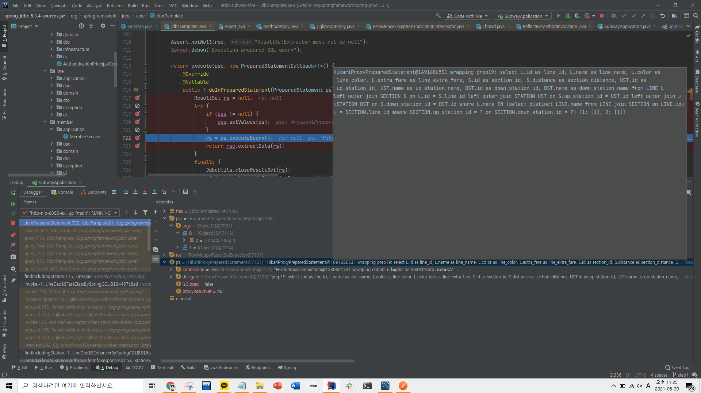
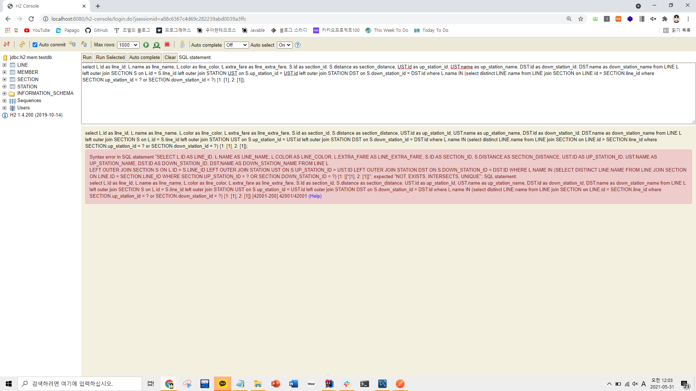
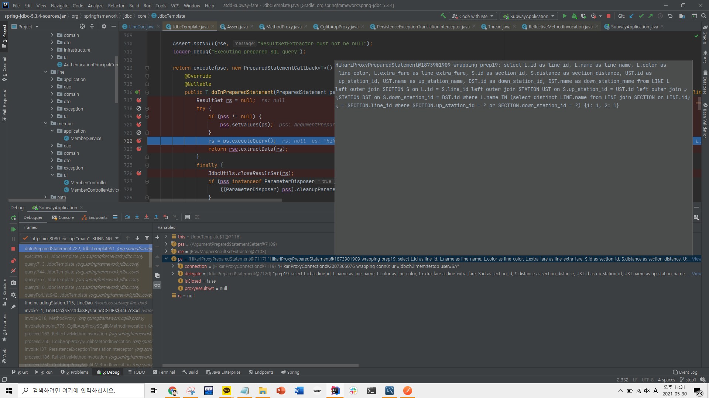
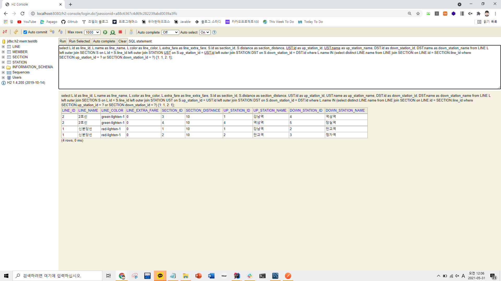
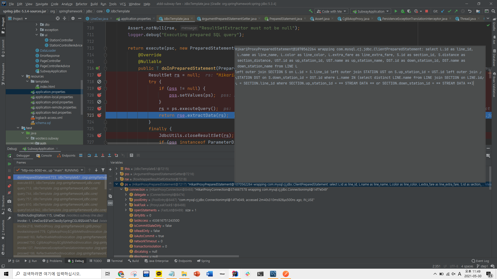

### 2021-05-30

## jdbcTemplate.queryForList()
- **오늘의 문제 상황**
    ```java
    public List<Line> findIncludingStation(Long stationId) {
        String sql = "select L.id as line_id, L.name as line_name, L.color as line_color, L.extra_fare as line_extra_fare, " +
                "S.id as section_id, S.distance as section_distance, " +
                "UST.id as up_station_id, UST.name as up_station_name, " +
                "DST.id as down_station_id, DST.name as down_station_name " +
                "from LINE L \n" +
                "left outer join SECTION S on L.id = S.line_id " +
                "left outer join STATION UST on S.up_station_id = UST.id " +
                "left outer join STATION DST on S.down_station_id = DST.id " +
                "where L.name IN (select distinct LINE.name " +
                "from LINE join SECTION on LINE.id = SECTION.line_id " +
                "where SECTION.up_station_id = ? or SECTION.down_station_id = ?)";
    
        List<Map<String, Object>> result = jdbcTemplate.queryForList(sql, new Object[]{stationId}, new Object[]{stationId});
        return mapLines(result);
    }
    ```
    - 다음과 같이 코드를 작성해놓고, H2로 돌아가는 스프링 부트 테스트 코드 다 통과 시키고 룰루랄라 서버에 배포
    - 근데 서버에서 계속 해당 jdbcTemplate.queryForList()의 결과를 "[]" 빈 List로 반환함
    - 어라...? H2에서는 이게 하나도 안터지던 테스트였는데?
    - 어라? H2를 기본으로 하고 로컬에서 서버 키고 PostMan으로 보내보면 결과 잘 반환하는데?
    - 근데 서버에 올려서 mysql로 하면 안된다? 왜..지??
    
- **queryForList()를 좀 봐보자**
    ```java
    @Override
    public List<Map<String, Object>> queryForList(String sql, @Nullable Object... args) throws DataAccessException {
        return query(sql, args, getColumnMapRowMapper());
    }
    ```
    - queryForList 메서드는 jdbcTemplate 클래스 안에 있음
    - Object... 로 가변인자로 받고있음
        - !!!!!!!!!!!!!!뇌절 포인트!!!!!!!!!!!!!!
        - 내가 지금 Object... 에 건네준 방식은 [[stationId], [stationId]]의 형태임
        - 이게 어떤 결과를 초래하냐면
            - **H2 Database 쓰는경우**
            - 
            - H2에 날릴 쿼리를 이렇게 작성하게함
            - 쿼리의 끝부분을 다시보면...
                -  where SECTION.up_station_id = ? or SECTION.down_station_id = ?) {1: [1], 2: [1]}
                - 이렇게 생겼음!
                - 물음표에 [1] 이런게 들어가는건 좋은 쿼리가 아님
                - 이 쿼리가 웹 화면 h2-console에서는 터지거든?
                - 
                - 근데 왜 프로그램에서 정상 동작하는지는 진짜 아직도 모르겠음;;;;;

- **그래서 다음과 같이 바꿔야해**
    ```java
    public List<Line> findIncludingStation(Long stationId) {
        String sql = "select L.id as line_id, L.name as line_name, L.color as line_color, L.extra_fare as line_extra_fare, " +
                "S.id as section_id, S.distance as section_distance, " +
                "UST.id as up_station_id, UST.name as up_station_name, " +
                "DST.id as down_station_id, DST.name as down_station_name " +
                "from LINE L \n" +
                "left outer join SECTION S on L.id = S.line_id " +
                "left outer join STATION UST on S.up_station_id = UST.id " +
                "left outer join STATION DST on S.down_station_id = DST.id " +
                "where L.name IN (select distinct LINE.name " +
                "from LINE join SECTION on LINE.id = SECTION.line_id " +
                "where SECTION.up_station_id = ? or SECTION.down_station_id = ?)";
    
        List<Map<String, Object>> result = jdbcTemplate.queryForList(sql, new Object[]{stationId, stationId});
        return mapLines(result);
        //OR!
        List<Map<String, Object>> result = jdbcTemplate.queryForList(sql, stationId, stationId);
        return mapLines(result);
    }
    ```    
    - 이제 queryForList()의 Object...에 넘겨줄 인자가 [stationId, stationId] 로 스무스해진 것을 알 수 있어
    - 이게 곧 다음과 같은 쿼리를 H2에서 날리게 해줘
    - 
    - 쿼리의 끝부분을 다시보면...
        -  where SECTION.up_station_id = ? or SECTION.down_station_id = ?) {1: 1, 2: 1}
    - 해당 쿼리는 심지어 웹 콘솔에서도 뚝딱 원하는 결과를 반환해
        - 

- **mysql에서는?**
    - 
    - 여기는 쿼리를 좀 이상하게 날리네...
    - DataSource 이런것과도 연관이 있지 않을까 싶어