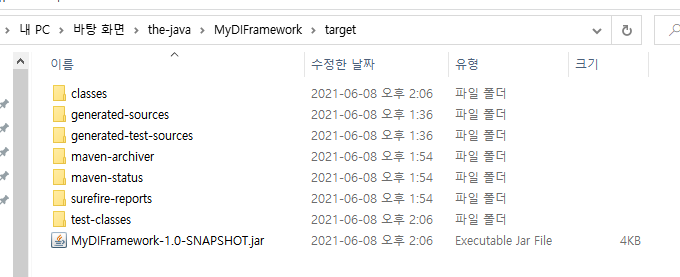
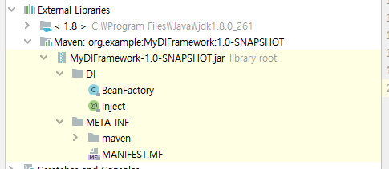

### 2021-06-08

## DI 만들어보기
- 다음과 같이 Inject 어노테이션을 만들기
    ```java
    @Retention(RetentionPolicy.RUNTIME)
    @Target(ElementType.FIELD)
    public @interface Inject {
    }
    ```
  
- 클래스 타입을 넘겨주면, 새로운 빈 객체를 생성한다. 해당 빈 객체의 필드로 주입해줘야할 객체가 있다면 생성하여 주입해준다
    ```java
    public class BeanFactory {
    
        public static <T> T getBean(Class<T> classType) {
            final T newInstance = createNewInstance(classType);
            InjectField(classType, newInstance);
            return newInstance;
        }
    
        private static <T> void InjectField(Class<T> classType, T newInstance) {
            Arrays.stream(classType.getFields()).forEach(field -> {
                if (field.getAnnotation(Inject.class) != null) {
                    final Object fieldInstance = getBean(field.getType());
                    try {
                        field.setAccessible(true);
                        field.set(newInstance, fieldInstance);
                    } catch (IllegalAccessException e) {
                        e.printStackTrace();
                    }
                }
            });
        }
    
        private static <T> T createNewInstance(Class<T> classType) {
            final Constructor<T> constructor;
            try {
                constructor = classType.getConstructor(null);
                return constructor.newInstance();
            } catch (Exception e) {
                throw new RuntimeException("새로운 빈 생성 실패");
            }
        }
    }
    ```

- mvn install 명령어를 통해 해당 프로덕션 코드를 jar 파일로 배포!  
    

- 이제 해당 라이브러리를 가져와서 사용해보자
    - pom.xml에 다음과 같이 의존성을 추가해주면
    ```xml
    <dependencies>
        <dependency>
            <groupId>org.example</groupId>
            <artifactId>MyDIFramework</artifactId>
            <version>1.0-SNAPSHOT</version>
        </dependency>
    </dependencies>
    ```
    - 이렇게 외부 라이브러리로 나의 코드가 주입된 것을 알 수 있다  
        
    
- 이제 사용해보기!
    ```java
    public class Controller {
        @Inject
        public Service service;
    
        public void getStations() {
            System.out.println("Controller Get Stations");
            service.getStations();
        }
    }
    
    public class Service {
        @Inject
        public Repository repository;
    
        public void getStations() {
            System.out.println("Service Get Station!");
            repository.getStations();
        }
    }
    
    public class Repository {
        public void getStations() {
            System.out.println("Repository Get Stations");
        }
    }
    
    public class Main {
        public static void main(String[] args) {
            final Controller controller = BeanFactory.getBean(Controller.class);
            controller.getStations();
        }
    }
    
    >> 결과
    Controller Get Stations
    Service Get Station!
    Repository Get Stations
    ```
