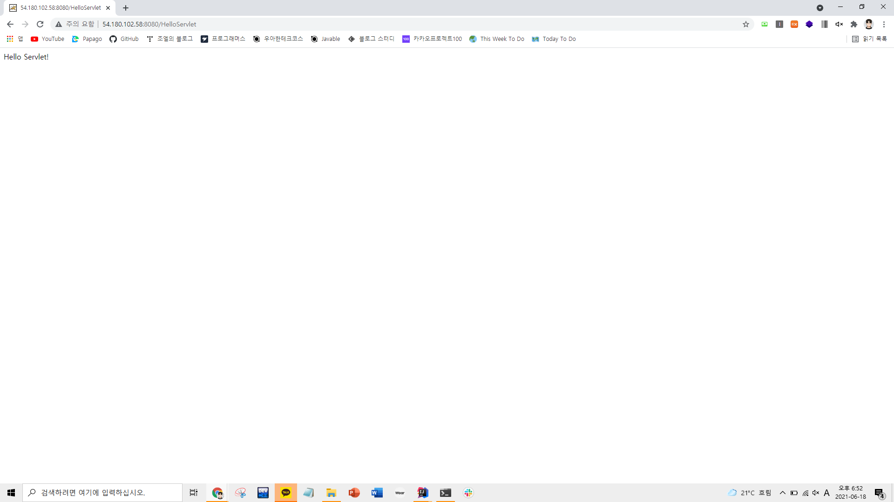

### 2021-06-18

## 웹 서버는 왜 필요한가?
- *참고: https://www.youtube.com/watch?v=Zimhvf2B7Es*
- 웹 서버
    - HTML, CSS, JS, data, 이미지 등의 서버 역할을 해줌
    - 정적 웹을 서빙함
    - PHP로 만든 간단한 동적 웹 서빙 가능
    - WAS와의 중간 다리 역할을 함
    - 보안과 운영에 장점!
- 웹 서버의 기능 *(장점 및 쓰임새)*
    1. Reverse Proxy
        - 클라이언트로부터 서버의 정보를 감춤
            - 서버의 내부 구조를 가릴 수 있음
                - 정적 리소스들이 어디에 위치해 있는지
                - WAS가 어디에 배포되어 있는지, 몇 번 포트로 돌고 있는지 
        - 보안 측면에서 장점을 제공함!
    2. Load Balancing
        - Client의 요청이 몰릴 때 분산해서 요청 처리하도록
            - 하나의 WS에서 여러개의 WAS를 두도록 하여 지속성을 유지시킴
    3. Caching
        - 자주 요청되는 서버의 자원을 캐싱해둬 빨리 전달할 수 있도록 하기 위함
    4. 서비스를 안정적으로, 안전하게 돌리기 위한 기타 기능
        - WAS health check

## 웹 서버 종류
- *참고 1: https://velog.io/@ksso730/Nginx-Apache-%EB%B9%84%EA%B5%90*
- *참고 2: https://taetaetae.github.io/2018/06/27/apache-vs-nginx/*
- *참고 3: https://cntechsystems.tistory.com/24*
- *참고 4: https://youngmind.tistory.com/entry/Apache-vs-Nginx*
- __Apache__
    - 다양하고 검증된 기능!
    - MPM 방식으로 HTTP 요청 처리
        - PreFork MPM *(다중 프로세스)*
            - Client 요청에 대해 자식 "프로세스"를 생성하여 처리
            - 자식 프로세스당 하나의 쓰레드 가짐
            - 독립적인 프로세스로 돌아가기에 안정적 but 메모리 소모가 큼
        - Worker MPM *(다중 쓰레드)*
            - 각 프로세스의 쓰레드를 생성해 처리하는 구조
            - 쓰레드 간의 메모리 공유 가능
                - 각 쓰레드는 하나의 연결만을 부여받음
        - 동시접속 요청이 들어오면 CPU와 메모리 사용이 증가... 대용량 요청에서 한계 

- __Nginx__
    - 성능과 가벼움!
    - Event Driven 방식
        - 요청이 들어오면 어떤 동작 해야하는지만 알려주고 다른 요청 처리
        - 프로세스를 fork하거나 쓰레드 사용하지 않고, IO를 모두 Event Listener로 미룸
            - 먼저 처리되는 것 부터 로직이 진행되도록 함
    - Nginx 특징
        - 쓰레드를 많이 사용하지 않음
            - 적은 수의 쓰레드로 효율적인 일처리
            - 쓰레드 당 메모리도 적게 사용
            - System Resource 자체를 적게 쓰게됨
        - 최소한의 리소스로 웹 서버의 아키텍쳐 개선위해 독립형 HTTP 서버 배치 가능
        - 정적 컨텐츠 처리가 탁월함
            - 동적 처리를 별도로 담당하는 SW 스택과 연계하여 고성능 서비스 제공 가능
            - 따라서 프록시 서비스로도 많이 사용됨 *(nginx.conf의 location)*
        - nginx.conf 예시
        ```
        events {}
        
        http {       
          upstream app {
            // 도커 내의 Localhost
            server 172.17.0.1:8080;
          }
          
          # Redirect all traffic to HTTPS
          server {
            listen 80;
            return 301 https://$host$request_uri;
          }
        
          server {
            listen 443 ssl;  
            ssl_certificate /etc/letsencrypt/live/[도메인주소]/fullchain.pem;
            ssl_certificate_key /etc/letsencrypt/live/[도메인주소]/privkey.pem;
        
            # Disable SSL
            ssl_protocols TLSv1 TLSv1.1 TLSv1.2;
        
            # 통신과정에서 사용할 암호화 알고리즘
            ssl_prefer_server_ciphers on;
            ssl_ciphers ECDH+AESGCM:ECDH+AES256:ECDH+AES128:DH+3DES:!ADH:!AECDH:!MD5;
        
            # Enable HSTS
            # client의 browser에게 http로 어떠한 것도 load 하지 말라고 규제합니다.
            # 이를 통해 http에서 https로 redirect 되는 request를 minimize 할 수 있습니다.
            add_header Strict-Transport-Security "max-age=31536000" always;
        
            # SSL sessions
            ssl_session_cache shared:SSL:10m;
            ssl_session_timeout 10m;      
        
            location / {
              proxy_pass http://app;    
            }
          }
        }
        ```

## WAS 종류
- *참고 1: https://velog.io/@kdhyo/Apache-Tomcat-%EB%91%98%EC%9D%B4-%EB%AC%B4%EC%8A%A8-%EC%B0%A8%EC%9D%B4%EC%A7%80*
- __WAS__
    - 동적 웹을 만들기 위해 DB 처리, 비즈니스 로직 처리
- __Tomcat__
    - 동적 사이트 전문 처리
        - 사실 웹 서버들도 PHP로 만든 간단한 동적 웹 프로그래밍 가능
        - 하지만 무거운 요청이 들어오면 이걸로 넘겨줘야함
        - JSP와 Servlet을 구동하기 위한 서블릿 컨테이너 역할
            - DB 연결, 다른 어플리케이션과 상호작용 가능
        - 자바 서블릿을 실행시키고 JSP 코드가 포함되어 있는 웹 페이지를 만들어줌
    - 서블릿 컨테이너?
        - 서블릿
            - 클라이언트의 요청을 받고, 처리하여 결과를 클라이언트에게 제공하는 자바 인터페이스
            - java.servlet.package에 정의된 인터페이스로, 라이프 사이클을 위한 3가지 필수 메서드
                - init()
                - service()
                - destroy()
        - 컨테이너
            - 동적인 데이터를 가공하여 정적인 파일로 만들어주는 모듈
        - 서블릿 컨테이너
            - 서블릿들을 모아서 관리
            - 새로운 요청 들어올 때마다 새로운 스레드 생성
            - 작업 끝난 스레드 자동 제거
    - 사용 방법
        - 스프링으로 코딩한 웹앱 war로 빌드
            - 이 안에 .class, jsp, 이미지, css, js 있음
        - Tomcat을 다운 받아, Tomcat의 특정 폴더에 war 파일 넣고 명령어 실행하면 스프링 서비스가 톰캣을 사용해서 돌게됨
    - 요즘은 반대로 스프링을 톰캣이 들어있는 jar 파일로 빌드해서 배포하기도 함

## Tomcat에 Servlet 띄워보기
- *참고 1: https://programmerhoiit.tistory.com/2*
- *참고 2: http://june0313.github.io/2018/05/22/install-tomcat-on-ubuntu/*
1. Tomcat을 우분투에 설치하기
    - 톰캣 홈페이지(http://tomcat.apache.org/) 에 방문하여 다운로드할 톰캣 URL 가져옴
    - wget 명령어로 설치
        ```bash
        wget https://mirror.navercorp.com/apache/tomcat/tomcat-10/v10.0.7/bin/apache-tomcat-10.0.7.tar.gz
        ```
    - 이후 압축 풀기
        ```bash
        tar -zvxf apache-tomcat-10.0.7.tar.gz
        ```

2. Tomcat 실행/종료 해보기 
    - apache-tomcat-10.0.7/bin의 startup.sh 로 톰캣 실행
        - 기본적으로 8080 포트에 잡혀있음
        - http://EC2-public-ip:8080 로 들어가면 톰캣 웰컴 페이지 나옴
        
    - apache-tomcat-10.0.7/bin의 shutdown.sh로 톰캣 종료

3. HelloServlet.java 만들기
    - apache-tomcat-10.0.7/webapps/ROOT/WEB-INF 으로 이동
    - classes, src 디렉토리 만들어주기
    - src 내부에 HelloServlet.java 만들어주기
        ```java
        import jakarta.servlet.ServletException;
        import jakarta.servlet.http.HttpServlet;
        import jakarta.servlet.http.HttpServletRequest;
        import jakarta.servlet.http.HttpServletResponse;
        
        import java.io.IOException;
        import java.io.PrintWriter;
        
        public class HelloServlet extends HttpServlet {
            public void init() {
                System.out.println("init...");
            }
        
            @Override
            public void doGet(HttpServletRequest req, HttpServletResponse resp)
                    throws ServletException, IOException
            {
                System.out.println("doGet here");
                resp.setContentType("text/html");
                PrintWriter out = resp.getWriter();
                out.println("<html><body>Hello Servlet!</body></html>");
            }
        
            public void destroy() {
                System.out.println("destroy!");
            }
        }
        ```
    - 필수적으로 정의해줘야 하는 init(), destroy()와 doGet()으로 Get메서드 오버라이딩 해준 것 볼 수 있다
      
4. HelloServlet.class 만들기
    - 이렇게 만들어 준 자바 소스 코드를 클래스 파일로 만들어주자
        - 해당 클래스 파일은 apache-tomcat-10.0.7/webapps/ROOT/WEB-INF/classes에 저장해둘 것
    - 톰캣의 servlet-api.jar가 컴파일할때 필요함! 다음과 같이 classpath 지정해주자
        ```bash
         javac -d ../classes HelloServlet.java -cp ../../../../lib/servlet-api.jar
        ```
    - 이제 apache-tomcat-10.0.7/webapps/ROOT/WEB-INF/classes에 "HelloServlet.class"가 생긴 것을 알 수 있음
    
5. web.xml에 HelloServlet 등록해주기
    - apache-tomcat-10.0.7/webapps/ROOT/WEB-INF의 web.xml에서 서블릿을 등록해주면 됨
    ```xml
    <?xml version="1.0" encoding="UTF-8"?>
    <!--
     Licensed to the Apache Software Foundation (ASF) under one or more
      contributor license agreements.  See the NOTICE file distributed with
      this work for additional information regarding copyright ownership.
      The ASF licenses this file to You under the Apache License, Version 2.0
      (the "License"); you may not use this file except in compliance with
      the License.  You may obtain a copy of the License at
    
          http://www.apache.org/licenses/LICENSE-2.0
    
      Unless required by applicable law or agreed to in writing, software
      distributed under the License is distributed on an "AS IS" BASIS,
      WITHOUT WARRANTIES OR CONDITIONS OF ANY KIND, either express or implied.
      See the License for the specific language governing permissions and
      limitations under the License.
    -->
    <web-app xmlns="https://jakarta.ee/xml/ns/jakartaee"
      xmlns:xsi="http://www.w3.org/2001/XMLSchema-instance"
      xsi:schemaLocation="https://jakarta.ee/xml/ns/jakartaee
                          https://jakarta.ee/xml/ns/jakartaee/web-app_5_0.xsd"
      version="5.0"
      metadata-complete="true">
    
      <display-name>Welcome to Tomcat</display-name>
      <description>
         Welcome to Tomcat
      </description>
    
      <servlet>
              <servlet-name>HelloServlet</servlet-name>
              <servlet-class>HelloServlet</servlet-class>
      </servlet>
      <servlet-mapping>
              <servlet-name>HelloServlet</servlet-name>
              <url-pattern>/HelloServlet</url-pattern>
      </servlet-mapping>
    
    </web-app>
    ```
    - "servlet"에서 서블릿의 이름을 지정해주고, 서블릿의 클래스 파일을 지정해준듯?
    - "servlet-mapping"에서 서블릿의 이름에 대응하는 url-pattern을 정의해준듯?
    
6. 이제 진짜 Tomcat 실행해보기 
    - http://EC2-public-ip:8080/HelloServlet으로 들어가보자!
    
    - 짜잔 잘 된다!!!!!