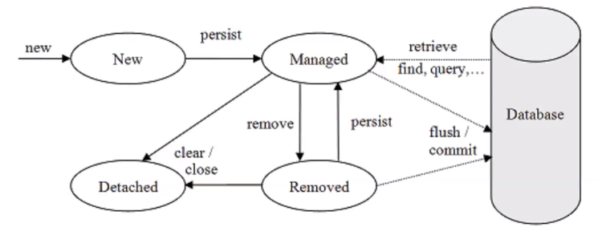

### 2021-06-28

## JPA 제이슨
- **마음 한편에는,,,**
    - Dao가 서로 의존해서 객체를 만들어야 할지 고민
    - 부모 자식 관계가 삭제되면 DB에 자동 반영될 수는 없나?

- **태초에,,,**
    - 객체 지향 패러다임
        - 시스템을 구성하는 객체들에게 적절한 책임 할당
            - 상속
            - 연관관계
        - 자유롭게 객체 그래프를 탐색할 수 있어야 함
    - 테이블
        - 방향성이 서로 없어 
            - A JOIN B를 하던
            - B JOIN A를 하던

- **SQL을 직접 작성하는 것의 문제점,,,**
    - 반복 작업
        - 새로운 필드 추가되면 SQL 다 추가해줘야해
    - 신뢰성
        - 개발자들이 Dao에서 조회해 온 엔티티 신뢰할 수 없다        
        
- **JPA (ORM Framework)**
    - hibernate 구현체
    - 장점
        - DB 스키마 자동생성 (내가 만든 객체를 기준으로!)
            - JPA가 보고 오? 이거 이런 테이블 만들면 되겠구나!
                - "spring.jpa.hibernate.ddl-auto=create"
                    - create: 기존 테이블 삭제 후 생성
                    - create-drop: create와 같으나 종료시점에 테에블 DROP
                    - update: 변경된 부분만 반영
                    - validate: entity와 table이 정상 매핑되었는지만 확인
                    - none: 사용하지 않음
    - 실습
        - 의존성
            - implementation 'org.springframework.boot:spring-boot-starter-date-jpa'
        - 사용법
            - 객체에 `@Entity`를 추가
            - 파라미터 없는 생성자 만듦 *(리플렉션과 비슷한 기술 사용함)*
            - Entity에 PK를 등록해주기 + Auto-increment 설정
                - `@Id` 어노테이션 붙여주기
                - `@GeneratedValue()`를 통해 어떻게 Id값 관리할지 지정
                    - strategy = GeneratedType.IDENTITY
                    - strategy = GeneratedType.SEQUENCE // PK 값 관리 테이블 별도 지금
                    - strategy = GeneratedType.AUTO // DB 벤더사에 의존적이라 위험함
            - `@Table(name = "station")` 매핑할 테이블 이름 지정
                - 안해주면 그냥 엔티티 이름이 테이블 이름
            - `@Column(nullable = false)`
                - 해당 필드는 not null!
                - DB 스키마 상에서 null이 될 수 없다는겨
                - `@NotNull` 이거랑은 달라

- **Spring Data JPA**
    - save(), findBy~()와 같은 반복작업을 
        - CRUDRepository를 만들어뒀어
        - JpaRepository<Station, Long> // 객체와 ID의 형
    - findByName() 과 같은 기능도 자동완성 해줄수 있어
    ```java
    public interface StationRepository extends JpaRepository<Station, Long> {
        Optional<Station> findByName(String name);
        List<Station> findAllByName(String name);
    }
    ```
    - 테스트 코드 작성
        - `@DataJpaTest`를 통해 필요한 설정 해둘 수 있음
        
- **영속성 컨텍스트**
    - 엔티티를 영구 저장하는 환경
    - 엔티티 매니저는 한 트랜잭션당 엔티티 매니저 생성함
    - 엔티티 매니저 팩토리는 하나만 생성
    - 엔티티 매니저로 엔티티 저장/조회 시 엔티티 매니저는 영속성 컨텍스트에 엔티티 보관/관리
        - 1차 캐시
        - 동일서 보장
        - 트랜잭션 지원 쓰기 지연
        - 변경 감지 
        - 지연 로딩
    - id를 key값으로 Entity를 value로
        - 캐시에 있으면 해당 Entity 반환
        - 캐시에 없으면 DB에 Entity 조회해서 반환
    - 엔티티의 생명주기
        - 비영속: 방금 인스턴스 생성한거 (메모리엔 있는데 DB/영속성 컨텍스트는 모름)
        - 영속: 영속성 컨텐스트에 저장한 상태
        - 준영속: 영속성 컨텍스트에 저장했다가 분리된 상태 (트랜잭션 벗어난 경우)
        - 삭제: 삭제된 상태
        - 
    - Transaction이 없으면 동작하지 않아!     
        - EmbeddedTomcat 하나의 요청 당 하나의 쓰레드, 하나의 트랜잭션
            - 하나의 요청에 대해 캐싱 동작
    - `@Transactional`
        - 트랜잭션 커밋하는 순간 영속성 컨텍스트 ---> 데이터베이스
        - commit & flush
    - 쓰기지연 SQL 저장소
        - INSERT QUERY 등
        - 여기에 쿼리를 쌓아 두었다가 commit() 되면 이거 촤르르 flush()
            - 이게 쓰기지연
    - 변경 감지
        - SNAPSHOT과 ENTITY를 비교하여 달라졌다면 update query 생성후 commit()
        - 마치 컬렉션을 다루듯이 DB를 사용하자
        ```java
        @Test
        public void update() {
            final Station station = stations.save(new Station("잠실역"));
            station.changeName("잠실나루역");
            // 변경 감지하고 update 쿼리 커밋한다
            final Station actual = stations.findByName("잠실나루역");
            assertThat(actual).isNotNull();
            // 여기서 트랜잭션 커밋
        }
        ```
        - 참고로 1차 캐시론 조회 안댐
            - 1차 캐시 key값은 ID
            - ID를 기반으로 1차 캐시 찌르기 가능
            - ID 기반 아니면 바로 DB를 찔러
        - Id 기반으로 찌르지 않는 친구들을 "JPQL"이라고 함
            - 직접 쿼리를 생성하는 것

## DB 관련 키워드 
- **Transaction**
    - *참고: https://mommoo.tistory.com/62*
    - DB의 상태를 변화시키기 위해 수행하는 "쪼개질 수 없는 작업의 단위" 뜻함
    - 특징
        - 원자성: DB에 모두 반영되던가, 전혀 반영되지 않던가
        - 일관성: 작업처리가 항상 일관성 있어야 함
        - 독립성: 어떤 하나의 트랜잭션이라도, 다른 트랜잭션의 연산에 끼어 들 수 없음
        - 지속성: 결과는 영구적으로 반영되어야 함
        - Commit: 하나의 트랜잭션 성공적으로 끝남. DB 일관성있는 상태에 있음
        - Rollback: 하나의 트랜잭션 처리가 비정상적으로 끝나 원자성이 깨진 경우, 트랜잭션 재시작 or 연산 취소
    
- **Primary Key**
    - *참고: https://docs.microsoft.com/ko-kr/sql/relational-databases/tables/primary-and-foreign-key-constraints?view=sql-server-ver15*
    - 테이블에 일반적으로 테이블의 각 행을 고유하게 식별하는 값
        - 데이터의 고유성 보장
    - 두 개의 열을 섞어서 PK로 하는 경우도 있음

- **Foreign Key**
    - *참고: https://brunch.co.kr/@dan-kim/26*
    - 두 테이블의 데이터 간 연결을 설정하고 강제 적용하여 외래 키 테이블에 저장될 수 있는 데이터를 제어하는 데 사용
    - 한 테이블의 기본 키 값을 가지고 있는 열을 다른 테이블의 열이 참조할 때 두 테이블간의 연결 생성
    - 다른 테이블의 기본키를 참조
    - 중복된 데이터를 효율적으로 표현하기 위함
        - 주문 테이블에서 사용자 아이디 정보를 활용해 사용자 테이블의 정보를 찾을 수 있음
    - 외래키는 두 테이블을 연결하는 연결 다리로, 참조하는 테이블에 무결성 *(DB의 값이 정확함)* 을 높여주는 역할을 함

- **CASCADE**
    - *참고: https://brownbears.tistory.com/182*
    - 부모 테이블에서 해당 행이 업데이트/삭제 시, 참조 테이블에서도 해당 행이 업데이트/삭제
    
- **실습**
    ```sql
    create table parent(
        id bigint auto_increment not null, 
        name varchar(10) not null,
        primary key(id)
    );
    
    create table child(
        id bigint auto_increment not null, 
        name varchar(10) not null,
        parent_id bigint not null,
        primary key(id),
        foreign key(parent_id) references PARENT(id)
    );
    
    insert into parent(name) values ('parent1');
    insert into child(name, parent_id) values ('child1', 1);
    delete from parent where id = 1;
    
    >> 오류 발생!!!!!
    Referential integrity constraint violation: 
    "CONSTRAINT_3D: PUBLIC.CHILD FOREIGN KEY(PARENT_ID) REFERENCES PUBLIC.PARENT(ID) ('1')"; SQL statement:
    delete from parent where id = 1 
    ```
    
    ```sql
    create table parent(
        id bigint auto_increment not null, 
        name varchar(10) not null,
        primary key(id)
    );
    
    create table child(
        id bigint auto_increment not null, 
        name varchar(10) not null,
        parent_id bigint not null,
        primary key(id),
        foreign key(parent_id) references PARENT(id) on delete cascade
    );
    
    insert into parent(name) values ('parent1');
    insert into child(name, parent_id) values ('child1', 1);
    delete from parent where id = 1;
    
    >> 정상 처리
    데이터 삭제 시 문제 없이 뚝딱 삭제된다
    ```

## STUB vs MOCK
- *참고 1: https://joont92.github.io/tdd/%EC%83%81%ED%83%9C%EA%B2%80%EC%A6%9D%EA%B3%BC-%ED%96%89%EC%9C%84%EA%B2%80%EC%A6%9D-stub%EA%B3%BC-mock-%EC%B0%A8%EC%9D%B4/*
- 테스트 더블: 테스팅을 목적으로 진짜 객체 대신 사용되는 모든 종류의 위장 객체
    - Dummy, Stub, Mock

- **STUB**
    - 호출되면 미리 준비된 답변으로 응답
    - 테스트 시에 프로그램 된 것 외에는 응답 X
    - 협력 객체의 특정 부분 힘들다면 stub을 사용해 수월한 테스트 가능
    - 일반적으로 우리가 mock으로 잘못 알고 있음

- **MOCK**
    - 행위 검증 사용을 추구
        - 상태 검증: 메서드가 수행된 후 협력 객체의 "상태"를 살펴보고 올바로 작동했는지를 판단
        - 행위 검증: 특정 메서드가 호출되었는지의 "행위"를 검사하여 올바로 작동했는지를 판단
    - 행위를 기록하는 식의 로직이 들어있음

 