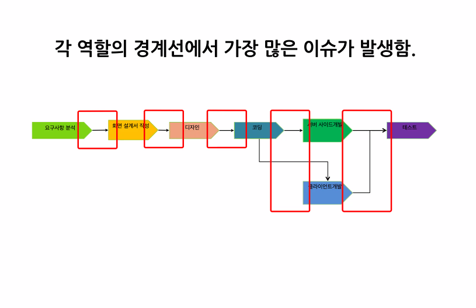
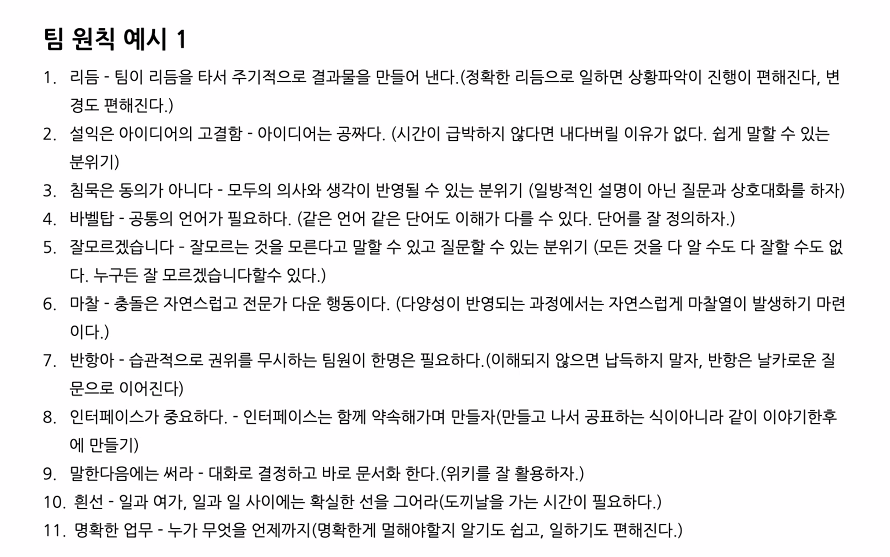
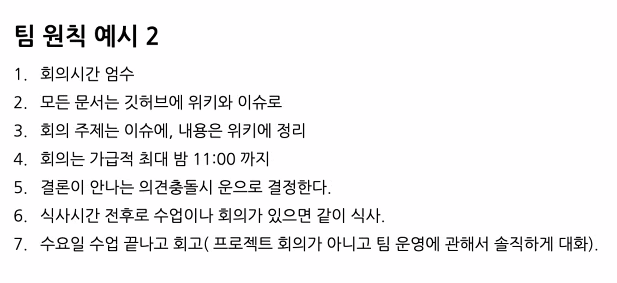

### 2021-07-02

## 포비 수업
- 부족함을 대하는 자세
    - 부정적으로 생각해서 좋을게 없어,,,
    - 빠름이 꼭 좋은 것이 아니다
    - 성장할 수 있는 여지가 많은 것이 아닐까?
- 찐한 협업
    - 배려한답시고 충돌을 피하지 마세요
- 팀 개발 문화 만들기
    - 각각의 역할이 세분화되어있는 현장
        - 이게 과연 좋을까?
    
    - 주인의식을 가지고 개입하지 않으면 무책임한 태도로 떠넘김
    - 좋은 팀이 되려면 자신의 분야에 대해서만 주인의식을 가지지 말고!
    - **프로젝트 전체에 대해 주인 의식을 가지자!!**
    - 기능 하나에 대해서 하나의 싸이클을 반복해 나가는 형식!
    - 작은 단계로 세분화 될 수 있도록 하는 것
        - 제조업, 하드웨어 에서는 효율적일 수 있지만 SW에서는 꼭 그렇지 않다
            - 서로 커뮤니케이션을 하는데에 비용이 발생해
- 팀이 지켜야할 원칙 만들기
    - 팀원 개개인이 지켜야할 원칙을 만들고 지켜나가는 것
    
    - 멋진 문구를 만들기 보다는 행동으로 지켜나가자
    
    - 쉬운 문구를 만들어 와닿게 하는게 더 좋지 않을까?
- 레벨3 핵심목표
    - 혼자가면 빨리 가고 함께가면 멀리 간다.
    - 빠르다고 좋은게 아니다.
    - 처음엔 빠르지만 후반에 갈등상황이 많아지면서 느려질 수 있다.
- 스크럼 개발 프로세스
    - 데일리와 회고
    - 짝 프로그래밍
    - 코드리뷰
    - TDD
    - 스크럼
        - 프로젝트 우선 순위 정하기
- 이슈 관리
    - 요구 사항 분석
        - To Do List
    - 팀의 우선순위를 분석하고 파악한다
    - 업무 배정?
        - 대부분의 회사
            - 팀장이 "야 너 이거 해"
            - push 방식
            - 수직 구조에 적합
        - 우리는
            - 우선 순위에 따라 본인이 본인의 업무를 할당한다
            - pull 방식
            - 수평 구조에 적합
- 일정 추정
    - 각 이슈별 일정 산정은 어떻게?
        - 경험 많은 CTO에게 일방적으로 맡겨?
           - 시니어는 공격적으로 할당
        - 반면 주니어는 약간 보수적
    - 일정을 정할 때 몇일?
        - MAX와 MIN 설명해야함
    - 플래닝 포커!
    