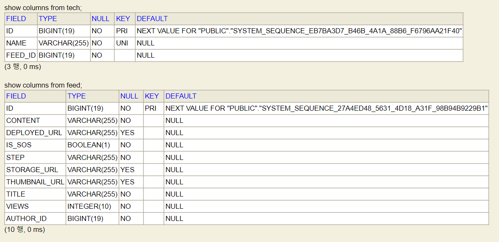

### 2021-07-07

## JPA 실전!
- **PK(id)**
    - `@Id`
    - `@GeneratedValue(strategy = GenerationType.IDENTITY)`

- **Column에 속성 지정하기**
    - `@Column()`
        - nullable = false *(NOT NULL)*
        - unique = true *(UNIQUE)*

- **외래키를 매핑하기**
    ``` java
    public class Feed {
        @ManyToOne(fetch = FetchType.LAZY)
        @JoinColumn(foreignKey = @ForeignKey(name = "fk_feed_to_author"), nullable = false)
        private User author;
    }
    
    public class User {
        @OneToMany(mappedBy = "author")
        private List<Feed> feeds = new ArrayList<>();
    }
    ```
    - Feed 여러개가 User 하나로 매핑될 거에요
    - Feed
        - User author가 외래키 관리자
        - `@ManyToOne`으로 User에게 매핑
        - FetchType.LAZY로 LAZY-LOADING
        - `@JoinColumn(foreignKey = @ForeignKey(name = "~~~"))`
            - "~~~"로 fk 제약조건 명명!
    - User
        - Lis<Feed>가 `@OneToMany`의 관계라고 명시
        - "mappedBy"를 통해 해당 필드의 외래키 관리자는 author 라고 명시
        
- **뇌절 포인트**
    - 어라? 왜 Tech가 Feed를 알고 있지?
        ```java
        @Entity
        public class Tech {
        
            @Id
            @GeneratedValue(strategy = GenerationType.IDENTITY)
            private Long id;
        
            @Column(nullable = false, unique = true)
            @NotBlank
            private String name;
        
            @ManyToOne(fetch = FetchType.LAZY)
            @JoinColumn(foreignKey = @ForeignKey(name = "fk_tech_to_feed"), nullable = false)
            private Feed feed;
        }
        ```
    - 그것은 Feed에서 List<Tech>를 필요로 하기 때문이야
        - {Tech 다수 --- Feed 하나} 매핑 관계이기 때문에 외래키는 Tech에서 관리해
        ```java
        @Entity
        public class Feed {
        
            @Id
            @GeneratedValue(strategy = GenerationType.IDENTITY)
            private Long id;
        
            @OneToMany(mappedBy = "feed")
            private List<Tech> techs = new ArrayList<>();
        }
        ```
    - 

    