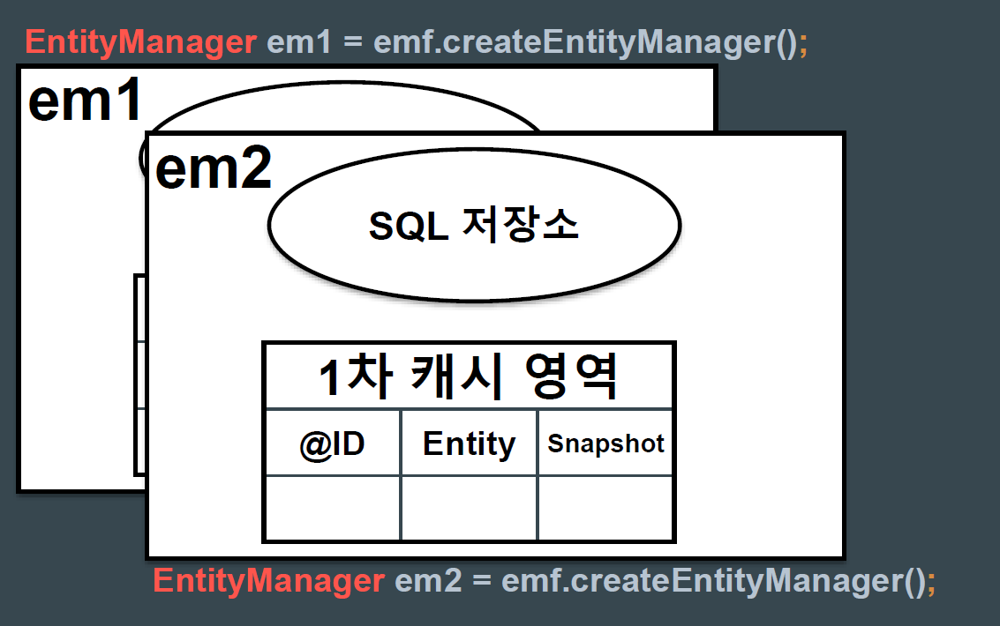

### 2021-07-07

## 영속성 컨텍스트로 보는 JPA
- **JDBC -> JPA**
    - JDBC: connection-query-close
    - JPA
        ```java
        EntityManager em = entityManagerFactory.createEntityManager();
        //INSERT
        em.persist(user);
        //SELECT
        User user = em.find(User.class, 1);
        //UPDATE
        user.setUsername("Update Name");
        user.setPassword("1111");
        //DELETE
        em.remove(user);
        ```
- **엔티티 생명주기**
    - 비영속 --persist()--> 영속 --remove()--> 삭제  
    - 비영속 --persist()--> 영속 --detach()--> 준영속
    - 준영속 --merge()--> 영속
    - 영속 --detach()--> 준영속

- **엔티티 매니저 팩토리 & 엔티티 매니저**

- **영속성 컨텍스트**
    - 
    - 제공 기능
        - 쓰기 지연 SQL
        - 자동 변경 감지
        - 1차 캐시
        - 엔티티 동일성
        - 지연 로딩
    - 트랜잭션 단위에서 동작
        - commit() 호출 전 flush()
        
## application.properties 설정
- **현재 프로젝트 설정 파일**
    ```properties
    spring.datasource.url=jdbc:h2:mem:testdb;
    spring.datasource.username=sa
    
    spring.jpa.properties.hibernate.format_sql=true
    spring.jpa.show-sql=true
    spring.jpa.hibernate.ddl-auto=create
    spring.jpa.properties.hibernate.dialect=org.hibernate.dialect.H2Dialect
    
    logging.level.org.hibernate.type.descriptor.sql.BasicBinder=TRACE
    ```
    - 어라 나는 왜 그 동안 인메모리 디비가 안댔지?
        - spring.datasource.url=jdbc:h2:mem:testdb;
        - 이거 할 때는 DB dialect를 H2로 설정해둬야 하는구나?
    - DB 방언 설정
        - spring.jpa.properties.hibernate.dialect=org.hibernate.dialect.H2Dialect

## DB 방언?
- *참고: https://goodgid.github.io/What-is-Dialect/*
- 표준 SQL == ANSI SQL
- 각 DBMS 벤더에서 (MySQL, PostgreSQL, Oracle, MSSQL 등) 자신만의 방언을 추가
    - 독자적인 기능을 추가해줌
        - MSSQL T-SQL
        - Oracle PL/SQL
        - MySQL AUTO_INCREMENT
        - Oracle SEQUENCE
- JPA에서는 어플리케이션이 직접 SQL 작성하고 실행
    - DBMS마다 종류별로 사용하는 SQL 문법이 다름
    - JPA에서 Dialect라는 추상화된 방언 클래스 제공 + 각 벤더에 맞는 구현체 제공
        - Dialect 설정해주면, 해당 Dialect를 참고하여 그에 맞는 쿼리 생성
    - H2: spring.jpa.properties.hibernate.dialect=org.hibernate.dialect.H2Dialect
    - MySQL: spring.jpa.properties.hibernate.dialect=org.hibernate.dialect.MySQL57Dialect
