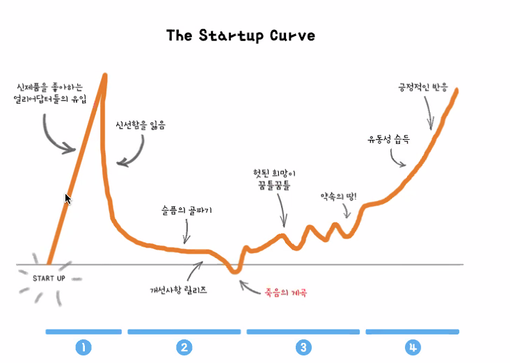

### 2021-07-11

## [초기 VC는 어떤 스타트업에 투자할까?] 풍성이형 특강
- **VC란??**
    - 스타트업에 투자하는 회사
    - 데스밸리 -> 스케일업 
        - 그때 그때 마다 필요한 돈을 투자
        - seed -> 시리즈A -> 시리즈B -> 시리즈C
        
- **아마존은 뭐하는 곳인가?**
    - Customer Obsession
    - 고객에게 어떠한 가치를 주는가?
        - 고객은 자기가 낸 비용보다 더 많은 가치를 느낄 때 돈을 낸다

- **시장의 원천**
    - 욕망을 만족시키는 서비스
        - ex. 타로 챗봇, 연예인, MBTI
        - 트렌드는 항상 바뀌어,,,
            - VC가 초반에 검토하기 힘들어
            - SNS 같은 것들 있자나? 이런 거는 특출나지 않으면 투자 힘들어
            - 진짜 투자 못받았다,,, IR에서 걸러
    - 문제를 푸는 서비스
        - 특정한 문제를 풀면, 문제를 겪는 고객들이 이 서비스 이용할 것
        - 문제를 푼다 == 욕망 만족
            - 비슷하긴 한데 말이지

- **그걸 기반으로 어떻게 검토할까?**
    - 왜 지금 이 팀이 이 문제를 가장 잘 풀 수 있는지!
        - Why Now
            - 아이디어, 팀, 비즈니스모델, 펀딩, 타이밍
            - 야! **타이밍**이 가장 중요해
            - 왜 5년 전은 너무 빨랐고, 5년 후는 너무 늦을까?
                - 기존 기업들이 포착하지 않/못하고 있는 곳은 어떤 허들이 존재
                - 허들이 허물어지는 3가지 요인
                    - 사회 구조의 변화
                        - OKHOME
                        - 프로덕트 헌트
                    - 기술의 변화
                        - AI 기반 스타트업
                    - 인식의 변화
                        - 마이리얼트립
                        - 에어비앤비
            - 지금까지 왜 없었지? 왜 팀은 잘하지?
        - Team
            1. 고객이 원하는 것을 잘 만들수 있는 역량이 이 팀에 있나?
                - 고객이 원하는 것을 만들지 못한다면 그것은 분명히 실패로 귀결!
                - Key Success Factor는 무엇일까?
                    - ex. 루닛: 얼마나 정확도 높은 AI 솔루션을 제공하는가?
            2. 팀이 얼마나 끈끈하고 Mission-Driven 한가?
                - 
                - 이러한 역경들이 있어도 버틸라면 미션이 확실해야함
            - 우리가 팀을 짠다면?
                - 우리기 때문에 가장 잘 풀 수 있는 영역이 있음
                    - MZ 세대를 위한 서비스
                    - 학생들이 겪는 문제를 푸는 서비스
                    - 학생이라도 오랜기간 관심 가졌던 영역
        - Problem
            - 문제를 겪는 고통의 크기 * 사람의 수 = 시장의 크기
            1. 문제가 진짜 문제인가?
                - 나만 겪는 문제는 아닌지
                - ex. 샌드버드: 창업가 개발하면서 채팅 구현 어려움 몸소 느낌
            2. 문제가 얼마나 심각한가?
                - 고통의 크기가 클수록 더 많은 가치
                - ex. 샌드버드: 중요한 기능임에도 안정적 운영 어려움
            3. 그 문제를 얼마나 많은 사람들이 겪는가?
                - Top Down + Bottom Up
                - ex. 샌드버드: IT 서비스 엄청 많음, 꼭 필요한 피쳐임
            4. 영속적인 문제인가?
                - ex. 엑스클로젯: 온라인 명품 중고거래 플랫폼
                    - 당근마켓이 하면 어쩌려고?
                        - 일반인 진품 검수 어려워
                        - 방향성이 달라
        - Solution
            - 진짜 심각한 문제인데 경쟁자가 없다? -> 의심해볼 것
            - 보통은 같은 문제를 다양한 접근으로 푸는 경쟁자가 무조건 있어!
            - 그럼에도 우리 솔루션이 가장 좋은 접근인 이유?
                - **프로덕트 우위!**
                    - 유저 경험! *이전 보다 10배 더 편한것?*
                    - 데이터! -> 더 좋은 유저 경험!
            - 실행력
                - 실험을 반복하며 Best Fit을 찾아가는 과정
                - 경쟁사보다 빠르게 실행하여 좋은 유지 경험 지속하기
            - 결국 초기 스타트업은 팀을 보고 투자 한다!
            1. 이제까지 어떤 솔루션이 있었나?
            2. 그 솔루션이 적절한 솔루션인가?
            3. 해당 솔루션이 모방하기 쉬운가?
            - 마켓컬리 대표님의 강연
                - 내가 잘 이해하고 공감하는 문제인가
                - 정말 열정을 가지고 풀 수 있는 문제인가?
                - 내가 잘 풀어낼 자신이 있는 문제인가?
                - 내가 꼭 해결하고 싶은 문제인지?

- **큐앤에이**
    - Qs. 문제를 푼다? == 고학력자?
        - 석박까지는 아니더라
        - 별로 저학력자라도 자기만의 고민을 통해 엣지를 
        - 좋은 학교에 있는 사람들이 주로 관심갖더라
    - Qs. AI를 잘하는 걸 어찌 판단해?
        - 초반에 없어도 굳이 안봐
        - 레퍼런스 체크
        - 팀원도 투자과정에서 만나게 됨
        - 커뮤니케이션을 많이 하면서 검토
    - Qs. AI 모델링까지 하는 스타트업은 얼마나되나?
        - AI가 정말 중요하다면, AI 팀원들이 정말 좋아야겠지?
        - 증강현실 쇼핑 SAAS 플랫폼 (API 제공)
            - 판매사들이 몇 번 사진을 찍으면 뚝딱 제공
        - AI가 본질이 아닌 스타트업이라면 굳이?
    - Qs. 주니어로써 VC에서 어떤 일을 했을까?
        - 스타트업 시장 리서치 지원
        - 현재 시장 트렌드 분석
        - 회의 parsing
        - 구글 리서치, 직접 가서 보기
    - Qs. Seed -> 시리즈 A/B/C 얼마나 넘어가는지 몇 프로나?
        - 글쎄다...
    - Qs. 사회적 기업은 BM이 없어도 투자 받을 수 있나?
        - 당근마켓도 초반엔 BM 없었어

## 배포 지식 알아보기
- **젠킨스**
    - *참고 1: https://krksap.tistory.com/1377*
    - *참고 2: https://www.itworld.co.kr/news/107527*
    - *참고 3: https://jw910911.tistory.com/81*
    - *참고 4: https://www.youtube.com/watch?v=UbI0Q_9epDM*
    - *참고 5: https://www.yalco.kr/43_ci_cd/*
    - 빌드
        - 서버에 올릴 수 있는 상태 (jar 파일)
        - 서버에 올려 사용자가 사용할 수 있도록 하는 것이 배포
    - 빌드 자동화
        - 반복되는 과정의 자동화 필요
        - Jenkins
            - 빌드 자동화 툴
            - 대쉬보드 제공
            - 배포 스크립트 실행
    - 젠킨스?
        - 젠킨스를 톰캣 같은 WAS에서 서블렛으로 실행 가능
        - 자바 런타임 위에서 동작하는 자동화 서버
        - 빌드/테스트/배포 모든것을 자동화
        - 도커 위에서도 잘 동작함
        - 다양한 플러그인으로 자동화 가능
            - AWS 배포, 테스트, 도커 빌드 등 할게 많아 이를 하나의 플러그인으로 모듈화
            - 일련의 자동화 작업의 순서들을 Pipeline을 통해 CI/CD 파이프라인 구축 가능
    - 젠킨스의 플러그인
        - Credential Plugin
            - 배포에 필요한 각종 리소스에 접근 위해 중요 정보 담고 있기
            - 클라우드 리소스, ssh 접근 등
        - Pipeline Plugin
            - 젠킨스의 핵심, 파이프라인 관리
        - Docker plugin
            - 도커 관리
        - 파이프라인 살펴보자
            - CI/CD 파이프라인을 젠킨스에 구현하기 위한 일련의 플러그인의 집합
    - CI/CD 파이프라인
        - 코드 작성 > 빌드 > 테스트 > 배포
        - CI가 왜 필요한가 (Continuous Integration)
            - 지속적 통합
            - 여기저기 개발하던 것을 하나로 합치는 과정에서 문제 발생
            - 코드 작성할 때마다 바로바로 합치는 것이 CI
            - 가능한 빨리 내 코드를 코드 베이스에 안착
            - 테스트 코드 없는 코드 쫓아 내자
        - CD가 왜 필요한가? (Continuous Deployment)
            - 지속적 배포
            - 프로덕션 배포시긴장
            - 실수도 많고 휴먼 에러 발생 다수
        - CI/CD
            - 코드를 합치고! 배포까지 뚝딱!
    - 젠킨스 쓰는 과정
        - 설치형!
        - 해당 컴퓨터의 주소로 크롬 브라우저로 접속할 수 있는 웹사이트 열림
            - 서버 아이피주소 + 젠킨스 기본 포트 8080 접속
            - 아이디 비밀번호 -> 세팅 페이지
            - 매크로를 만드는 화면이 열림!
        - ex. 스프링부트 프로젝트 배포해보자!
            - 새 자동화 작업, 매크로를 생성
            - 저장소 연동
            - 저장소 특정 브랜치에 푸시하면, 젠킨스에서 해당 코드 전용 폴더에 다운받음
            - 매크로로 할일 지정
            - ./gradlew clean build 마냥 테스트 돌리고 빌드 뚝딱
                - 실패하면 메일 or 슬랙 (이것도 플러그인)
            - 원하는 폴더로 옮겨서 스크립트로 뚝딱

- **EC2**
    - *참고 1: https://opentutorials.org/course/608/3004*
    - *참고 2: https://goddaehee.tistory.com/179*
    - 생활 코딩
        - 한대의 컴퓨터를 임대받는 것
        - 데탑, 노트북 마냥 똑같아
        - 선호하는 운영체제 깔고, 웹 서비스를 위한 프로그램 깔고
        - 해당 컴퓨터에 접속할 수 있는 Public URL을 제공, 이를 통해 웹 서비스 가능
        - 컴퓨터의 설치된 프로그램, 파일 저장, 설정 변경 --> 이미지로 저장
            - 이걸로 똑같은 컴퓨터를 생성
    - 갓대희님
        - 소개
            - 컴퓨팅 파워 조정 가능
            - 새로운 서버 인스턴스 부팅 몇 분으로
            - 실제 사용한 만큼 돈 내고!
        - 설치 과정
            - AMI 선택: 운영체제 선택 (Amazon Machine Image)
            - vCPU: CPU 갯수 (virtualCPU)
            - 인스턴스 패밀리: 사용 사례
                - 범용(t2, t3, m5, m4, m3): 트래픽 적은 웹사이트, 소형/중형 DB
                - 컴퓨팅 최적화(c5, c4, c3): 고성능 프론트엔드 집합, 비디오 인코딩
                - 메모리 최적화(r5, r4, x1): 고성능 데이터베이스, 분산 메모리 캐싱
                - 스토리지 최적화(h1, i3, i2, d2): 데이터 웨어하우징, 로그 및 데이터 처리
                - GPU 인스턴스(p3, p2, g2): 3D 애플리케이션 스트리밍, AI
    
- **S3**
    - *참고 1: https://opentutorials.org/course/608/3006*
    - *참고 2: https://docs.aws.amazon.com/ko_kr/AmazonS3/latest/userguide/Welcome.html*
    - 생활 코딩
        - 파일 서버의 역할을 하는 서비스
        - 일반적인 파일 서버 트래픽이 증가하면서 장비 증설 필요,,, S3는 이를 대행
            - 트래픽에 따른 시스템 문제 해결!
        - 파일에 대한 접근 권한 지정해 서비스를 호스팅 용도로 사용하는 것을 방지
        - 특징
            - 많은 사용자 접속에도 시스템 작업 알아서 해줌
            - 저장 파일 갯수 없음
            - 최소 1바이트에서 최대 5TB 데이터 저장/서비스 가능
            - HTTP, BitTorrent 프로토콜 지원
            - REST, SOAP 인터페이스 제공
    - AWS 공식 문서
        - 사용법
            - 버킷 만들기: 버킷 만들고 지정해서 여따가 저장
            - 데이터 저장: 버킷에 무한정 저장
            - 데이터 다운로드: 모두가 다운받을 수 있게 함
