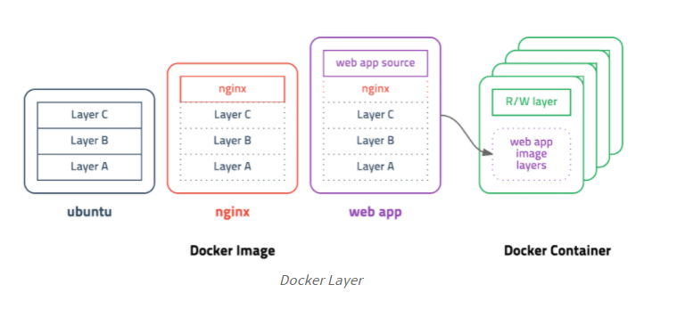

### 2021-07-13

## 도커
- *참고1: https://subicura.com/2017/01/19/docker-guide-for-beginners-1.html*
- **도커**
    - "컨테이너 기반의 오픈소스 가상화 플랫폼"
    - 다양한 프로그램, 실행환경을 추상화 
    - 동일한 인터페이스를 제공해 프로그램의 배포/관리 단순하게 해줌

- **컨테이너**
    - 격리된 공간에서 프로세스가 동작하는 기술
    - 기존의 가상화 방식... OS 가상화 
        - VMware, VirtualBox 등
        - 무겁고 느려서 운영환경 사용 불가능
    - 이를 개선하고자 CPU의 가상화 기술 이용한 "KVM"과 반가상화 방식의 "Xen" 등장
        - 전체 OS 가상화 아니라서 성능 향상
        - 반가상화,,, 이것도 결국 성능 문제 있어
    - 프로세스를 격리하는 방식 등장 => 리눅스 컨테이너
        - 단순히 프로세스를 격리시키기에, 가볍고 빠르게 동작!
        - CPU나 메모리는 딱 프로세스가 "필요한 만큼"만 추가로 사용, 성능 손실 거의 없음!
        - 하나의 서버에 여러개의 컨테이너 실행하면 서로 영향 안 미치고 독립적으로 실행
            - 가벼운 VM 사용하는듯함

- **이미지**
    - 이미지: 컨테이너 실행에 필요한 파일과 설정값등을 포함하고 있음
    - 컨테이너는 이미지를 실행한 상태!
        - 추가되거나 변하는 값은 컨테이너에 저장!
    - 이미지에는 컨테이너를 실행하기 위한 **EVERY** 정보를 가지고 있어, 더 의존성 파일 컴파일, 추가 설치 다 필요없음
        - 새로운 서버가 추가되면 미리 만들어 놓은 이미지 다운받고 컨테이너 생성

- **레이어 저장방식**
    - 도커 이미지 == 컨테이너 실행을 위한 모든 정보 가지고 있어 수백MB
        - 기존 이미지에 파일 추가했다고 이거 다시받으면 비효율적
    - 이를 해결하고자 Layer 개념 도입
        - 
    - 기존 레이어 제외하고 새로운 레이어만 다운받으면 되기에 효율적인 이미지 관리 가능!
    
- **이미지 경로**
    - 이미지는 url 방식으로 관리
    - 직관적으로 사용 가능
    
- **Dockerfile**
    - 도커는 이미지 만들기 위해 Dockerfile이라는 파일에 자체 DSL 언어 사용해 이미지 생성과정 적음
    
## 찰리의 젠킨스 공장
- **CI**
    - 옛날 얘기
        - 폭포수 개발... 개발 주기 길었어
        - 마지막에 통합하는 거라 통합 ㄹㅇ 마지막 단계
        - 어떤날을 머지데이로 지정 (세달에 한번)
    - 애자일 방법 ==> CI와 잘어울려!
    - 짧은 주기의 빌드와 테스트
        - 코드 통합시 발생하는 에러에 대한 빠른 피드백
        - 버그 픽스 등 가능

- **젠킨스 설치법**
    - 도커 이미지 pull
        - 그 와중 포트 매핑
    - 인스턴스IP:port 로 접근하면 뚝딱 젠킨스 페이지 나옴
    - 웹에서 설치할 수 있어!

- **젠킨스는 어디에?**
    - 따로 인스턴스파서 젠킨스 정의해두면 여기서 CI/CD 의 책임을 지고 빌드

- **젠킨스 대시보드**
    - JOB/ITEM: 젠킨스가 담당할 하나의 워크 플로우
        - Freestyle Project 선택! 
    - Github URL 적고
    - Git Repository (git clone 링크) 적고
    - Github id, Github pw 입력
    - 어떤 브랜치에 작업일어나면 빌드 할지 선택
    - 빌드 유발 trigger 선정
        - Github hook trigger for GITScm polling

- **깃헙 webhooks**
    - 여기서 젠킨스 등록해주자!
    
- **CD**
    - CD를 위한 플러그인 설치
        - Dashboard -> 젠킨스 관리 -> 플러그인 관리 -> "Publish Over SSH" -> Restart로 설정 추가해줌
    - Publish Over SSH 설정해주기
        - Dashboard -> 젠킨스 관리 -> 시스템 관리 -> Publish Over SSH 창 생김 -> Public pem key 작성  
            -> EC2 Name, hostname(ip), username(ubuntu), remoteDirectory(home/ubuntu) 작성
    - 빌드 후 조치 변경해주자!
        - Dashboard -> 구성
        - Transfers
            - source files: build/libs/*.jar
            - remove prefix: build/libs (jar 파일 앞에 붙은 말 제거)
            - application directory: /application (/home/ubuntu 뒤에 붙음)
            - Exec command: 배포할 EC2 에서 실행할 쉘 스크립트 저장
    
