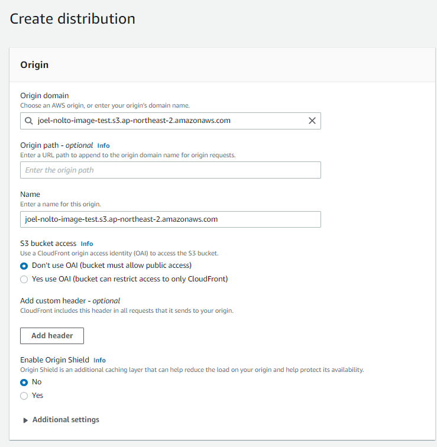
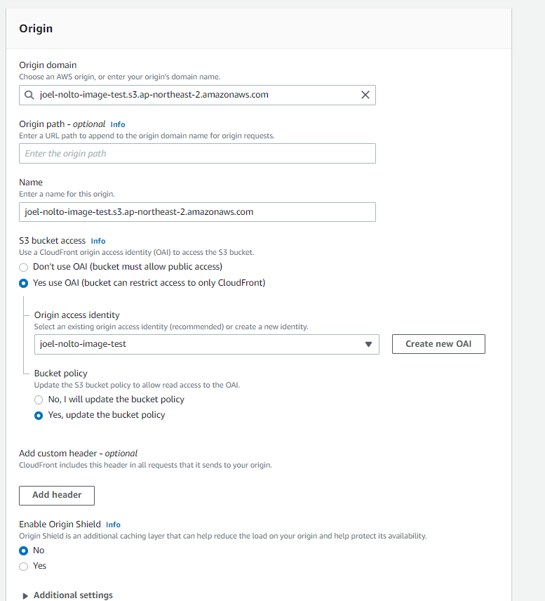
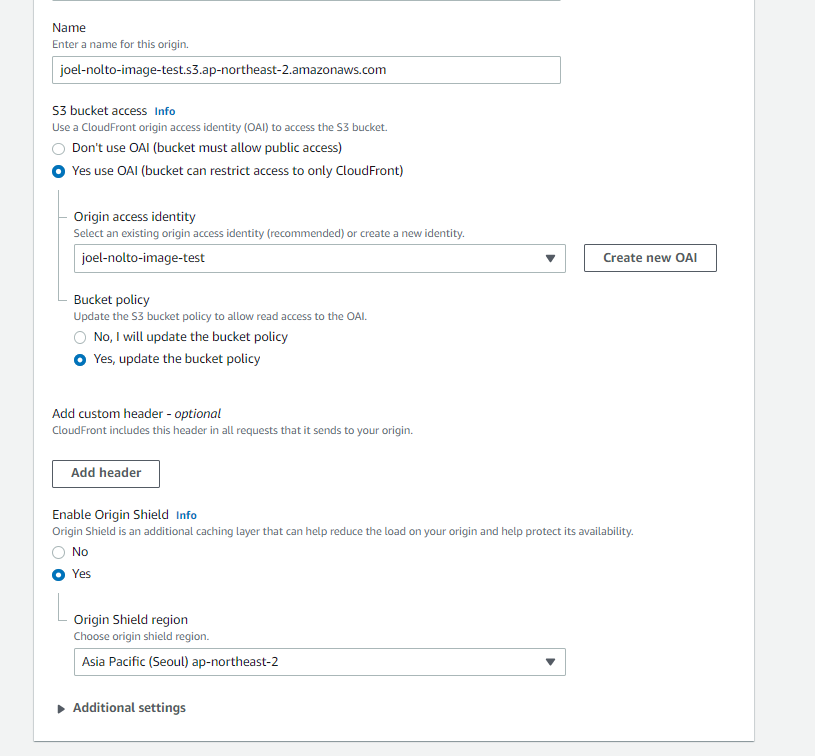

### 2021-07-14

## S3 개요
- *참고1: https://www.youtube.com/watch?v=Dr7WKfHvqIw*
- *참고2: https://www.youtube.com/watch?v=LM1QCTu7crM*
- *참고3: https://www.youtube.com/watch?v=xN8C-y4DUI4*
- 생활코딩
    - Simple Storage Service
    - 내구성이 좋음 (클라이언트의 파일 유실 안 됨)
    - 저렴한 비용 (사용한 만큼만 낸다)
    - 가용성 (파일 서비스 중단 거의 없음)
    - 보안 (SSL을 통해 안전한 운반)
- AWS 자격증 강의
    - 개요
        - 객체 스토리지 서비스
        - 무제한 용량
        - Bucket 이라는 단위로 구분
        - 버전 관리 가능
        - 업로드와 업데이트/삭제의 데이터 일관성 모델이 다름
    - S3 객체 스토리지 서비스
        - 파일만 가능! 프로그램 설치 이런거 안대!
        - 무제한 용량! 
        - Bucket이라는 단위로 구분 
            - 디렉토리의 개념
            - Global Unique! 전 세계 나혼자 나야나
            - Web Hosting 시 Bucket 명이 같아야 함
    - S3 API
        - 업로드 성공시 200 상태코드
        - 큰 용량의 파일 경우 Multipart upload 가능
            - Multipart: 큰 파일을 잘게 쪼개서 S3에서 합침
    - S3 static hosting
        - 원래 다음과 같은 도메인으로 자원 접근 가능함
            - https://bucket-name.s3.Region.amazonaws.com/keyname
            - https://s3.Region.amazonaws.com/bucket-name/keyname
    - S3 보안 설정
        - Bucket Policy
            - 버킷 단위
            - JSON 형식
            ```json
            {
              "Version": "2021-10-19", 
              "Id": "cddserr3d9s-sdf",
              "Statement": [
                {
                  "Sid": "ExampleStatementBuckPolicy",
                  "Effect": "Allow",
                  "Principal": {"AWS": "arn:aws:iam::spark323:user/spark"}, //누구에게 허용하겠는가?
                  "Action": ["s3:GetObject", "s3:GetBucketLocation", "s3:ListBucket"],
                  "Resource": ["arn:aws:s3:::examplebucket"], 
                  "Condition": {
                    "IpAddress": {"aws:SourceIp":  "192.168.0.1/24"},
                    "NotIpAddress": {"aws:SourceIp": "192.168.0.2/32"}}
                  } 
                } 
              ] 
            }
            ```

## CloudFront (S3를 곁들인)
- *참고: https://hyeon9mak.github.io/access-s3-through-cloudfront/*
- 아마존의 CDN
    - S3는 public 개방을 해주지 않았음
- CDN으로는 S3에 접근이 가능하고, 컨텐츠를 가져올 수 있음
- CloudFront 설정을 다음과 같이 해주자
    1. 만든 S3 버킷을 Origin domain에 입력해주기
        
    2. S3 bucket access를 Yes use OAI로 변경, 가지고 있는 OAI 등록, S3 Bucket Policy에 등록될 수 있도록 Yes update bucket policy 선택
        
    3. Enable Origin Shield를 Yes로 설정, 캐시 적중률이 높은 지역에 등록
        
- 이후 생성

## S3 with Spring Boot
- *참고1: https://www.youtube.com/watch?v=vY7c7k8xmKE*
- 빈 설정을 통해 간단히 AWS S3를 설정할 수 있다!
