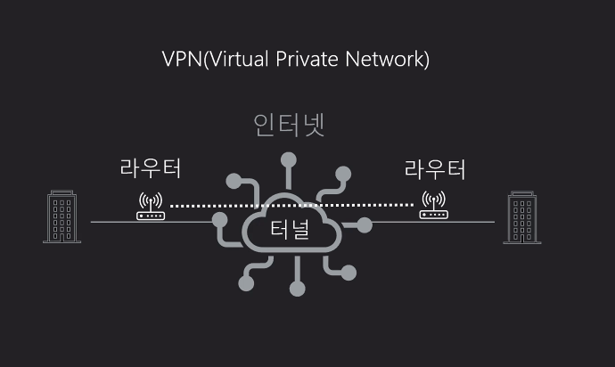

### 2021-07-22

## IN
- *참고: https://ojava.tistory.com/12*
- **WHERE 일치하기 원하는 칼럼명 IN (조건1, 조건2, 조건3)**
    - IN 뒤로 나열한 조건들 중 일치하는 row를 가져옴
        - 조건들은 OR로 검색
        - 조건에 일치하는 모든 내용을 가져옴

- **WHERE 일치하지 않길 원하는 칼럼명 NOT IN(조건1, 조건2, 조건3)**
    - 일치하지 않길 원하는 칼럼명
        - 조건1 이거나, 조건2 이거나, 조건3 이면 제외!

## JPA 뇌절
- *참고: https://bebong.tistory.com/entry/JPA-Lazy-Evaluation-LazyInitializationException-could-not-initialize-proxy-%E2%80%93-no-Session*
- **could not initialize proxy - no Session**
    - JPA Session?
        - JPA 영속성 컨텍스트가 유지되는 하나의 세션 (트랜잭션 시작 ~ 트랜잭션 끝)
    - Lazy Loading에서 Proxy 반환하고 트랜잭션 끝! 이 상태에서 get을 해올라고 하면 뇌절!
        - 따라서 get까지 해오는 것을 하나의 Transaction으로 묶어줘야해!
            - 기억나지? 토비의 스프링! 트랜잭션 Connection 하나에 저장소에 묶어놓고 그거만 쓰는거!
        ```java
        @Transactional
        public Set<Feed> findFeedUsingTech(List<String> techNames) {
            List<Tech> techs = techRepository.findAllByNameIn(techNames);
            List<FeedTech> findFeedTech = findFeedTechByTech(techs);
            return findFeedByFeedTech(findFeedTech);
        }
        
        private List<FeedTech> findFeedTechByTech(List<Tech> techs) {
            List<FeedTech> findFeedTech = new ArrayList<>();
            techs.forEach(tech -> findFeedTech.addAll(feedTechRepository.findByTech(tech)));
            return findFeedTech;
        }
        
        private Set<Feed> findFeedByFeedTech(List<FeedTech> feedTechs) {
            Set<Feed> findFeed = new HashSet<>();
            feedTechs.forEach(feedTech -> findFeed.add(feedTech.getFeed()));
            return findFeed;
        }
        ```

- **em.flush() & em.clear()**        
    - em.flush()
        - 엔티티를 관리하는 영속성 컨텍스트에 있는 내용을 DB에 반영하는 것
            - 트랜잭션 커밋까지 DB에 엔티티 저장 않고 내부 쿼리 저장소에 INSERT SQL 모아둠
        - commit() 메서드 호출시 flush()가 호출되어지고, flush() 메서드에 의해 DB에 반영됨
            - "flush"는 영속성 컨텍스트의 내용을 DB에 반영하는 역할을 함
                - 이때 쓰기 지연 SQL 저장소에 있는 SQL 쿼리가 DB로 보내짐
            - "commit" 이라면 DB에 영속성 컨텍스트 내용이 모두 저장된것이 확정되기에, 영속성 컨텍스트/1차 캐시 모두 파기
        - flush() 동작 과정
            1. 변경 감지 (Dirty Checking)
            2. 수정된 Entity를 쓰기 지연 SQL 저장소에 등록
            3. 쓰기 지연 SQL 저장소의 Query를 DB에 전송
            4. flush() 메서드 호출 후 commit() 호출

## 네트워크 보안
- **보안의 3요소**
    - 기밀성: 인가 되지 않은 사용자가 정보 내용 모르게
    - 무결성: 정보가 인가된 사용자에 의해서만 변경 가능
    - 가용성: 정보에 대한 사용이 확실히

- **해커의 공격**    
    - 스니핑
        - 네트워크 패킷 캡쳐
            - 기밀성 훼손
    - 스푸핑
        - 네트워크 패킷을 변조
            - 무결성 훼손
    - Dos
        - 공격 대상의 자원을 소비시켜 서비스 마비
    
- **전송계층, 인터넷계층에서 쓰는 보안 프로토콜**
    - TLS
    - IPSec
        - AH, ESP

- **방화벽**
    - 트래픽 차단 및 필터링
    - 접근 제어
    - 외부 불법 침입 차단
    - 내부 정보 유출 방지
    - 수동적인 방어

- **IDS, IPS**
    - 불법 침입 자동 대응 및 차단
    - 방화벽과 함께 사용하면 효율적

- **VPN**
    

- **망분리**
    - 논리적 망분리
        - PC기반 가상화
        - 서버기반 가상화
