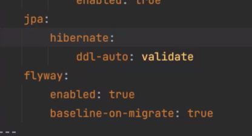

### 2021-07-24

## FLYWAY
- *참고: https://dailyheumsi.tistory.com/183*
- *참고: https://www.youtube.com/watch?v=ovG1wgEqE10*
- **DB 마이그레이션**
    - 데이터베이스의 스키마 변경사항을 기록하는 버전관리 기능
    - Flyway라는 툴을 사용해보자!
    
- *Flyway*
    - SQL 스크립트나 자바 코드로 업데이트 수행 가능
    - 메타데이터 테이블을 생성함
    - 업데이트 오퍼레이션을 수행해서 플라이웨이가 necessary 오퍼레이션을 수행함

- **실습 과정**
    - implementation(org.flyway~) build.gradle 추가
    - application.yml 수정
        
