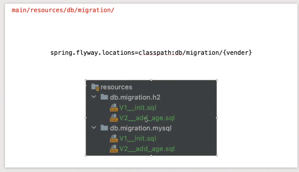

### 2021-07-28

## 코기 Flyway 특강
- DB 형상 관리 툴
    - DB 변경 관리하자 마치 Git 마냥
- 개발하다가 DB 스키마 바뀌면?
    1. ddl-auto=create, update
        - create 하면 날리자나,,,
        - update 하면 부족한 부분만 채우자너
            - 씽크를 맞추기 위함
        - ex. member -> user 이름바꿈
            - update로 하면 그냥 user 새로 파게되어요
    2. 각 배포환경 촤르르 쿼리 날리면서 돌아다니면서 적용
- 어찌 되는거지?
    - 메타데이터 테이블을 만듦
    - 버전 추가하면서 거기에 맞게 db 변경
    - 이런걸 migration이라고 함
    - 변경 꼬리에 꼬리를 물고 진행
- 유의점
    - 마이그레이션은 최신버전 보다 높은 경우에만 적용
    - v1 -> v2 사이에 v1.5 이딴거 불가능해!        
    - 변경 기록 테이블을 지우거나 변경 X
- 버전 관리
    - 날짜를 기반으로 V20210227
    - 찐 버전 기반 V1, V2
- classpath 커스텀
    

## Logback으로 메일 보내기
- *참고: https://www.baeldung.com/logback-send-email*

## Spring RestDocs
- *참고 1: https://techblog.woowahan.com/2597/*
- *참고 2: https://subji.github.io/posts/2021/01/06/springrestdocsexample*
- **junit, MockMvc, asciiDoc의 환경**
    - build.gradle
    ```
    plugins {
        id "org.asciidoctor.convert" version "1.5.9.2" // (1) AsciiDoc 파일 컨버팅 후 Build 폴더에 복사 위함
    }
    
    asciidoctor {
        dependsOn test // (2) 그래들 빌드시 test -> asciidoctor 순으로 수행
    }
    
    bootJar {
        dependsOn asciidoctor // (3) 그래들 빌드시 asciidoctor -> bootJar 순으로 수행
        from ("$/html5") { // (4) 그래들 빌드시 ./build/asciidoc/html5/에 html 파일 생성
            into 'static/docs'
        }
    }
    
    dependencies {
        testImplementation('org.springframework.restdocs:spring-restdocs-mockmvc') // (5) mockmvc + restdocs
    }
    ```
  
- **ControllerTest 설정**
    - mockMvc 객체 restDocs 쓸 수 있도록 설정해두기
    - `protected static OperationRequestPreprocessor getDocumentRequest()`
        - OperationRequestPrepocessor 설정 해주기

- **찐 Controller 객체 테스트+문서화**  
    - `@MockBean` 선언하여 mocking 할 서비스 객체 생성
    - mocking 하여 예상 응답값 받기
    - 테스트 수행시 `./build/generated-snippets/` 하위에 지정한 문자열의 폴더에 스니펫 문서 작성됨
        - http-request.adoc
        - http-response.adoc
        - path-parameter.adoc
        - request-fields.adoc
        - response-fields.adoc 등

- **필수값 여부**
    - requestField에 .optional() 추가
    - 스티펫에는 없는 필드라서, 스니펫을 커스텀 할 것!
        - src/test/resources/org/springframework/restdocs/templates 경로에 `request-fields.snippet` 추가하기
        - 다량의 mustache 문법 함유

- **스니펫을 조합해 문서 만들기**
    - 사용자 정의 .adoc 파일을 `src/main/docs/asciidocs`에 만들고 다음과 같이 생성
    ```
    == Feed (피드)
    
    === 피드 업로드
    
    ==== Request
    
    include::{snippets}/feed-create/http-request.adoc[]
    include::{snippets}/feed-create/request-parameters.adoc[]
    include::{snippets}/feed-create/request-parts.adoc[]
    
    ==== Response
    
    include::{snippets}/feed-create/http-response.adoc[]
    ```
    - 이후 빌드하면 build/generated-snippets 밑에 기본 파일 생성
        - 해당 snippet은 자동으로 .adoc과 연결

## `@WebMvcTest`
- *참고 1: https://docs.spring.io/spring-boot/docs/current/reference/html/features.html#features.testing.spring-boot-applications.spring-mvc-tests*
- HTTP 서버 없이 MVC 컨트롤러 테스트하기 쉬움
- Spring MVC 구조를 테스트하기 위해 다음과 같은 친구들만 받아옴
    - `@Controller`
    - `@ControllerAdvice`
    - `@JsonComponent`
    - `Converter`
    - `GenericConverter`
    - `Filter`
    - `HandlerInterceptor`
    - `WebMvcConfigurer`
    - `HandlerMethodArgumentResolver`
- 주로 하나의 컨트롤러를 테스트하기 위함 
- `@MockBean`으로 필요한 친구 모킹
