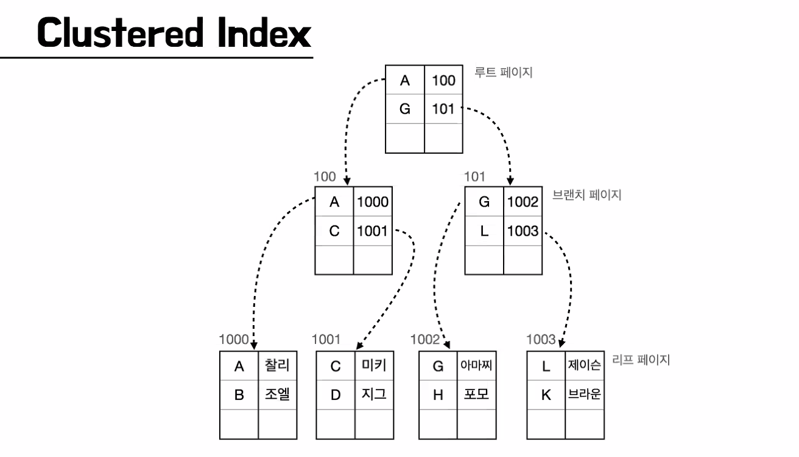
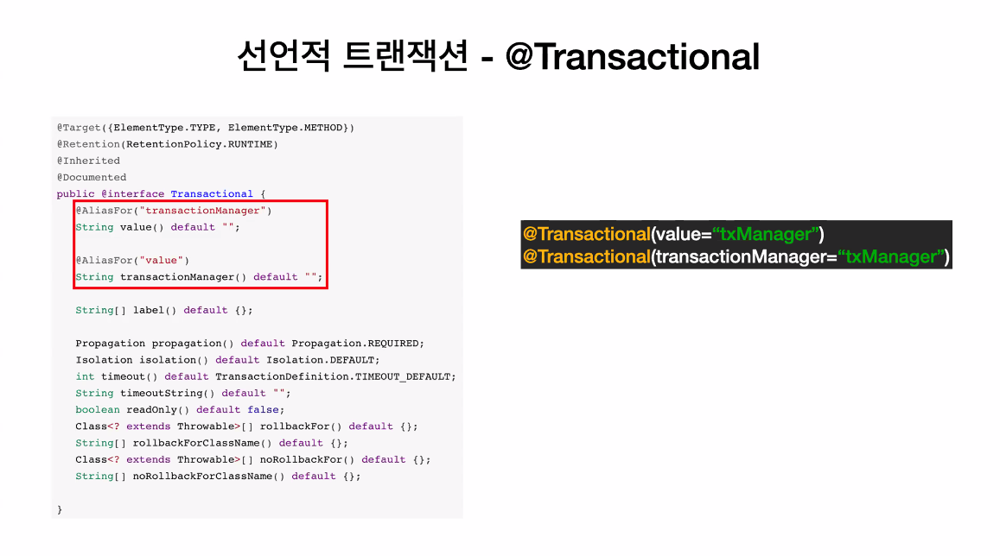

### 2021-07-29

## 빈 라이프 사이클
- *참고 1: https://yangbongsoo.gitbook.io/study/spring-1/basic*
- *참고 2: https://haruhiism.tistory.com/186*
- 스프링 컨테이너가 다음 사이클 관리 
    - 빈 객체 생성 -> 프로퍼티 할당 -> 초기화 수행 -> 사용 끝나면 소멸
- 스프링은 InitializingBean 인터페이스를 통해 빈 객체가 초기화함
    - 빈 라이프사이클
        - 빈 객체 생성
        - 빈 프로퍼티 설정
        - BeanNameAware.setBeanName() //해당 빈 객체는 초기화 과정에서 빈 이름 전달받음
        - ApplicationContextAware.setApplicationContext() //해당 빈 객체는 초기화 과정에서 ApplicationContext 전달 받음
        - BeanPostProcessor의 초기화 전처리
        - 초기화 
            - `@PostConstruct` 메서드 //초기화 실행 메서드
            - InitializingBean.afterPropertiesSet() //객체에 특별한 프로퍼티 추가적으로 설정하거나, 필수 요구사항 충족되었나 검사
            - 커스텀 initMethod
        - BeanPostProcessor의 초기화 후처리
        - 빈 객체 사용
        - 소멸
            - `@PreDestroy` 메서드 //소멸 실행 메서드
            - DisposableBean.destroy() //Bean들을 폐기하는데 해당 destroy 메서드가 호출됨
            - 커스텀 destroyMethod

## 인덱스
- **Index**
    - 색인: 어떤 것을 뒤져서 찾아내거나 필요한 것을 밝힘
    - DB의 Index 사용목적
        - 대용량 데이터에서 원하는 데이터 빠르게 조회하기 위함
        - SELECT * FROM feed WHERE title = "제목";
            - SELECT 문의 조회 속도 향상 시킴
            - Insert, Update, Delete 시 성능 조금 희생
            - 대용량이 아니면 조회 시 성능 향상이 없음

- **Index의 작성/삭제**
    - Index도 하나의 DB 객체
    - Oracle, DB2 등에서는 스키마 객체
    - 작성
        - CREATE INDEX 인덱스명 ON 테이블명(컬럼명);
        - DROP INDEX 인덱스명 ON 테이블명;

- **Index 검색에 사용하는 알고리즘**
    - Full Table Scan
        - 데이터가 1억건이 있다면 1억번의 값을 비교
    - B-Tree
        - 이진 탐색 with B-Tree (Balanced-Tree)
            - 트리 치우치지 않게

- **Clustered Index vs Non-Clustered Index**
    - Clustered Index: 군집 인덱스
        - 인덱스 안에 데이터 포함
        - 특징
            - 테이블 당 1개만 존재
            - PK 제약 조건으로 컬럼 생성하면 자동 생성
            - 인덱스에 데이터 페이지가 함께 존재
            - 데이터가 정렬된 상태
        - 루트 페이지 -> 브랜치 페이지 -> 리프 페이지
            - 
    - Non-Clustered Index: 비군집 인덱스
        - 인덱스 안에 데이터 비포함
        - 특징
            - 보조 인덱스
            - Unique로 생성하면 자동 생성
        - CUD는 유리
        - R은 군집보다 더 걸려
    - Cardinality: 중복된 수치가 낮은 것에 인덱스를 생성하자!
    
## 트랜잭션
- **사용자는 트랜잭션으로 DB 완결성 확보**
    - 온전히 명령을 실행해줌
    - 디비는 트랜잭션 설정 가지고 있어
        - Redo, Undo 로그를 사용해서 트랜잭션 확보
        
- **트랜잭션은 원자성을 보장해야해!**
    - 롤백 혹은 커밋이 수행되어야 하나의 흐름 끝!

- **여러 명령을 트랜잭션으로 묶고 싶으면 원래 개발자가 명시해줘야해!**
    - interface PlatformTransactionManager로 관리
        - getTransaction, commit, rollback로 구성됨
    - 구현체로는,,,
        - DataSourceTransactionManager
        - JpaTransactionManager
        - JtaTransactionManager

- **선언적 트랜잭션 - tx namespace**
    - 일괄적으로 트랜잭션 뚝딱뚝딱
    - `@Transactional`
        - 클래스: 해당 클래스 메서드 모두 다 이걸로
        - 메서드: 해당 메서드만
        - 
        - propagation: 트랜잭션 전파 옵션 줄 수 있음
        - isolation: 동시에 많은 트랜잭션하면서도 부작용 없게
        - readOnly: 트랜잭션 Update, Insert, Delete 노! JPA 더티체크
        - rollbackForClassName: 어떤 예외가 발생할 경우에만 롤백!

## JPA 더티 체킹
- *참고: https://jojoldu.tistory.com/415*
- **상황 보기** 
    1. 트랜잭션 시작
    2. 엔티티 조회
    3. 엔티티 값 변경
    4. 트랜잭션 커밋
    - update 쿼리 없음애도 변경된 것이 DB에 저장됨!

- **더티 체킹**
    - Dirty: 상태의 변화가 생긴 정도
    - Dirty Checking: 상태 변경 검사
    - JPA는 __"트랜잭션이 끝나는 시점에 변화가 있는 모든 엔티티 객체를 DB에 자동 반영함"__
        - 변화의 기준은 최초 조회 상태

- **더티 체킹 과정**
    - JPA는 엔티티 조회하면 조회 상태 스냅샷 만듦
    - 트랜잭션 끝나는 시점에 비교해서 다른점이 있다면 Update Query 날림
    - 이런 상태 변경 검사의 대상은 영속성 컨텍스트가 관리하는 엔티티에만 적용됨!
        - 준영속/비영속 상태의 엔티티는 더티 체킹 대상이 아님!
    - 기본적으로 더티 체킹으로 업데이트 나가는 쿼리는 "모든 필드" 업데이트 시킴
        - 엔티티 상단에 `@DynamicUpdate` 선언하면 바뀐 놈만 쿼리나감
    ```java
    public void update(User user, Long feedId, FeedRequest request) {
        Feed findFeed = findEntityById(feedId);
    
        if (findFeed.notSameAuthor(user)) {
            throw new UnauthorizedException(ErrorType.UNAUTHORIZED_UPDATE_FEED);
        }
        updateFeed(request, findFeed);
    }
    
    private void updateFeed(FeedRequest request, Feed findFeed) {
        findFeed.update(
                request.getTitle(),
                request.getContent(),
                Step.of(request.getStep()),
                request.isSos(),
                request.getStorageUrl(),
                request.getDeployedUrl()
        );
    
        updateThumbnailIfImageExist(request, findFeed);
    
        feedTechRepository.deleteAll(findFeed.getFeedTechs());
        List<FeedTech> feedTechs = makeTechIdToFeedTech(request, findFeed);
        findFeed.changeFeedTechs(feedTechs);
    }
    
    private List<FeedTech> makeTechIdToFeedTech(FeedRequest request, Feed feed) {
        List<Tech> allTechs = techRepository.findAllById(request.getTechs());
        return allTechs.stream()
                .map(tech -> new FeedTech(feed, tech))
                .collect(Collectors.toList());
    }
    ```
