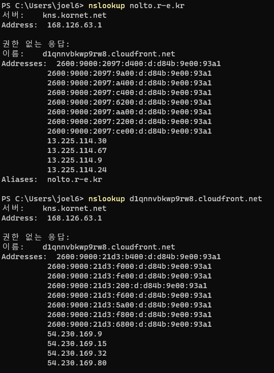

### 2021-08-02

## A record vs CNAME
- *참고: https://coding-start.tistory.com/348*
- **A record**
    - 도메인에 IP 주소를 매핑하는 방법
    - 도메인 하나에 여러가지 IP 주소를 매핑할 수 있음 (VIP)
        - 하나의 호스트에 여러 개의 IP를 할당하는 기술
        - 로드 밸런싱을 위해 사용
- **CNAME**
    - 하나의 도메인에 도메인 별칭을 부여
    - 도메인의 또다른 도메인 이름
    - IP가 변경되면 직접 영향받는 A record와 달리, CNAME은 IP 변경에 직접 영향 X



## JPQL
- *참고 1: https://ict-nroo.tistory.com/116*
- **JPA의 다양한 쿼리 방법**
    - JPQL
    - QueryDSL
    - JPA Criteria
    - Native SQL
    - JDBC API 직접 사용, MyBatis/SpringJdbcTemplate
    
- **JPQL 필요성**
    - 가장 단순한 조회 방법
        - EntityManager.find() 활용?
        - 객체 그래프 탐색하는 건 비용이 너무 커,,, .get().get().get()

- **JPQL**
    - 엔티티 객체 중심의 개발
        - 검색 쿼리가 문제!
        - 검색 할 때에도 테이블이 아닌 **엔티티 객체**를 대상으로 검색해야함!
            - DB를 모르고 자바 코드를 보고 이런 객체가 있구나 해야하
        - 하지만 필요한 데이터만 DB에서 가져오려면 검색 조건이 필요한 SQL이 필요해!
        - JPA는 SQL을 추상화한 JPQL이란 객체 지향 쿼리 제공
            - SQL과 문법이 유사
            - JPQL은 엔티티 객체를 대상으로 쿼리를 질의하고, SQL은 데이터베이스 테이블 대상으로 쿼리를 질의
    - 테이블이 아닌 객체를 대상으로 검색하는 객체지향 쿼리!
        - SQL을 추상화했기에 특정 DB 벤더에 의존 X

- **JPQL 문법**
    ```
    select_문 ::=
        select_절
        from_절
        [where_절]
        [groupby_절]
        [having_절]
        [orderby_절]
    
    update_문 ::= update_절 [where_절]
    
    delete_문 ::= delete_절 [where_절]
    ```
    - from 절에 들어가는 것은 객체!
        - `select m from Member m where m.age > 8`
    - 엔티티와 속성은 대소문자를 구분!
    - JPQL 키워드는 대소문자 구분 X
    - 엔티티 명을 사용해서 쿼리쓸것! (테이블 XXXX)
    - 별칭은 무조건 필수!
    
- **반환값**
    - 멤버 조회
        - `SELECT m FROM Member m`
    - 멤버 안의 팀 조회
        - `SELECT m.team FROM Member m`
    - 단순 값 조회
        - `SELECT m.username, m.age FROM Member m`
    - DTO new로 조회
        - `SELECT new UserDto(m.username, m.age) FROM Member m`

- **FetchJoin**
    - fetchType 모두 LAZY로 세팅
        - "쿼리 튜닝할 때 한꺼번에 조회" 필요한 경우 사용
    - 엔티티 객체 그래프를 한번에 조회하는 방법
    - 별칭 사용 불가
    - 멤버를 조회할 때 팀까지 같이 조회하기
    - 마치 fetchType.EAGER 마냥!
        - `select m from Member m join fetch m.team`
    - LAZY로 범벅하면 반복문으로 정보 받아올 때 마다 쿼리 나감 (JPA N+1 문제)
    