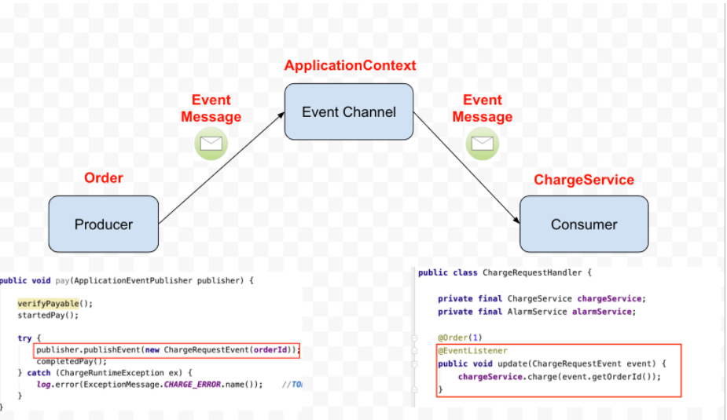

### 2021-08-04

## Spring EventListener
- *참고: https://brunch.co.kr/@springboot/422#comment*
- **왜 필요해?**
    - 복잡한 도메인 의존성을 줄이기 위함
    - A로직에 B로직이 필요한데 사실 A로직 입장에서 B로직이 핵심 역할이 아니야

- **사용법**
    - 메서드 상단에 `@EventListener` 어노테이션을 선언해주자!
    - 매개변수에 Event클래스를 정의하자!
    - 

- **기선님 강의**
    - ApplicationEventPublisher
        - 이벤트 프로그래밍에 필요한 인터페이스 제공
    - 스프링 4.2 이전
        ```java
        public class MyEvent extends ApplicationEvent {
            public MyEvent() {}
        }
        ```
        - 이런 이벤트를 퍼블리싱 하는게 어플리케이션 컨텍스트한테 있어
            - 자~ 이거 주입받자 (ApplicationEventPublisher)
            - ApplicationEventPublisher.publishEvent(new MyEvent());
        - 이제 이걸 받을 친구를 만들어주자
            ```java
            class MyEventHandler implements ApplicationListener<MyEvent> {
                public void onApplicationEvent(MyEvent); // 뚝딱받아서 처리
            }
            ```
    - 스프링 4.2 이후
        - 필요없는 상속 멈춰!
        ```java
        public class MyEvent { //빈 아니야
            public MyEvent() {} //그냥 이렇게!
        }
        ```
        - POJO 기반!
        ```java
        @Component //빈등록
        class MyEventHandler {
            //@EventListener //듣자!
            public void onApplicationEvent(MyEvent); // 뚝딱받아서 처리
        }
        ```
        - 이벤트 핸들러 여러가지
            - 이벤트 발생시 리스닝하고 있는거 다 실행
            - 순차적으로 실행됨 (뭐가 먼전진 모르겠어)
            - 순서 중요하면 `@Order()`로 순서 지정하자
        - `@Async` 각각의 쓰레드 풀에서 따로 돌아
            - 따라서 `@Order`가 무의미해
            - 메인에서 `@EnableAsync`로 뚝딱 해주자
    - 스프링이 기본으로 제공하는 이벤트들
        - ContextRefreshedEvent() 
        - ContextClosedEvent() 

## `@TransactionalEventListener`

## CASCADE