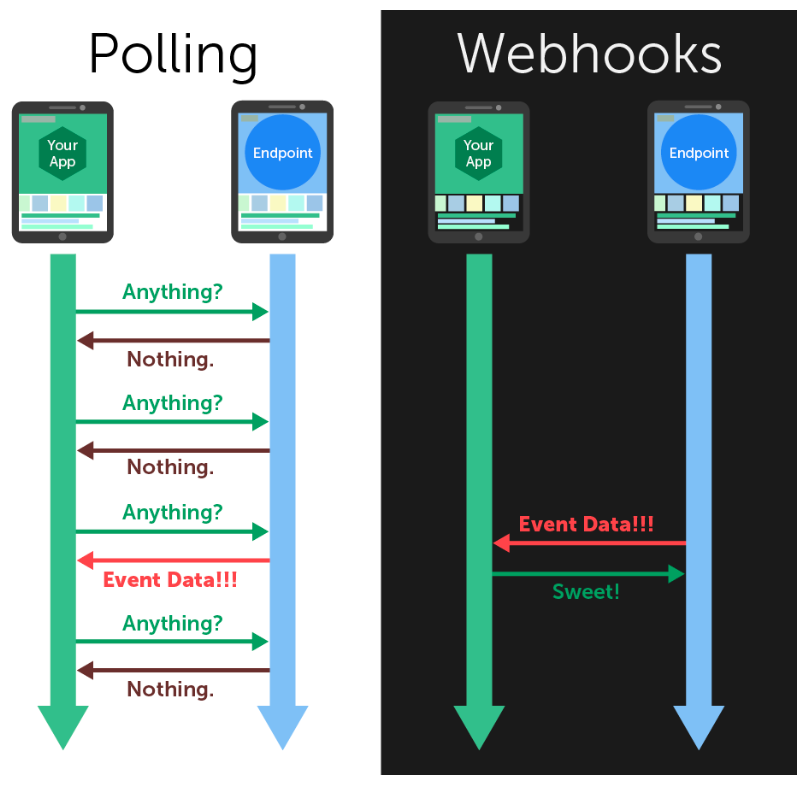

### 2021-08-14

## Webhook
- *참고 1: https://leffept.tistory.com/329*
- *참고 2: https://sddev.tistory.com/9*
- *참고 3: https://simsimjae.medium.com/%EC%9B%B9%ED%9B%85%EC%9D%B4%EB%9E%80-e41cf1ba92f0*
- **정의**
    - 웹 페이지 또는 웹 앱에서 발생하는 특정 이벤드들을 커스텀 콜백으로 변환해주는 방법
    - 하나의 앱이 다른 어플리케이션으로 앱간련 이벤트 정보를 "실시간"으로 제공하기 위한 방법
        - Web Callback 또는 HTTP PUSH API로도 불림
        - "실시간": 해당 앱에서 특정 이벤트 일어나자마자, 정해놓은 URL을 통해 다른 어플리케이션으로 이벤트 관련 정보 보냄
    - 서버에서 발생하는 이벤트를 처리하기 위해 Webhook 사용

- **관련 용어**
    - Webhook: 서버에서 특정 이벤트 발생시 클라이언트 호출하는 방식 "역방향 API"
    - API: 클라이언트가 서버 호출
    - callback URL: 서버 측에서 이벤트 발생시, 클라이언트의 어느 URL로 데이터 보낼지 정해놓은 주소

- **동작 방식**
    - 웹앱에서 발생하는 특정 이벤트들을 커스텀 Callback으로 변환하는 방법
    - Webhook 서비스로 부터 특정 이벤트 관련 정보 받기 기다리기만 하면됨 (Reverse API)
    - Webhook 서비스가 Post 요청을 보낼 API 요청 URL을 생성하고, 해당 요청을 처리할 수 있도록 API 설계하고 서비스하기
    - Webhook 이벤트 핸들러: 웹훅 엔드포인트는 그 발생한 이벤트가 어디로 전달되어야 하는가

- **왜 필요한가?**
    - ex. 서버가 메일 받았음. 클라이언트에게 알려줘야해
        - API라면?
            - while (클라 -> 서버가 메일 있다면)
            - 메일 정보 받아옴
        - Webhook이라면?
            - 메일 수신되면 서버 -> 클라이언트에게 "미리 지정한" 클라이언트의 callback URL로 메일에 대한 정보 보냄 (HTTP POST)
            - 메일 정보 받아옴
    - 서버 측에서 이벤트 발생할 경우 클라이언트로 HTTP POST하니까 해당 이벤트를 핸들러를 통해 처리만 하면 됨
        - API 요청 적음
    - 

- **주의사항**
    - 우리 서비스가 에러로 인해 중단되면 데이터 영원히 유실됨
    - 웹훅이 너무 많은 이벤트 발생시키면 DDOS 공격이 될 수도
    
## Callback
- *참고: https://sddev.tistory.com/22*
- 동기: A함수 호출 -> A함수 실행 -> A함수 반환 -> B함수 호출 -> B함수 실행 -> B함수 반환
- 비동기: A함수 호출 -> B함수 호출 -> B함수 처리 -> B함수 실행 -> B함수 반환 -> A함수 결과 콜백
    - A함수는 별도의 쓰레드에서 처리! 처리 이후에 반대로 Call
        - 작업완료시 호출되는 함수 Callback
        
