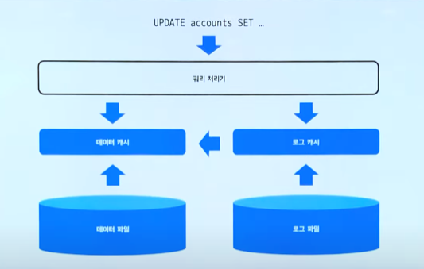
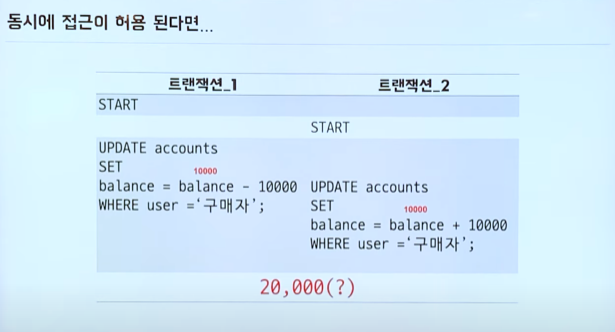
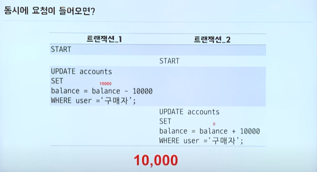

### 2021-08-16

## 트랜잭션
- *참고 1: https://www.youtube.com/watch?v=aX9c7z9l_u8*
- *참고 2: https://www.youtube.com/watch?v=ImvYNlF_saE*
- **DB에서의 트랜잭션**
    - Transaction: 더 이상 나눌수 없는 가장 작은 하나의 단위
        - 하나의 명령 실행시, DB가 온전히 그 명령을 실행해 주는 것
    - 사용자가 데이터베이스에 대한 완전성을 신뢰할 수 있도록
    - DB에서는 기본적으로 트랜잭션 관리 위한 설정이 있어
        - 명령 끝마칠때 까지 수행내역을 로그로 저장해둬
            - Redo Log
            - Undo Log
    - 여러 명령을 하나의 트랜잭션으로 묶고 싶다면?
    - 트랜잭션의 성질
        - 원자성: 성공하면 싹다, 아니면 다 돌려! (롤백/커밋)
        - 일관성: DB 상태, DB 계층관계, 칼럼 속성 등 항상 일관되게 유지하는 것
        - 지속성: 영원히 DB에 내용이 저장되어야해
        - 독립성: 딴거 끼어들 수 없어!
            - 트랜잭션은 격리 수준 설정을 통한 독립성을 보장해!
    - DB에 작업 요청들어오고, 모든 작업 독립성 보장해 하나씩 순차진행하면, CPU는 응답 대기 시간 너무 길어져

- **스프링에서의 트랜잭션**
    - `PlatformTransactionManager`를 통해 다양한 DataSource에 맞는 트랜잭션 권리 지원
        ```java
        public interface PlatformTransactionManger extends TransactionManger {
            TransactionStatus getTransaction(TransactionDefinition definition);
            void commit(TransactionStatus status);
            void rollback(TransactionStatus status);
        }
        ```
        - commit~rollback 사이가 경계 설정
    - 구현체: DataSourceTransactionManager(JDBC), JpaTransactionManager(JPA), JtaTransactionManager(하나 이상 DB)
    - AOP를 이용한 선언적 트랜잭션
        - tx namespace
            - transaction 매니저 빈설정
        - 어노테이션
            - 메서드, 클래스, 인터페이스
    - 트랜잭션 어노테이션
        - propagation : 전파 레벨 설정
            - required
            - supports
            - mandatory
            - requires_new
            - not_supported
            - never
            - nested
        - isolation : 트랜잭션 격리 수준 (동시 여러 트랜잭션 시작시, 트랜잭션 작업 내용을 다른 트랜잭션에게 보여줄지 말지... 동시에 많은 트랜잭션 진행하면서 문제가 안생기게 할라고)
            - DEFAULT: DB가 쓰는 놈으로 따른다 (거의 READ_COMMITTED)
            - READ_UNCOMMITED: 아직 커밋 안된 데이터 다른 트랜잭션이 읽을 수 있음
            - READ_COMMITTED: 커밋되지 않은 정보 읽을 수 없음!
            - REPEATABLE_READ: 하나의 트랜잭션이 읽은 로우를 다른 트랜잭션이 수정할 수 없게!
            - SERIALIZABLE: 동시 같은 테이블 접근 X
        - timeout : 초로 시간 제한
        - readOnly: 해당 트랜잭션에서는 CUD 멈춰! (JPA 더티체킹 무시)
        - rollbackFor: 해당 체크예외를 롤백 대상으로 삼기
        - noRollbackFor: 해당 체크예외 발생해도 그냥 커밋해부려!

- **트랜잭션은 어떻게 동작하는가?**
    ```sql
    BEGIN TRAN
    ~~~쿼리들~~~
    COMMIT TRAN
    ```
    - 
    - 로그 캐시
        - Redo 로그: 변경 후 값 기록
            - 예상치 못한 예외 (OS단 등) 데이터를 다시 일관성있게 만들어주고 Undo 필요없는거 복구
        - Undo 로그: 변경 전 값 기록
            - Rollback 발생하면 Undo 로그 역순으로 따라가면서 원복
    - 동시 접근 허용시
        - Lock을 통해 트랜잭션 시작되면 끝날때까지 점유함
        - 
        - 

- **전파 설정 활용 예시**
    ```java
    @Component
    @AllArgsConstructor
    public class NotificationEventHandler {
    
        private final NotificationService notificationService;
    
        // 트랜잭션 종료 되고 실행시킬 메서드
        @TransactionalEventListener
        public void saveNotification(NotificationEvent notificationEvent) {
            notificationService.save(notificationEvent);
        }
    
        @EventListener
        public void deleteNotification(NotificationFeedDeleteEvent notificationFeedDeleteEvent) {
            notificationService.deleteNotificationRelatedToFeed(notificationFeedDeleteEvent);
        }
    
        @EventListener
        public void deleteNotification(NotificationCommentDeleteEvent notificationCommentDeleteEvent) {
            notificationService.deleteNotificationRelatedToComment(notificationCommentDeleteEvent);
        }
    }
    
    @Service
    @Transactional
    @AllArgsConstructor
    public class NotificationService {
    
        private final NotificationRepository notificationRepository;
    
        // 기존 트랜잭션은 커밋까지 다했으니 새로운 트랜잭션 필요해!
        @Transactional(propagation = Propagation.REQUIRES_NEW)
        public void save(NotificationEvent notificationEvent) {
            Notification notification = notificationEvent.toEntity();
            if (notificationEvent.validatePublisher()) {
                notificationRepository.save(notification);
            }
        }
    }
    ```


