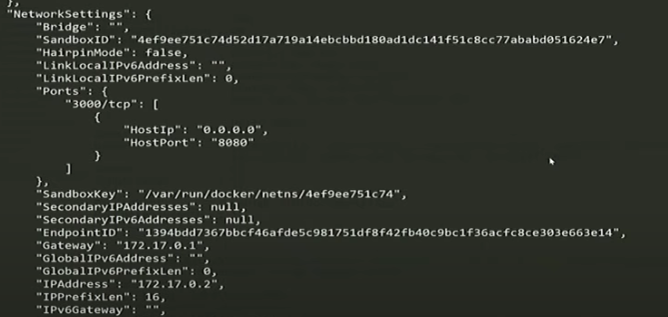

### 2021-08-21

## Docker From Scratch
- *참고: https://www.youtube.com/watch?v=i7yoXqlg48M&t=2282s*
- **Useful Terminology**
    - It is not a VM
        - Linux "chroot"
            - user space isolation inside a kernel
            - process isolation
    - Image
        - starting point of docker
        - used to reproduce output
        - 클래스랑 비슷
    - Container
        - running image
        - implementation from Class -> it is like an Object
    - Host
        - Machine that runs docker

- **기본 CLI**
    - `docker ps`로 살아있는 거 확인
        - it's running just a single process until that process is told not to run any longer
        - `-a` 옵션으로 나간놈도 확인 가능
    - `docker start ContainerID`: 컨테이너 시작
    - `docker attach ContainerID`: 컨테이너 쉘 접근
        - 실행되고 있는 컨테이너에 표준 입력과 표준 출력을 연결
    - `docker stop ContainerID`: 컨테이너 중지
        - gracefully shutdown process
    - `docker rm ContainerID`: 컨테이너 삭제

- **여러 컨테이너 만들어보자**
    - `-d`: detach 모드로 컨테이너 생성
        - 나중에 attach 명령어로 들어가!
    - `--rm`: if stops, remove yourself
    ```
    docker run -it -d --rm --name ubuntu1 ubuntu /bin/bash
    docker run -it -d --rm --name ubuntu2 ubuntu /bin/bash
    docker run -it -d --rm --name ubuntu3 ubuntu /bin/bash
    ```
    - ubuntu1, ubuntu2, ubuntu3 모두 다 각각 격리
        - 서로의 파일시스템 모르고 공유도 불가

- **컨테이너의 내용 공유/저장하고 싶을수도 있자나? (도커 볼륨)**
    - `-V`: map point from "the host" - "container itself"
    - 해당 명령어의 의미 (rar 압축 풀기)
        - 한 번 쓰고 버릴 프로그램이 있다고한다면,,,
            - 이걸 설치하고 나중에 삭제해?
            - 그러지 말고 그냥 도커 프로세스 하나로 띄운 다음에 처리하는게 좋지 않겠어?
    - unrar 한 결과값을 호스트 볼륨에 연결해서 받아볼 수 있도록 하자!
    ```
    docker run --rm -v %CD%:/files maxcnunes/unrar unrar x -r Trunk.rar
    ```

- **여러 버전의 node**
    - 노드로 만들었는데 다른 버전에서 잘 돌아가리란 보장 어찌할래?
        1. nvm으로 버전 뒤지게 바꿔가면서 테스트하기
        2. 각 버전별로 컨테이너 깔아서 테스트 각 컨테이서 안에서 돌려보기
    ```
    docker run -it --rm --name node node:7.7.4-alpine
    ```
    - 이제 실제로 웹서버 띄워보자
    ```
    docker run -it --rm --name node -d -v %CD%:/src -w /src node:7.7.4-alpine node app.js
    ```
    - 이렇게 돌리면 오류나
        - 포트 매핑 안해줘서 그래!
    - `docker inspect 컨테이너이름`를 활용해서 도커 정보 알 수 있음
        - 컨테이너 자체가 "ports": {} 포트가 읎어

- **Port 바인딩 해보기**
    - 포트 매핑해주자~!
    - 호스트_포트:컨테이너_포트
    ```
    docker run -it --rm --name node -d -v %CD%:/src -w /src -p 8080:3000 node:7.7.4-alpine node app.js
    ```
    - `docker inspect 컨테이너이름`을 통해 정보 조회 가능
    

- **Dockerfile**
    - Instruction Set 
    - how to create an Image
    - execute bunch of commands
        ```Dockerfile
        FROM node:7.7.4-alpine
        
        #포트매핑할거야!
        EXPOSE 3000
        RUN mkdir /src
        COPY app.js /src
        WORKDIR /src
        CMD node app.js
        ```
    - 이제 도커파일로부터 도커 이미지를 만들어야해!
        ```
        docker build -t nodejs-app . //현재 디렉토리의 Dockerfile을 찾아 nodejs-app으로 태그 달아서 이미지 생성!
        docker run --rm -p 8080:3000 -d nodejs-app
        ``` 

- **Docker Compose**
    - 도커 컨테이너를 시작하는 또다른 방법
        - yml 문법으로 도커-컴포즈 가능!
    ```yml
    version: "3"
    
    //이게 시작할 컨테이너
    services:
        node:
            ports:
                - "8080:3000"
            networks:
                - webnet
            build:
                context: ./
                dockerfile: Dockerfile
    //아이솔레이션 어찌할지 결정
    networks:
        webnet:
    ```
    - 컨테이너 지어보자~
    ```
    docker-compose -f ./docker-compose.yml up node
    docker-compose rm -f //프로세스 끝나면 그냥 다 삭제해버려
    ```
    
- **Run SQL Server with Docker**
    ```yml
    version: '3'
    
    services: 
        demoapp:
            image: demoapp
            build: 
                context: ./DemoApp
                dockerfile: Dockerfile
            container_name: demoapp
            networks:
                - web
                - db
        sql:
            ports:
                - "1433:1433"
            image: microsoft/mssql-server-linux
            environment:
                - ACCEPT_EULA=Y
                - SA_PASSWORD=yourStrongPassword
            container_name: demoapp_sql
            networks: 
                db:
                    aliases:
                        - sql
    
    networks:
        web:
        db:
    ```
    - 닷넷코어로 만든 웹서버는 외부에서 접속이 가능해야함
    - 하지만 디비 서버가 퍼블릭에게 공개되면 좋을게 없자나!
        - 그냥 웹서버에서 접속만 할 수 있으면되는건데!
    - 그래서 아래와 같이 sql ports를 빼버렸어
    ```yml
    version: '3'
    
    services: 
        demoapp:
            image: demoapp
            build: 
                context: ./DemoApp
                dockerfile: Dockerfile
            container_name: demoapp
            networks:
                - web
                - db
        sql:
            image: microsoft/mssql-server-linux
            environment:
                - ACCEPT_EULA=Y
                - SA_PASSWORD=yourStrongPassword
            container_name: demoapp_sql
            networks: 
                db:
                    aliases:
                        - sql
    
    networks:
        web:
        db:
    ```
    - 도커 네트워크 안에서 포트로 듣고 있는거야
        - 외부로 공개되진 않은 거고!
    - 웹 서버는 외부로 공개되어 접속 가능하고, 디비 같은 경우 외부로 접속X
    