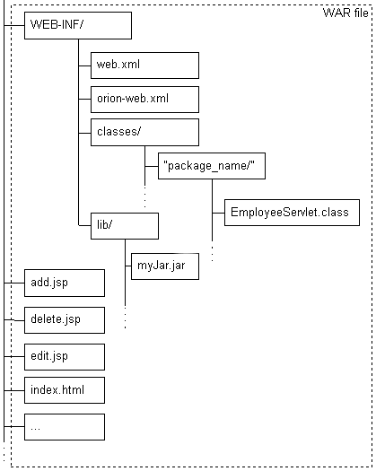

### 2021-09-08

## 서블릿
- **서블릿이란?**
    - 자바를 이용한 동적인 웹 처리
    - 자바로 HTTP 요청 및 응답을 처리하기 위한 표준
        - Jakarta Servlet defines a server-side API for handling HTTP requests and responses
    - 서블릿 표준은 인터페이스로 제공
    - 해당 인터페이스를 구현한 서블릿 컨테이너들
        - Tomcat, Jetty, Undertow
            - Spring: Tomcat 기본 내장
            - SparkJava: Jetty 기본 내장

- **서블릿 구현 방식**
    
    - HTML/JSP 같은 정적 파일들은 루트 디렉토리에 배치
    - 컴파일된 서블릿 클래스는 /WEB-INF/classes 디렉토리에 배치
    - 라이브러리 파일은 /WEB-INF/lib 디렉토리에 배치
    - 어노테이션, xml 방식으로 서블릿 구현할 수 있음

- **서블릿 컨테이너**
    - 동적 웹 처리를 위해 dynamically generate the web page on the server-side
    - 하는 일
        - 통신 지원: 웹서버 <-> 서블릿 통신 API
        - Lifecycle 관리: init -> service -> destory
        - 멀티스레딩 지원
    - 처리 순서
        1. 사용자가 HTTP 요청을 서버에 보냄
        2. 서블릿 컨테이너가 HttpServletRequest, HttpServletResponse 객체 생성
        3. 서블릿은 요청을 처리할 수 있는 서블릿 찾아 스레드 할당, request/response 객체 전달
        4. 서블릿 컨테이너 service() 메서드 호출 ==> doGet(), doPost() 등 호출
        5. 처리 이후 컨테이너에게 응답 객체 전달

- **서블릿 컨테이너의 멀티쓰레딩**
    - 서블릿 컨테이너는 각 서블릿 객체를 하나씩만 만듦
        - 서블릿 객체는 thread-safe 보장해야함
    - 서블릿 컨테이너는 쓰레드 풀을 사용해 쓰레드 만들어두고 재사용
    - *참고 1: https://tomcat.apache.org/tomcat-8.5-doc/config/executor.html*
    - *참고 2: https://tomcat.apache.org/tomcat-8.5-doc/config/http.html*
    ```xml
    <Connector port="8080" protocol="HTTP/1.1" 
               connectionTimeout="10000" 
               redirectPort="8443"  
               maxThreads="200"   
               acceptCount ="100" />
    ```
    - **[maxThreads]** 
        - 처리할 수 있는 최대 동시 요청 수 결정
        - default 200개로 지정
        - CPU 사용량 고려하여 CPU 사용량이 적다면 쓰레드를 좀 더 만들수 있게 하자
    - **[minSpareThreads]**
        - 항상 살아있는 최소한의 쓰레드 수
            - active, idle 모두 포함
        - default 25개로 지정
    - **[acceptCount]**
        - queue에 저장 가능한 최대 요청수 설정
        - 대기열이 가득차면 OS가 추가 연결을 거부하거나 연결 시간 초과될 수 있음
        - 기본값 100

- **서블릿 필터**
    - 서블릿으로 요청이 전송되기 전에 추가적인 처리 하고 싶을 때 적용
        - ex. 서블릿의 요청의 로그를 쌓을 수 있음
        - ex. 서블릿 시작/종료 시간 로그로 기록해 호출 지연되는 부분 탐색

## 도커 디비를 디비로 이전하기
- **디비는 도커에 띄우면 안 좋지?**
    - *참고 1: https://this-programmer.tistory.com/entry/%EA%B3%BC%EC%97%B0-%EB%8F%84%EC%BB%A4Docker-%EC%BB%A8%ED%85%8C%EC%9D%B4%EB%84%88%EB%A5%BC-%ED%86%B5%ED%95%B4-%EB%8D%B0%EC%9D%B4%ED%84%B0%EB%B2%A0%EC%9D%B4%EC%8A%A4%EB%A5%BC-%EC%9A%B4%EC%98%81%ED%95%98%EB%8A%94-%EA%B2%8C-%EC%A2%8B%EC%9D%80-%EB%B0%A9%EB%B2%95%EC%9D%BC%EA%B9%8C*
    - *참고 2: https://patrobinson.github.io/2016/11/07/thou-shalt-not-run-a-database-inside-a-container/*
    - *참고 3: https://vsupalov.com/database-in-docker/*
    - Docker 볼륨 관리는 불안정한 요소가 있어 디비 활용이 힘듦
        - 볼륨 관리가 잘 안되었을 경우 문제 큼!
        - 굳이 도커라는 중간 관리가 필요한가? 
            - 디비의 트러블 슈팅할 때 도커 네트워크까지 끼어있는게 좋은 것일까?
        - 디비를 도커로 스케일 아웃을 할 필요가 있는가? 스케일 업만 해도 되지 않나?
    - DB의 중심은 "영속적 데이터 저장"
        - 컨테이너로 볼륨 마운팅하더라도 그냥 데이터 정도만 마운팅하는거잖아?
        - DB에서 만든 로그 형식, 쿼리 로그 남기는 것은 어떻게 가져올라고?
    
- **어떻게 옮기지?**
    - *참고: https://mariadb.com/kb/en/mysqldump/*
    - **mysqldump**
        - It can be used to dump a database or a collection of databases for backup or transfer to another database server (not necessarily MariaDB or MySQL). 
        - The dump typically contains SQL statements to create the table, populate it, or both. 
        - However, mysqldump can also be used to generate files in CSV, other delimited text, or XML format.    
        ```
        도커 쉘 안에서
        mysqldump -u root -p 1234 --all-databases > all_backup.sql
        mysqldump -u root -p 1234 dbname > dbname_backup.sql
        mysqldump -u root -p 1234 옵션 안주면 전체 DB 백업
        ```
        - 처음에 10.1 로 서버에 깔았음
        - 도커엔 10.6 이 깔려있었음 
        - 꺾쇠로 덤프 실패! 10.1 < 10.6 파일 멈춰!
        - 10.1 버전이랑 10.6 버전 차이로 인한 문제
            - 둘이 도커 컨테이너 실행시 환경변수도 달랐음
        - 서버에 10.1 밀고 10.6 깔아서 해결

## apt (Advanced Packaging Tool)
- *참고: https://coding-groot.tistory.com/90*
- 우분투 포함 데비안 계열의 리눅스에서 쓰이는 패키지 관리 명령어 도구
- apt vs apt-get
    - apt-get은 더 많은 옵션을 제공!
    - apt-get의 자주쓰는 옵션 + GUI => apt
    - 일반 리눅스 사용자라면 apt를, 패키지 관리의 세밀한 옵션은 apt-get으로 하자
