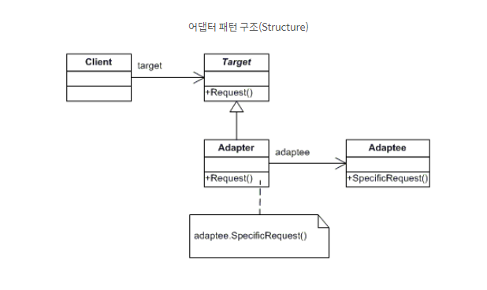

### 2021-09-15

## HandlerMapping
- *참고: https://docs.spring.io/spring-framework/docs/current/javadoc-api/org/springframework/web/servlet/HandlerMapping.html*
- **정의**
    - Request와 Handler 객체 사이의 매핑을 구현하는 인터페이스
- **특징**
    - 프레임워크에는 BeanNameUrlHandlerMapping과 RequestMappingHandlerMapping이 이미 포함됨
    - 핸들러들은 HandlerExecutionChain으로 감싸짐
    - DispatcherServlet에서 HandlerInterceptor의 모든 preHandle 메서드가 true라면 이후 실행
- **활용**
    - session/cookie 상태에 따라서 custom mapping 정의 가능

## HandlerAdapter
- *참고: https://docs.spring.io/spring-framework/docs/current/javadoc-api/org/springframework/web/servlet/HandlerAdapter.html*
- **정의**
    - Request를 처리하기 위해 각 핸들러 유형에 대해 구현해야 하는 인터페이스
- **특징**
    - DispatcherServlet의 확장 가능
    - 해당 인터페이스를 통해 설치된 핸들러를 액세스 가능
    - 애플리케이션 개발자 위한 것은 아니야
    - 자체 웹 워크플로우 개발하려면 쓰세요~

## Adapter Pattern
- **특징**
    - 한 클래스의 인터페이스를 사용하고자 하는 다른 인터페이스로 변환할 때 주로 사용
    - 인터페이스 호환성이 맞지 않아 같이 쓸 수 없는 클래스를 연관 관계로 연결해서 사용
    - 기존 클래스의 소스코드를 수정해서 인터페이스 맞추는 작업보다 기존 클래스의 소스코드 수정 전혀하지 않고 타겟 인터페이스에 맞춰 동작 가능케 함
- **구조**
    
- **예시**
    ```java
    public interface MediaPlayer {
        void play(String filename);
    }
    
    public class MP3 implements MediaPlayer {
        @Override
        public void play(String filename) { 
            System.out.println("Playing MP3 file" + filename);
        }   
    }
    
    public interface MediaPackage { 
        void playFile(String filename); 
    }
    
    public class MP4 implements MediaPackage {
        @Override
        public void playFile(String filename) { 
            System.out.println("Playing MP4 file" + filename);
        }   
    }
    
    public class MKV implements MediaPackage {
        @Override
        public void playFile(String filename) { 
            System.out.println("Playing MKV file" + filename);
        }   
    }
    
    public class FormatAdapter implements MediaPlayer {
        private MediaPackage media;
    
        public FormatAdapter(MediaPackage m) {
            media = m;
        }
    
        @Override
        public void play(String filename) {
            System.out.println("Using adapter ==> ");
            media.playFile(filename);
        }
    }
    
    public class Main {
        public static void main(String[] args){
            MediaPlayer player = new MP3();
            player.play("file.mp3");
        
            player = new FormatAdapter(new MP4());
            player.play("file.mp4");
    
            player = new FormatAdapter(new MKV());
            player.play("file.mkv");
        }
    }
    ```

## Spring MVC
- *참고: https://velog.io/@hsw0194/Spring-MVC-HandlerMapping%EC%9D%98-%EB%8F%99%EC%9E%91%EB%B0%A9%EC%8B%9D-%EC%9D%B4%ED%95%B4%ED%95%98%EA%B8%B0-1%ED%8E%B8*
- Spring MVC Request flow
    
    1. 먼저 DispatcherServlet이 요청을 받음
    2. DispatcherServlet은 HandlerMapping에게 적절한 controller를 선택하도록 요청
    3. HandlerMapping은 적합한 controller 선택
    4. DispatcherServlet은 선택된 controller의 로직 실행작업을 HandlerAdapter에게 위임
    5. HandlerAdapter가 controller의 비즈니스 로직 호출하고 결과를 ModelAndView 객체에 담아 이를 리턴
    6. DispatcherServlet이 ViewResolver를 이용해 결과를 보여줄 View를 가져옴
    7. View 객체에게 DispatcherServlet이 응답 결과 생성 요청