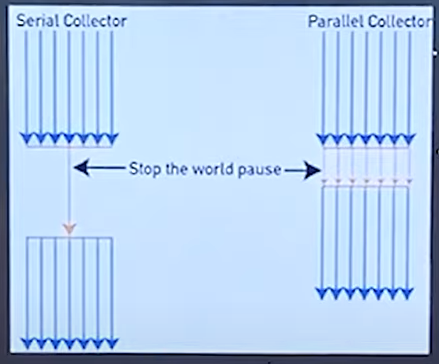
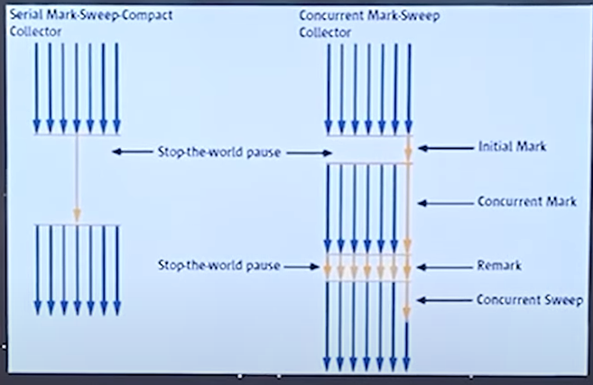

### 2021-09-19

## 테코톡 - JVM GC
- *참고: https://www.youtube.com/watch?v=vZRmCbl871I&list=PLSnmzK8DduHIcb_FsgG-yjXYARCKCKwzh&index=3&t=717s*
- **JVM**
    - 운영체제의 메모리 영역에 접근하여 메모리를 관리하는 프로그램

- **GC**
    - 동적으로 할당한 메모리 영역 중 사용하지 않는 영역을 탐지하여 해제하는 기능
    - 동적 할당: HEAP
        - 모든 Object 타입의 데이터가 할당. 
        - Heap 영역의 Object를 가리키는 참조변수가 stack에 할당
    - Stack: 정적으로 할당한 메모리 영역
        - 원시 타입의 데이터가 값과 함께 할당. 
        - Heap 영역에 생성된 Object 타입의 데이터의 참조 값 할당
    - Stack 할당된거 다 POP되고, HEAP에 남은 참조가 끊긴 친구들,,, unreachable object => GC의 대상

- **GC 과정**
    1. Stack의 모든 변수 스캔하면서 각각 어떤 객체 참조 중인지 찾아서 마킹 - MARK
    2. Reachable Object가 참조중인 객체도 찾아서 마킹 - MARK
    3. 마킹 안된 객체 Heap에서 제거 - SWEEP
    - Mark And Sweep 과정!

- **GC 언제 일어남?**
    - Heap의 구조
        - New Generation: Eden / Survival 0 / Survival 1
        - Old Generation
    - 새로운 객체는 Eden 영역에 할당
    - Eden 꽉 차면 Minor GC 발생
        - Eden 영역에 대해서만 Mark And Sweep
        - Eden 영역 중 Reachable 객체는 Survival 0 으로 옮겨짐
        - Eden 영역 중 Unreachable 객체는 메모리에서 해제
    - Survival 0 영역이 꽉 참 Minor GC 발생
        - Survival 0에서 Mark And Sweep
        - 살아남은 놈들 다 Survival 1 영역으로 이동
            - 이동한 객체는 Age 값이 증가
    - Survival 1 영역이 꽉 참 Minor GC 발생
        - Survival 1에서 Mark And Sweep
        - 살아남은 놈들 Survival 0 영역으로 이동
            - 이동한 객체 Age 값이 증가
    - 특정 Age 값 넘어가면 Old Generation으로 Promotion
    - Old Generation 영역 꽉차면 Major GC 발생

- **GC의 종류**
    - Stop-The-World
        - GC를 실행하기 위해 JVM이 애플리케이션 실행 멈추는 것
        - GC 수행하고 중단한 작업 다시 실행
        - 
        - 
    - Serial GC
        - GC를 처리하는 스레드가 1개
        - CPU 코어가 1개만 있을 때 사용
        - Mark-Compact Collection 알고리즘
    - Parallel GC 
        - GC 처리 쓰레드 여러개
        - 코어 갯수 많을 때
    - Concurrent Mark Sweep GC
        - stop the world 줄여!
            - initial Mark: 멈추고 살짝 검토
            - concurrent Mark: 다른 어플리케이션 쓰레드와 동시에 수행하면서, 객체 그래프 타고가면서 계속 마크해!
            - remark: 멈추고 찐 리마크
            - concurrent Sweep: 찐 해제
        - 애플리케이션 응답시간이 빨라야 할 때 사용
        - 다른 GC 방식보다 메모리/CPU 많이 사용
        - Compaction 사용 안함
    - G1 GC
        - GC 일어날 때 전체 영역을 탐색하지 X
        - 바둑판의 영역에 객체를 할당하고 GC 실행
        - 그러다가, 해당 영역이 꽉 차면 다른 빈 영역에 객체 할당하고 GC 실행
        - G1 GC STW 시간 짧음
        - Compaction 사용
        
## 네이버 D2 GC
- *참고 1: https://d2.naver.com/helloworld/1329*
- **Stop-The-World**
    - GC를 실행하는 쓰레드를 제외한 나머지 쓰레드는 모두 작업 멈춤
    - 어떤 GC 알고리즘을 쓰더라도 stop-the-world 발생
    - GC 튜닝이란 stop-the-world 시간 줄이는 것

- **객체 메모리 해제**
    - 명시적 해제를 위해 객체를 null로 지정하는 것은 ㄱㅊ
    - System.gc() 메서드는 절대 사용하지마! 시스템 성능에 매우 큰 영향 끼침

- **GC 등장의 가설 (weak generational hypothesis) **
    1. 대부분의 객체는 금방 접근 불가능한 상태가 된다
    2. 오래된 객체에서 젊은 객체로의 참조는 아주 적게 존재한다.

- **HotSpot VM의 메모리 공간**
    - Young 영역: 대부분의 객체가 여기에 위치. 매우 많은 객체가 Young 영역에 생성되었다가 사라짐. Minor GC
    - Old 영역: 접근 불가능 상태로 되지 않아 Young 영역에서 살아남은 객체가 여기로 복사. Young 영역보다 크게 할당. Young 영역보다 GC 적게 발생. Major GC

- *참고 2: https://d2.naver.com/helloworld/329631*
- **특징**
    - 최초의 Java GC는 어플리케이션의 사용자 코드 관여 X
    - JDK 1.2 부터 java.lang.ref 패키지를 추가해 사용자 코드와 GC가 상호작용 할 수 있음
    - java.lang.ref 패키지는 전형적인 객체 참조인 strong reference 외에도 soft, weak, phantom 3가지 새로운 참조 방식 제공
    - 객체 참조
        - strong
        - soft
        - weak
        - phantom

- **GC와 Reachability**
    - Reachable: 객체에 유효한 참조가 존재
    - Unreachable: 객체에 유효한 참조 X
    - 
    - 런타임 데이터 영역
        - 큰 힙: 객체 생성/보관
        - 메서드 영역: 클래스 정보가 차지하는 영역
        - 쓰레드 영역: 쓰레드가 차지하는 영역
    - 힙에 있는 객체들에 대한 참조 종류들
        - 힙 내의 다른 객체에 의한 참조
        - Java 스택(지역 변수, 파라미터 등)에서의 참조
        - JNI에 의해 생성된 객체에 대한 참조
        - 메서드 영역의 정적 변수에 의한 참조
        - 

- **Soft, Weak, Phantom Reference**
    - 
    - 
    
- **Reference와 Reachability**
    - 
    - reachable인가 unreachable인가만 구분하여 사용자 코드 관여 X
    - java.lang.ref 패키지 이용하여 reachable 객체들을 경우에 따라 다르게 지정할 수 있음
        - strongly reachable
        - softly reachable
        - weakly reachable
        - phantomly reachable
    - 녹색으로 표시한 중간 두 객체는 WeakReference로만 참고된 weakly reachable
        - GC 동작시 unreachable 뿐만 아니라 weakly reachable 객체도 가비지 객체도 메모리에서 회수

- **Strengths of Reachability**
    - strongly reachable
        - root set으로 시작해 어떤 reference object도 안 끼어있는 상태
        - reference object가 없는 사슬이 하나라도 있는 객체
    - softly reachable
        - weak, phantom 없이 soft reference만 통과
    - weakly reachable
        - phantom reference 없이 weak reference만 통과
    - phantomly reachable
        - finalize 되었지만 아직 메모리 회수 안된 상태
    - unreachable
        - root set으로 부터 시작되는 참조 사슬로 참조 X

- **Soft Reachable과 SoftReference**
    - soft reachable 객체는 힙에 남아있는 메모리의 크기와 해당 객체 사용 빈도에 따라 GC 여부 결정
    - Oracle HotSpot VM에서는 softly reachable 객체의 GC 조절하는 옵션 제공
        - `-XX:SoftRefLRUPolicyMSPerMB=<N>`
        
- **Weakly Reachable과 WeakReference**
    - WeakReference 내의 참조가 null로 설정되고 GC에 의해 메모리 회수
    - 실제 GC가 언제 객체 회수할지는 알고리즘에 따라 다 달라
        
- **ReferenceQueue**
    - PhantomReference는 객체 내부의 참조를 null로 설정하지 않고 참조된 객체를 phantomly reachable 객체로 만듦
    - 이후에 ReferenceQueue에 enqueue 됨

- **Phantomly Reachable과 PhantomReference**    
    - GC 대상 객체 찾기 / GC 대상 객체 처리 / 메모리 회수 모두 따로따로의 작업
    - Phantomly Reachable은 파이널라이즈-메모리 회수에 관여
    - GC가 객체 처리하는 순서
        1. soft references
        2. weak references
        3. 파이널라이즈
        4. phantom references
        5. 메모리 회수
        
- **마치며**
    - Java GC는 GC 대상 객체 찾고, 대상 객체를 finalization 하고, 할당된 메모리 회수하고
    - 애플리케이션은 사용자 코드에서 객체의 reachability 조절하여 Java GC에 관여
    - 객체의 reachability를 조절하기 위해 java.lang.ref 패키지의 SoftRef, WeakRef, PhantomRef, ReferenceQueue 등 사용
