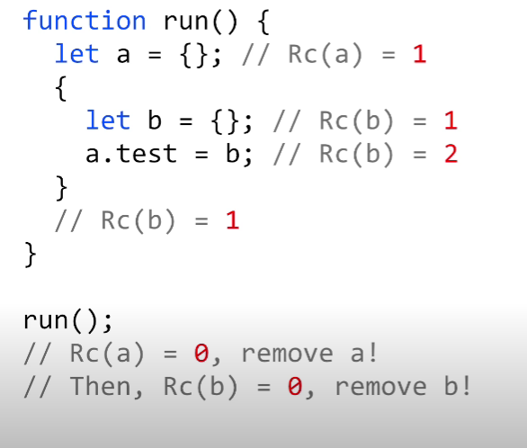
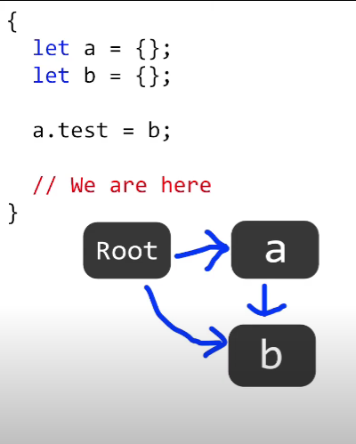
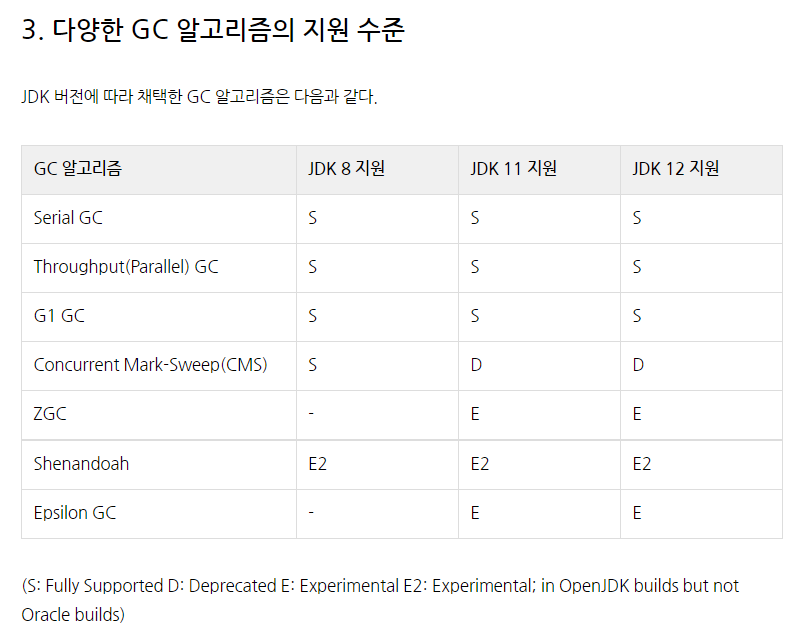
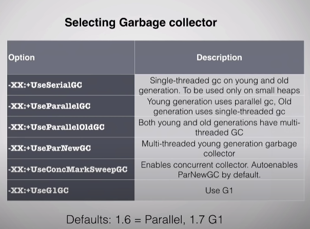
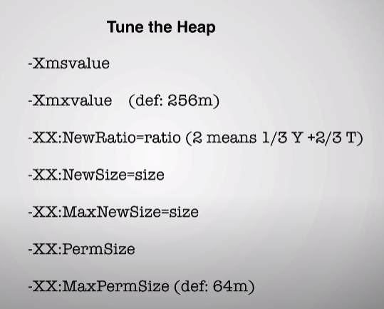
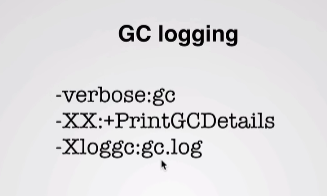
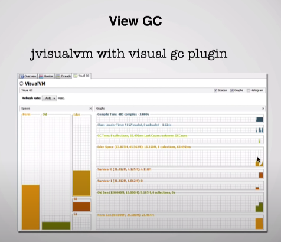

### 2021-09-22

## GC 얄코
- *참고: https://www.youtube.com/watch?v=24f2-eJAeII&list=PLSnmzK8DduHIcb_FsgG-yjXYARCKCKwzh&index=10*
- 메모리 공간 하나하나 차지하던거 비워둬야하는 것 (Unmanaged Language)
    - Memory Leak 발생 (C의 malloc 등)
    - 두둥 GC 등장

- Mark-And-Sweep
    - 루트에서 참조가 안되면 치워

- Reference Counting
    - 한 요소가 다른 요소에게 몇번이나 참조되는지 세어서 0이면 갖다버려!

- 언어/프로그램의 특성마다 메모리 누수 발생하는, 성능을 저하시키는 경우들이 다름
    - 그래서 조금 알아볼 필요가 있다. 

- 공통적으로 안좋은 것
    - 순환참조!
        - 서로 참조하니까 레퍼런스 카운팅... 0이 안되네

## GC 태훈
- *참고: https://www.youtube.com/watch?v=j9Vncn04GsE&list=PLSnmzK8DduHIcb_FsgG-yjXYARCKCKwzh&index=5*
- **Reference Counting**
    - 선언하는 모든 객체들은 reference count라는 별도 숫자를 가지게됨 (초기 1, 다쓰면 0 됨)
    - reference count: 어떤 방법으로 해당 객체에 접근할 수 있는지!
    - 
    - 객체마다 ref-count하나 주고 세도록 하게 하면 됨!
    - 한계점
        - 순환참조 및 사이클이 생기면 잡아낼 수가 없어! => Memory Leak
    - 따라서 이거만 가지고 GC 구현하지 않아! Mark And Sweep으로 대체 or 보완함
        
- **Mark And Sweep**
    - 시작하는 노드 필수! (루트)
    - 객체를 선언을 한 출처와 연결!
    - 
    - Ref-Count와 다르게, 매번 계산 X
    - 의도적으로 GC를 돌려야해!
        -  메모리 일정 수준 이상 사용된 경우 처럼 (ex. 에덴 꽉참)
    - GC 시작
        - 루트부터 시작된 그래프 순회! (DFS 등) [MARK]
        - 연결이 안되어 있구나! 지워! [SWEEP]
            - 순환참조도 지울 수 있어!
    - 최적화를 구현하면서 구현하기가 빡셈,,, 성능 좋게 유지하면서 지워주는게!
    - 한계점
        - Ref-Count 같은 경우 가비지 체크 그때그때 (Refcount 0이면 지운다!)
        - GC 돌릴때 매번 선언된 객체 다 훑어야해
            - 최적화 덜된 적당히 구현된 놈이면 freezing

## GC 메모리 관리가 제대로 안되면?
- *참고: https://www.youtube.com/watch?v=Y17EdphR3HA&list=PLSnmzK8DduHIcb_FsgG-yjXYARCKCKwzh&index=10&t=446s*
- **문제 상황**
    - 통신사에서 고객센터 뭐 보내면 Heap 사용량이 오지게 늘었음
    - Memory Leak이 발생해
    - 화면에서 모래시계만 줄창 나옴
    - 매주 재구동 했음,,, 부하 체크하고 맨날 재구동
    - 공장 라인 증설,,,
    - Heap 사용량 오지게 늘더니 결국 화면 멈춤
    - 로그 보니까 Out Of Memory Error
    - JVM 메모리 용량...
    
- **보물 창고**
    - https://blog.naver.com/pcmola/222074787428

## 자바 GC
- *참고: https://blog.naver.com/pcmola/222060198638*
- **승격**
    - `-XX:MaxTenuringThrehold=<n>`를 통해 Promotion 이전 통과해야할 가비지 수집 횟수 조절 가능
        - Java 11에서 디폴트 값은 7, 최대 15
        - 한계치가 높을 수록 진짜 장수한놈만 승격
        - 한게치가 낮을면, 너무 쉽게 승격되어 메모리압 증가
            - 승격이 너무 잦으면 STW 너무 자주 발생함

- **GC 종류**    
    - Serial GC: 단일 쓰레드 환경
        - `-XX:+UseSerialGC`
        - VirtualBox VM에서 기본 가비지 수집기를 Serial GC로 사용중이란다
        ``` shell script
        $ grep -c processor /proc/cpuinfo
        2
        
        $ java -XX:+PrintCommandLineFlags  -version
        -XX:InitialHeapSize=16137664 -XX:MaxHeapSize=258202624 -XX:+PrintCommandLineFlags -XX:ReservedCodeCacheSize=251658240 -XX:+SegmentedCodeCache -XX:+UseCompressedClassPointers -XX:+UseCompressedOops -XX:+UseSerialGC
        openjdk version "11.0.7" 2020-04-14
        OpenJDK Runtime Environment AdoptOpenJDK (build 11.0.7+10)
        OpenJDK 64-Bit Server VM AdoptOpenJDK (build 11.0.7+10, mixed mode)
        ```
    - Parallel GC: 멀티 CPU 환경에서 어플리케이션 처리 속도 향상위함
        - `-XX:+UseParallelGC`
        - Java 8 사용시 기본 GC를 ParallelGC로 사용
        ``` shell script
        $ java -XX:+PrintCommandLineFlags  -version
        -XX:InitialHeapSize=536870912 -XX:MaxHeapSize=8589934592 -XX:+PrintCommandLineFlags -XX:+UseCompressedClassPointers -XX:+UseCompressedOops -XX:+UseParallelGC
        openjdk version "1.8.0_212"
        OpenJDK Runtime Environment (Zulu 8.38.0.13-CA-macosx) (build 1.8.0_212-b04)
        OpenJDK 64-Bit Server VM (Zulu 8.38.0.13-CA-macosx) (build 25.212-b04, mixed mode)
        ```
    - Concurrent Mark Sweep (CMS) GC
        - `-XX:+UseConcMarkSweepGC`           `
        - 중단 시간을 매우 짧게 하기 위함!
        - 대부분의 GC 작업을 어플리케이션 쓰레드와 동시에 수행하며, STW 최소화를 위함!
    - G1 GC: 4기가 이상의 대용량 메모리 공간이 있는 멀티 프로세서 시스템에서 실행되는 응용 프로그램을 위해 설계
        - G1 GC 튜토리얼: https://www.oracle.com/technetwork/tutorials/tutorials-1876574.html
        - `-XX:+UseG1GC`
        - 중단 시간이 짧은 새로운 수집기 (CMS 보다 튜닝 쉬움)
        - 조기 승격에 덜 취약
            - 조기 승격: 할당률 높아 테뉴어드로 빨리 승격되는 문제
        - Java 9 부터는 G1이 디폴트
        - Young-Old 개념 X
        - 가비지 우선!
            - Heap 2개로 나누고 가비지가 있으면 지워버려!
        - `-XX:MaxGCPauseMillis=200`           `
            - 디폴트 중단 목표를 200 밀리초로 설정하는 스위치
    - 

## 자바 힙 메모리 분석
- *참고 1: https://blog.naver.com/pcmola/222038466393*
- *참고 2: https://techblog.woowahan.com/2628/*
- **힙 히스토그램**
    - jcmd
        - `jcmd JavaPID GC.class_histogram`
        - Full GC 발생
    - jmap
        - `jmap -histo JavaPID`
        - 죽은 객체 포함
        - Full GC 안 일어남

- **힙 덤프 뜨기**
    - jcmd
        - `jcmd JavaPID GC.heap_dump heap_dump.hprof`
    - jmap
        - `jmap -dump:file=heap_dump.hprof 10141`

- **힙 덤프 분석**
    - visualVM, mat
    
## JVM 상태 모니터링 - jstat
- *참고 1: https://blog.naver.com/pcmola/222062377357*
- *참고 2: https://d2.naver.com/helloworld/6043*
- **jstat**
    - JVM 통계 모니터링 툴, JDK 설치시 기본 설치되는 유틸리티
    - `jstat -gc JavaPID 1000` => 1초에 한번씩 javaPid에 대해 결과값을 보여주세요
    - `jstat -gcutil -h5 -t javaPID 1000 10` => jstat을 -gcutil 옵션을 주고 5개씩 출력마다 헤더 출력하고, 1초마다 출력하되 10개씩 보여줌

## JVM 모니터링 + 튜닝
- *참고: https://goodgid.github.io/Java-8-JVM-Metaspace/*
- **Metaspace VS PermGen**
    - Metaspace (java 8 이후) 
        - part of Native Memory (OS level)
        - process sizes can go large
        - too many classes loading can bring down the server
        - Java의 클래스로더가 현재까지 로드한 클래스들의 메타데이터 저장되는 곳
        - Heap 영역이 아니라 Native 메모리 영역에 위치함
        - Default로 제한된 크기 X, 필요한 만큼 늘어남
        - JVM에서 Heap과 Metaspace 조절 (시스템의 기본 메모리)
            - Java 어플리케이션에는 크게 Heap과 Metaspace 두 공간 활용하여 동작
            - 어플리케이션 메모리를 결정하기 위해서는 Xmx (Heap 메모리 최대치 결정하는 Java 옵션) => OOME
            - Xmx에 MaxMetaspace 값 더하고 추가로 Non-blocking I/O 통해 Native memory 할당받는 로직 고려하여 Heap + Metaspace 할당해야 정확
        ```
        <----- Java Heap -----> <--------- Native Memory --------->
        +------+----+----+-----+-----------+--------+--------------+
        | Eden | S0 | S1 | Old | Metaspace | C Heap | Thread Stack |
        +------+----+----+-----+-----------+--------+--------------+
        ```
    - PermGen
        - Used to store objects of methods and class
        - Apps which have lots of classes loaded will have more permgen utilization
        - Results in OOM error due to PermGen space
        - 클래스 혹은 메서드 코드가 저장되는 영역
        - Heap 영역에 속함
        - Default 로 제한된 크기 가짐
        ```
        <----- Java Heap ----->             <--- Native Memory --->
        +------+----+----+-----+-----------+--------+--------------+
        | Eden | S0 | S1 | Old | Permanent | C Heap | Thread Stack |
        +------+----+----+-----+-----------+--------+--------------+
                                <--------->
                               Permanent Heap
        S0: Survivor 0
        S1: Survivor 1
        ```
    - Why Perm 대신 Metaspace?
        - Metaspace는 JVM에 의해 관리되는 Heap이 아니라 OS 레벨에서 관리되는 native 메모리 영역
        - Metaspace가 Native 메모리 이용함으로써 개발자는 영역 확보의 상한 의식 안해도 됨

- **Select GC**
    - 

- **Tune Heap**
    - 

- **GC logging**
    - 

- **View GC**
    - 

## 생기는 질문들
- JVM에서 얼마만치의 OS 메모리를 사용할 수 있는가?
    - 내가 꽂아놓은 램은 모두 싹다 메모리로다가 쓸수 있는건가?
