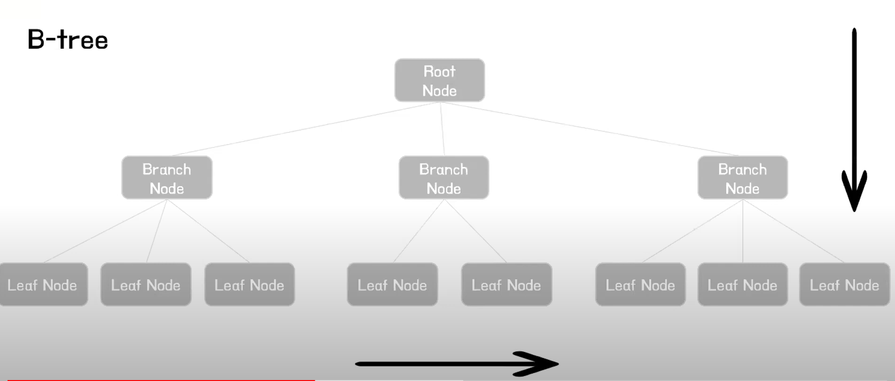
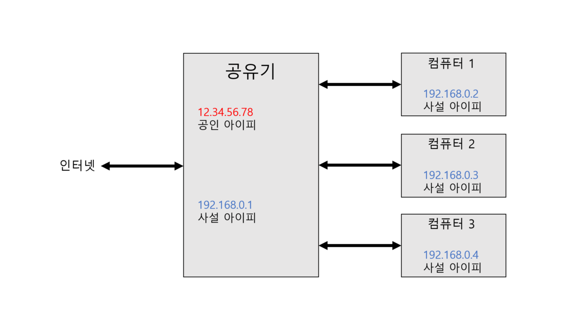
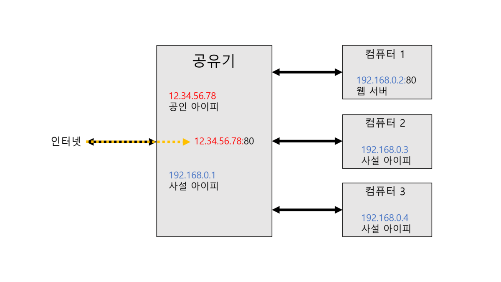

### 2021-09-23

## DB 인덱스
- *참고 1: https://www.youtube.com/watch?v=9ZXIoh9PtwY&t=252s*
- *참고 2: https://www.youtube.com/watch?v=NkZ6r6z2pBg&t=590s*
- *참고 3: https://www.youtube.com/watch?v=P5SZaTQnVCA&t=569s*
- **Index 사용 이유**
    - 대용량 데이터에서 원하는 데이터를 빠르게 조회하기 위함
    - 대용량 데이터 조회 시 SELECT 쿼리 조회 속도 향상을 위함
    - 단 Insert, Update, Delete 시 성능 조금 희생

- **Index의 작성/삭제**
    - Index도 하나의 DB 객체 (저장된 데이터의 10% 정도의 공간 필요!)
        - Oracle, DB2 등에서는 스키마 객체
        - MySQL, SQL Server 등에서는 테이블 내의 객체
    ```mysql
    create index IDX_FIRST_NAME ON employees(first_name)
    
    drop index IDX_FIRST_NAME ON employees
    ```

- **Full Table Scan**
    - 원하는 데이터 찾을때 싹 다 돌아버려
    - 대용량 데이터에 비효율적

- **B-tree**
    - 자식 노드의 갯수가 2개 이상인 트리
    - 
    - 수직적 탐색, 수평적 탐색
        - 수직적으로 조건 알맞는 Branch Node 찾고
        - 수평적으로 조건 알맞는 Leaf Node 찾기

- **Clustered vs Non-Clustered**
    - Clustered: 인덱스 안에 데이터가 포함됨
    - Non-Clustered: 인덱스 안에 데이터 없음

- **Clustered Index**
    - PK: Clustered index 자동 생성
    - 특징
        - 테이블 당 1개만 존재
        - PK 제약조건으로 칼럼 생성하면 자동 생성
        - 리프 페이지 == 데이터 페이지
        - 데이터가 정렬된 상태

- **Non-Clustered Index**
    - 특징
        - 테이블에 여러개 존재 가능
        - Unique 제약 조건으로 컬럼 생성시 자동 생성
        - 인덱스와 데이터 페이지 따로 존재
        - 리프 페이지에서 데이터가 있는 곳의 주소를 가짐
        - 데이터 페이지에 데이터가 정렬되지 않아도 됨
        - Clustered에 비해 SELECT 약간 느림, INSERT/UPDATE/DELETE 시 부하 적음

- **인덱스를 언제 쓸까?**
    - SELECT FROM WHERE: 성능 굿! 조회 빨리 할 수 있음
    - INSERT: 성능저하, 비트리에 우겨넣는거랑 비슷하다고 생각
    - DELETE: 성능저하, 비트리에 삭제하는것과 비슷
    - UPDATE: 성능저하, DELETE 후 INSERT 하는 방식으로 구동됨

- **인덱스 Column 설정 기준**
    - Cardinality가 높은 것을 인덱스의 기준으로 삼자!
        - 성별로 거를지, 닉네임으로 거를지, 주민번호로 거를지? ==> 고유하게 거를값!
        - 고유한 수가 많은 것!

## 네트워크 관련 키워드
- **인터넷**
    - TCP/IP를 기반으로 한 전 세계적으로 연결된 네트워크 통신망
    - 웹, 이메일, 파일 공유, 스트리밍, 온라인게임, VoIP, 모바일 앱등 다양한 서비스 포함

- **이더넷**
    - LAN을 위해 개발된 근거리 유선 네트워크 통신망 기술 (유선 인터넷)
    - CSMA/CD 프로토콜 사용
    - 각 기기들의 고유 주소인 맥주소를 가지고 호스트 간의 데이터를 주고 받음
    - 장점
        - 적은 용량의 데이터 전송시에 성능 우수
        - 설치 비용 저렴하고, 관리가 쉬움
        - 네트워크 구조가 간단함
    - 단점
        - 네트워크 사용 시, 신호때문에 충돌 발생

- **맥주소**
    - 네트워크 하드웨어를 식별하는 주소
    - 하나씩 할당되어 중복되지 않고, 고유한 값을 가짐

- **포트 포워딩**
    - *참고: https://lamanus.kr/59*
    - 컴퓨터 네트워크에서 패킷이 라우터나 방화벽과 같은 네트워크 게이트웨이를 가로지르는 동안,   
      하나의 IP 주소와 포트 번호 결합의 통신 요청을 다른 곳으로 넘겨주는 네트워크 주소 변환의 응용
    - 공유기 <-> 사설 네트워크
        - 인터넷 사용을 위해서 고유한 IP 주소 필요 (공인 IP)
        - 네트워크가 딱히 필요하지 않은 장비들에 대해서는 별도의 사설 네트워크 구축함
            - 10.x.x.x, 172.16~31.x.x, 192.168.x.x 대역
        - 공유기가 사설 IP 딱 대줘
        - 
    - 포트 포워딩이 필요한 이유
        - 내가 웹 서버를 내 노트북에서 열어봤자 외부에서 접근을 못하자나?
        - 그 이유가 바로 공유기까지만 연결 시도하고 연결된 노드에는 연결을 못해서 그래
            - 어디로 가야하죠 아저씨
            - 

- **포워드 vs 리다이렉트**
    - 포워드
        - Web Container 차원에서 페이지의 이동만 존재
        - 실제로 웹 브라우저는 다른 페이지로 이동했음을 알 수 X
        - 웹 브라우저에는 최초 호출 URL만 표시, 이동한 URL은 모름
        - 현재 실행중인 페이지와 forward에 의해 호출될 페이지는 Request/Response 객체를 공유
    - 리다이렉트
        - 서버가 클라이언트에게 특정 url로 이동하라는 요청을 보내는 것
        - 서버에서는 클라이언트에게 응답으로 302와 함께 이동할 url 정보를 Location 헤더에 담아 전송
        - 클라이언트가 서버로 부터 받은 응답이 302이면 Location 헤더값으로 재요청 보냄
            - 이 과정에서 브라우저의 주소창 전송받은 url로 변경
        - 각각의 요청이 실행될 때마다 Client/Server 간 새로운 요청 생성됨 (request, response 객체 생성됨)

## DB Key Point
1. OLTP (Online Transaction Processing)
    - 온라인 트랜잭션 처리
    - 복수의 사용자 PC에서 발생하는 Transaction을 DB 서버가 처리하고, 그 결과를 요청한 사용자 PC에 결과값을 되돌려주는 과정
    - 무수히 많이 발생되는 각각의 작업요청을 오류없이 처리, 결과값을 실시간으로 확인시켜줘야 함
2. ACID
    - Atomicity, Consistency, Isolation, Durability
    - 원자성, 일관성, 독립성, 지속성 
3. MVCC (Multi Version Currency Control)
    - *참고: https://mangkyu.tistory.com/53*
    - 동시 접근 허용하는 DB에서 동시성을 제어하기 위해 사용하는 방법
    - 데이터에 접근하는 사용자는 접근한 시점에서 DB의 스냅샷 읽음
    - 스냅샷 데이터에 대한 변경 완료시(트랜잭션 커밋 시) 만들어진 변경사항은 다른 DB 사용자는 못 봄
    - 이전 버전의 데이터와 비교해서 변경된 내용을 기록
    - MVCC의 특징
        - 일반적인 RDBMS보다 빠르게 동작
        - 사용하지 않는 데이터 쌓여서 데이터 정리 시스템 필요
        - 데이터 버전 충돌시 애플리케이션 영역에서 이러한 문제 해결할 것

## NGINX 작동법
- *참고 1: http://nginx.org/en/docs/beginners_guide.html*
- *참고 2: http://nginx.org/en/docs/http/request_processing.html*
- **Nginx가 request를 처리하는 방법**
    - 어떤 server가 request를 처리할지 정함
    ```
    server {
        listen      80;
        server_name example.org www.example.org;
        ...
    }
    
    server {
        listen      80;
        server_name example.net www.example.net;
        ...
    }
    
    server {
        listen      80;
        server_name example.com www.example.com;
        ...
    }
    ```
    - 요청의 "Host" 헤더값으로 어떤 서버로 라우팅이 되어야 하는지 지정함
        - server_name에 알맞은 host가 없다면 default_server로 라우팅됨
        - default_server 지정이 없다면 맨 처음께 default_server
        - 아래와 같이 지정 가능
        ```
        server {
            listen      80 default_server;
            server_name example.net www.example.net;
            ...
        }
        ```

- **정적 컨텐츠 제공하기**
    - /data/www에 HTML 파일을, /data/images에 이미지 파일을 저장
    ```
    http {
        server {
            location / {
                root /data/www;
            }
        
            location /images/ {
                root /data;
            }
        }
    }
    ```

- **프록시 서버 설정**
    - 8080 포트로 리스닝, 모든 요청을 /data/up1 디렉토리로 매핑
    ```
    server {
        listen 8080;
        root /data/up1;
    
        location / {
        }
    }
    ```
    - 이미지 확장자에 대한 요청은 /data/images에서 처리하고, 나머지는 proxy_pass (localhost:8080에서 돌고 있는 프로그램에서 처리하도록)
    ```
    server {
        location / {
            proxy_pass http://localhost:8080;
        }
    
        location ~ \.(gif|jpg|png)$ {
            root /data/images;
        }
    }
    ```

- **origin vs referer**
    - *참고 1: https://developer.mozilla.org/ko/docs/Web/HTTP/Headers/Origin*  
    - *참고 2: https://developer.mozilla.org/ko/docs/Web/HTTP/Headers/Referer*
    - origin: fetch가 시작되는 위치, 경로 정보 포함 않고 서버 이름만 포함
    - referer: 현재 요청을 보낸 페이지의 절대 혹은 부분 주소를 포함
        - 어디로부터 와서 방문 중인지를 인식할 수 있음
        - 분석/로깅/캐싱 최적화에 적용 가능
        
- **nginx 변수**
    - *참고: https://opentutorials.org/module/384/4508*
    - http://opentutorials.org:80/production/module/index.php?type=module&id=12 로 접근시...
        - $host: opentutorials.org
        - $uri: /production/module/index.php
        - $args: type=module&id=12
        - server_addr: 서버 주소
        - server_name: localhost
        - server_port: 80
        - server_protocol: HTTP/1.1
        - $arg_type: module
        - $request_uri: /production/module/index.php?type=module&id=12
        - $request_filename: /usr/local/nginx/html/production/module/index.php
