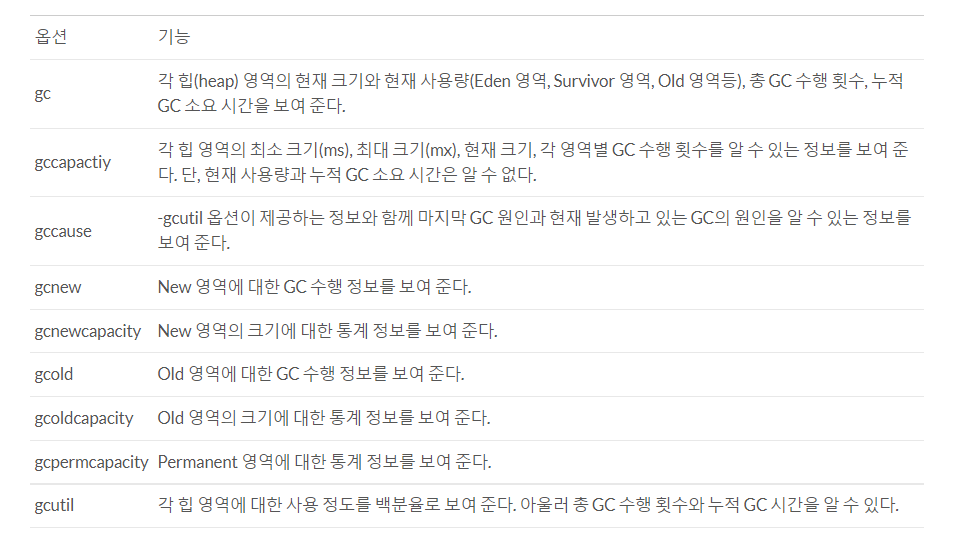
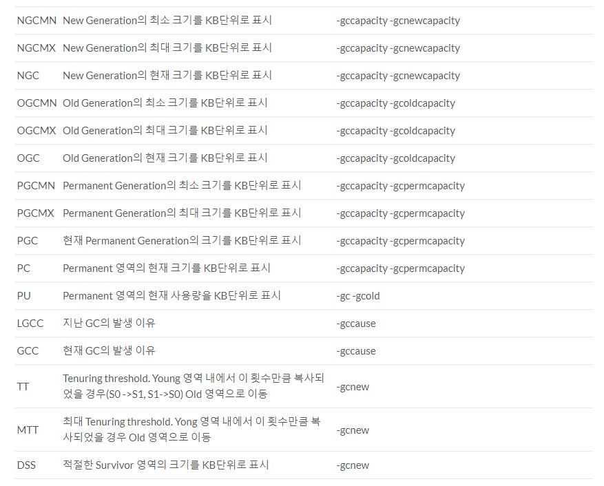
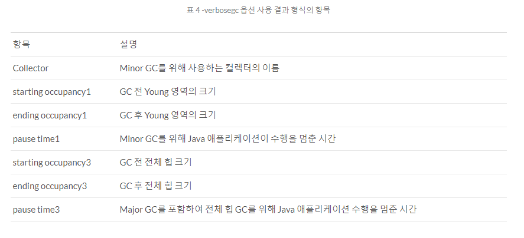

### 2021-09-26

## GC 모니터링
- *참고: https://d2.naver.com/helloworld/6043*
- **GC 모니터링?**
    - JVM이 GC를 어떻게 수행하고 있는가?
    - Young 영역의 객체 => Old로 언제 얼마나 이동했는가?
    - stop-the-world가 언제 얼마나 일어났는가?
    - 해당 글에서는 오라클의 HotSpot JVM을 기준으로 설명함

- **jstat**
    - HotSpot JVM에 있는 모니터링 도구
    - GC 수행 정보, 클래스 로더 수행 정보, JIT 컴파일러 수행 정보 등 알 수 있음
    - GC 관련 jstat 옵션
        - 
    - jstat 옵션에 따른 칼럼 정보
        - 
        - 

- **verbosegc 옵션**
    - java 어플리케이션 가동할 때 지정하는 JVM 옵션 가운데 하나
    - 직관적으로 쉬운 출력 결과
    ```
    -XX:+PrintGCDetails //default option when -verbosegc is used
    -XX:+PrintGCTimeStamps
    -XX:+PrintHeapAtGC
    -XX:+PrintGCDateStamps
    ```
    - 

- **VisualVM + VisualGC**
    - Oracle JDK가 제공하는 GUI 프로파일링/모너터링 툴
    - VisualGC 플러그인 설치해서 실시간 확인 가능

## GC 튜닝
- *참고 1: https://wiserloner.tistory.com/554*
- *참고 2: https://d2.naver.com/helloworld/37111*
- **GC 튜닝**
    - 자바 프로그램 실행 환경인 JVM 구성하는 가운데, 성능상 이슈 일으키기 쉬운 GC에 대한 최적화 진행
    - "Stop-the-world" 시간을 줄이는 것!
    - 일반적으로는 권장되지 않음 (리스크에 비해 얻는것이 적다네요)
    - 가장 마지막에 해야하는 작업이야!!!
        - 운영하고 만드는 시스템이 GC를 적게하려면 "객체 생성을 줄이는 게" 우선이야
    - 되도록 코드레벨에서의 개선이 권장된다고 함
        - 메모리, 알고리즘, StringBuilder 등의 간과한 좀좀따리 최적화
    - 사실 XML, JSON 파싱하면 임시 메모리 많이 생겨
    - 쨋든 중요한건 메모리 사용도 튜닝을 먼저하는거!

- **GC 튜닝의 목적**
    - 주로 Major GC랑 연관되서 하는게 많아보임
    1. Old 영역으로 넘어가는 객체 최소화
        - Old 영역 가득찼을 때 Major GC 때려버리자나?
            - 이게 성능에 안좋은 것이지
                - Stop The World가 짧게 여러번 나눠서 나타나는 것이 성능상 좋다더라
            - 따라서 애초에 여기로 넘어오지 않게 하는 것이 좋겠지?
        - weak generational hypothesis
            - 대부분의 객체는 금방 접근 불가능한 상태가 된다
        - Young 영역의 객체가 빠르게 소멸, 메모리 반납 시, Old 영역으로 넘어가는 객체 적어짐
    2. Major GC의 시간 최소화
        - Major GC의 횟수도 줄이고, Major GC가 빨라지면 좋겠지?
        - Old 영역을 줄이면 당연히 Major GC 빨라짐
        - 하지만 OOME 뜰 가능성도 올라감
        - 따라서 "적절히" Old 영역 조절하자
    - 메모리 크기 크면 => GC 발생 횟수 Down, GC 수행시간 Up
    - 메모리 크기 작으면 => GC 발생 횟수 Up, GC 수행시간 Down

- **Option 변경법**
    - jvm.options 파일에서 원하는 부분에 변경 주자
    - 내부 구조/기술 잘 이해해야해
    - Heap
        - `-Xms`: JVM 시작 시 힙 영역의 크기 (중요!)
        - `-Xmx`: 최대 힙 영역 크기 (중요!)
    - New 영역의 크기
        - `-XX:NewRatio`: New 영역과 Old 영역의 비율 (중요!)
            - `-XX:NewRatio=1`: New 영역:Old 영역 == 1:1
            - `-XX:NewRatio=2`: New 영역:Old 영역 == 1:2
            - New 영역 작으면 Old 자주 넘어가겠지?
        - `-XX:NewSize`: New 영역의 크기
        - `-XX:SurvivorRatio`: Eden 영역과 Survivor 영역의 비율
    - GC 방식 설정 옵션   
        - 알고리즘 자체가 바뀌면 성능에 가장 큰 영향
        - `-XX:+UseSerialGC`: SerialGC 사용
        - `-XX:ParallelGCThreads=value`: ParallelGC 사용
        - `-XX:+UseParallelOldGC`: ParallelGC + Compacting
        - `-XX:+UseGMSInitialingOccupancyOnly`: CMS GC 사용
        - `-XX+UseG1GC`: G1 사용

- **튜닝 사례**
    - 주로 휴리스틱한 접근법 채택
    - Major GC: 1389ms
        - 이거 1초 넘어가자나?
        - 만약 DB 커넥션 맥시멈 연결이 1초면 많은 Timeout 발생 => 튜닝 ㄱㄱ
    - 애지간 하면 튜닝을 해서 Full GC 발생안하는 방향으로다가
    
## 기계인간 GC
- *참고: https://johngrib.github.io/wiki/java-gc-tuning/*
- **GC가 하는일?**
    - OS로 부터 메모리를 받아 할당에 사용
    - 어플리케이션이 메모리 요청하면 전달해줌
    - 어플리케이션이 메모리의 어떤 부분을 사용 중인지 확인
    - 사용되지 않는 메모리 회수하고, 어플리케이션이 메모리 재사용하도록 함

- **Java 8**
    - CMS Collector 사용
    - 초기 heap: 물리 메모리 * 1/64
    - 최대 heap: 물리 메모리 * 1/4

- **Java 9~12**
    - G1 Collector 사용
    - 초기 heap: 물리 메모리 * 1/64
    - 최대 heap: 물리 메모리 * 1/4
    
- **Behavior-Based Tuning**
    - Hotspot VM GC는 두 가지 목표 중 하나를 우선적으로 달성하도록 설정
        1. 최대 일시 정지 시간 최소화: `-XX: MaxGCPauseMillis=<nnn>`
        2. 어플리케이션 처리량 향상: `-XX:GCTimeRatio=<nnn>`
            - 해당 옵션은 GC 시간과 어플리케이션 시간 비율 정함
            - `-XX:GCTimeRatio=19`로 설정 시, 1/20 즉 5%의 GC 시간으로 조절

- **튜닝 전략**
    1. 디폴트 최대 heap 사이즈보다 큰 heap이 필요한게 아니면 max 건들지마
        - 어플리케이션에 필요한 처리량 달성을 목표로 튜닝하자!
    2. 처치량을 목표로 잡고, heap이 커지는지, 줄어드는지 봐라
        - heap이 최대한으로 커졌는데 목표달성 못했다? => 그러면 최대 heap 크기가 처리량 목표에 비해 작은거야
            - 최대 heap 크기를 플랫폼의 물리 메모리 최대값에 가깝게 설정해봐
    
- **튜닝 옵션**
    - `-XX:MinHeapFreeRatio`: 사용가능한 공간이 x% 보다 줄었을 떄 generation 크기 키워 x% 이상 유지하도록
    - `-XX:MaxHeapFreeRatio`: 사용가능한 공간이 x% 보다 초과했을 때 generation 크기 줄여 x% 이하 유지하도록

## 내 질문
- Qs. G1 어떻게 돌아가는건데?
- Qs. Permanent 영역? 그게 뭔데?
