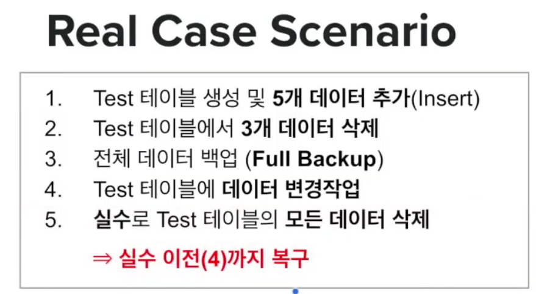
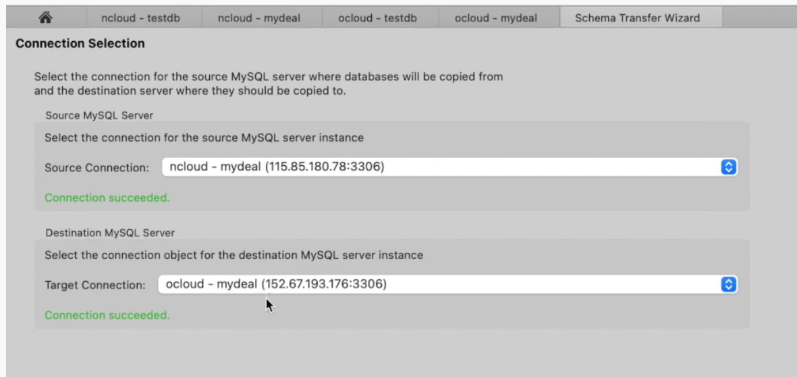

### 2021-09-28

## DB 백업
- *참고: https://www.youtube.com/watch?v=7_cilpkXfAA&t=31s*
- **기본적인 개념**
    - Full Backup (datafile)
        - 전체 데이터 백업
        - 보통 일단위, 주단위 백업
        - `mysqldump` 활용
        ```shell script
        $> mysqldump [options] (dbname | -A) [dbname] [table] > backupfile.sql
        ---
        options
        --user=<user-name> : 백업을 수행할 데이터베이스 유저명 (-u)
        --password=<password> : 유저의 암호 (-p)
        --single-transaction : 단일 트랜잭션으로 백업 수행 (시스템 부하 좀 적어지겠죠?)
        --routines : 데이터뿐만 아니라 프로시저와 함수 함께 백업 (-R) (꼭 걸어주기!)
        --flush-logs : 백업 수행과 동시에 빈로그 지우기 (-F) (비우면 안되겠죠 근데?)
        --ingore-table <table-name> : 특정 테이블은 백업에서 제외하기
        --verbose : 실행 시 모든 메시지 출력하기 (-v)
        ```
    - Incremental Backup (logfile)
        - 전체 쓰기에 대한 로그 (binlog)
        - 전체 백업 후 "증분량"에 대해서만 백업
        - `mysqlbinlog` 활용
        ```shell script
        $> mysqlbinlog [options] (binlog-file1, ..) > backupfile.sql
        ---
        options
        --database="db-name" : 특정 스키마를 지정할 때 사용 (-d)
        --no-defaults : 기본 옵션을 읽지 않고 수행
        --verbose : 수행된 SQL 문까지 함께 추출 (-v | -vv: 어떤 데이터의 타입까지) 
        --raw : 텍스트 형태가 아닌 바이너리 그대로 백업
        --start-datetime="<시작지점>" : 연월일시 형태의 백업 받을 시작 시점
        --stop-datetime="<종료시점>" : 연월일시 형태의 백업 받을 종료 시점
        --start-postition=N : 시작 지점을 시간이 아닌 빈로그 위치로
        --stop-postition=M : 종료 시점을 시간이 아닌 빈로그 위치로
        ```
    - Restore
        - 전체 데이터 복구 (Full Recovery)
        - 증분량에 대해서 복구 (Point In Time Recovery)
    - 실제 사례 탐구
        - 
        1. Find Point in Last Binlog File
            - `$> mysqlbinlog --no-defaults -v binlog.000024 > t.log`
        2. Point in Time Backup (Full Backup이 안된 시점 ~ 장애가 난 시점까지)
            - t.log 살펴보면서 빈로그 분석
            - `$> mysqlbinlog --no-defaults --start-datetime="63897" --stop-datetime="64430" -d testdb binlog.000024 > t3.log`
            - `$> mysqlbinlog --no-defaults --start-datetime="2021-02-26 18:47:52" --stop-datetime="2021-02-26 18:50:09" -d testdb binlog.000024 > t3.log`
                - 아 살펴보니까 (#63897, 18:47:52 ~ #64430, 18:50:09) 가 장애 시점이구나!
        3. Full Recovery (Full Backup 해둔거 채워넣고)
            - `$> mysql -u root -p testdb < backup_testdb.sql`
        4. Point in Time Recovery (그 이후 연산 수행한거 채워넣고)
            - `$> mysql -u root -p testdb < t3.log`
        
- **DB Transfer**
    - 참고: db migration?
        - 다른 벤더사의 DB로 이전 (oracle -> mysql)
        - 다른 버전의 DB로 이전 (mysql 5.7 -> mysql 8.0)
    - workbench 혹은 mysqldump를 사용
    - workbench를 통한 Transfer
        - workbench는 source-target GUI로 설정이 가능하네?
        - 
    - mysqldump를 통한 Transfer
        - 목적지에 이관 받을 schema를 미리 생성
        - rsync, rcp등 파일 전달이 가능하다!
        - mysqlsh과 rsync를 설치 & 실행
            ```
            sudo dnf install rsync-daemon -y
            sudo vi /etc/rsyncd.conf
            sudo systemctl --now enable rsyncd
            ```
        - rsync를 띄워주자
            - `rsync -av h.txt 152.67.193.176:/home/opc/` => 퍼미션 디나이라면 rsync도 ssh를 사용
                - authorizedKey에 넣어주자!
            - 자동 로그인
                ```
                $ncloud> ssh-keygen -t rsa
                $ncloud> cat ~/.ssh/id_rsa.pub
                $ncloud> vi .ssh/authorized_keys
                ```
        - 이제 진짜 좀 옮기자
            1. 전체 데이터 백업 (Full Backup)
                - `$> mysqldump -u root -p -R testdb > testdb_trans.sql`
            2. 백업 파일을 목적지(ocloud)로 이동
                - `$> rsync -av testdb_trans.sql opc@152.67.193.176:/home/opc`
            3. Import
                - 이미 만들어진 스키마에다가 넣을 수 있어
                - `$> mysql -u mydeal -p testdb < testdb_trans.sql`

- **백업 플랜**
    - backup_ncloud.sh
        ```shell script
        NOW=`date +%Y%m%d_%H%M`
        
        REMOTE_SERVER='opc@152.67.193.176'
        PASSWD='XXXXX!123'
        OUTDIR='/var/lib/mysql/backup'
        
        cd ${OUTDIR}
        #해당 작업 디렉토리에서 3일 지난 gz 파일은 삭제할 것이야
        /bin/find . -type f -name \*.gz -mtime +3 -delete 
        
        for db in testdb mydealdb
        do
            /usr/bin/mysqldump --user="root" --password=$PASSWD --single-transaction -R ${db} > ${db}.${NOW}.sql /usr/bin/tar -zcf ${db}.${NOW}.tar.gz ${db}.${NOW}.sql
        done
        
        /usr/bin/rm -f *.sql
        
        /usr/bin/rsync -az --delete ./ ${REMOTE_SERVER}:/data/backup/ncloud/
        ```
    - Full Backup
        - 매일 5시에 자동으로 crontab 수행
        ```shell script
        MAILTO=""
        
        # 매일 5시에 이걸 실행해주세요!
        0 5 * * * /root/bin/backup_ncloud.sh >> /root/bin/backup_ncloud.log 2>&1
        ```
    - Incremental Backup
        - binlog를 실시간으로 원격 서버에 복제
        - 3일간만 binlog 유지가 목표
            - my.cnf에 `expire_logs_days=3` 을 추가해주자
        - 원격지에서 다음과 같이 실행해주자
            - 맨뒤에 & 붙여서 백그라운드로 실행하세요~ (그럴땐 패스워드 필수)
            ```shell script
            $> mysqlbinlog --read-from-remote-server --host=<mysql-server-ip> -u <db-user> -p [암호] --raw [--stop-never] <binlog-file>
            $> mysqlbinlog --read-from-remote-server --host=115.85.180.78 --raw --stop-never -u mydeal --password="password" binlog.000005 &
            ```
        - &로 데몬행은 조금 불안해 사실
        - 이것도 쉘 스크립트 + crontab 설정을 통해서 할 수 있어
            ```shell script
            #!/bin/bash
            
            OUTDIR='/data/backup/ncloud-binlog'
            
            P=`/usr/bin/ps -ef | grep mysqlbinlog | grep mydeal`
            
            PASSWD='password'
            
            if [ "$P" == "" ]; then
                echo "$(date) Doesn't exists ncloud mysqlbinlog Now Starting..."
                cd $OUTDIR
                /usr/bin/mysqlbinlog --read-from-remote-server --host=115.85.180.78 --raw --stop-never -u mydeal --password="password" binlog.000001 &
            fi;
            ```

- **DB Replication**
    - DB 두 대를 동시에 서비스
    - Master - Slave
        - Slave는 Read-Only
        - 쓸 떄는 Master에만, Read는 둘에서 다
        - Master의 binlog를 Slave에 갖다줘
    - Realtime Binlog Backup
        - 원본(Source): Master
            1. Create User for Replication
                - `mysql> CREATE USER 'replicator'@'IDENTIFIED WITH mysql_native_password BY' ***`
                - `mysql> GRANT replication slave on *.* to 'replicator'@'%'`
            2. Reset Master & Restart MySQL
                - `mysql> reset master;`
                - `$> systemctl restart mysqld`
            3. Check BinLog File & Position
                - `mysql> show master status`
        - 목적지(Target): Slave
            1. Change server-id (mysql-server.conf)
                - `server-id=101`
                - `#replicate-do-db='mydeal' (for Replication)`
            2. Set slave configuration (from show master status)
                ```shell script
                mysql> change master to master_host="115.85.180.78",
                        master_user="replicator",
                        master_password="password",
                        master_log_file="<master-binlog-file>",
                        master_log_pos=<master-position>;
                ```
           3. Restart MySQL
                - `$> sudo systemctl restart mysqld`
            4. Start slave
                - `mysql> start slave;`
            5. Show status
                - `mysql> show slave status\G;`