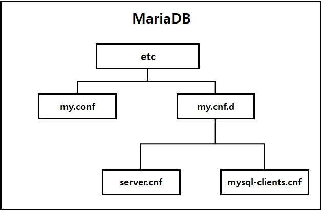
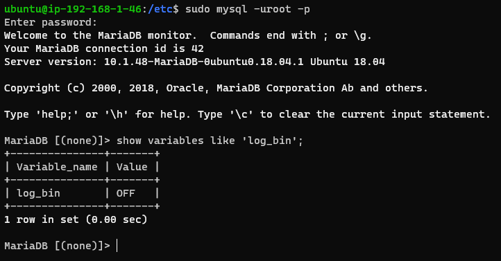
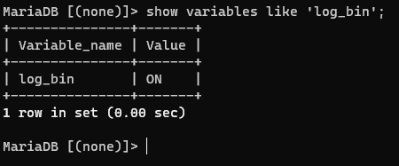
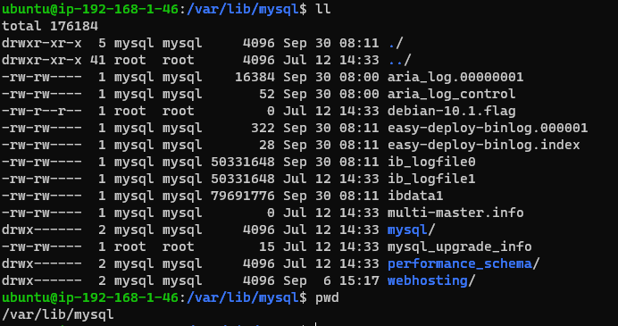

### 2021-09-30

## MySQL 구조
- 데이터를 저장하는 표 (table)
    - 표가 많아짐에 따라 디렉토리마냥 관리하는 필요성이 대두
- 연관된 표들을 그룹핑해서 데이터베이스/스키마 (database)를 만듦
- 스키마들을 저장해두는 데이터베이스 서버 (database server)
    - 우리가 설치한 프로그램은 기본적으로 데이터베이스 서버

## my.cnf 설정
- MariaDB 설정 파일 구조
    - 
    - `/etc/my.cnf`: MariaDB의 주 설정 파일. /etc/my.cnf.d/ 폴더의 파일들을 include
    - `/etc/my.cnf.d`: 이 폴더안에 모든 .cnf 파일들이 실제 설정 파일들. 이 파일들이 my.cnf에 include됨
    - `/etc/my.cnf.d/server.cnf`: 실질적인 서버 설정파일. 서버의 charset
    - `/etc/my.cnf.d/mysql-clients.cnf`: mysql, mysqldump 같은 client app들을 위한 설정 파일
    
## 내 삽질 
- my.cnf에 빈로그 추가하려다가 restart 하니까 아예 구동이 안되더라
    - 시작 못했으니까 여기저기 참고해보라고 알려줌
    - 난 그냥 /var/log/mysql/error.log에서 뭔 일 인지 알아봄
    ```
    2021-09-30  0:28:04 140266459028608 [ERROR] mysqld: File '/home/ubuntu/database_backup/binlog/bin.index' not found (Errcode: 13 "Permission denied")
    2021-09-30  0:28:04 140266459028608 [ERROR] Aborting
    ```
- 뭐 퍼미션이 안되는 구나. 우선 재구동 시키자 하고 빈로그 옵션 지우고 restart
    - 어라 근데 안되네? 
    - 이번에는 다음과 같은 에러로그 /var/log/mysql/error.log
    ```
    2021-09-30  2:05:01 139824495119488 [ERROR] /usr/sbin/mysqld: unknown option '--...'
    2021-09-30  2:05:01 139824495119488 [ERROR] Aborting
    ```
- 쉣,,, 뭔일이다냐
    - 문제는 저기 ... 보이지 중간에
    - 이게 옵션마냥 읽혀서 mysql 데몬을 띄울라는데 "--..." 옵션 이런거 없으니까 화를 낸 듯
    ```shell script
    ubuntu@ip-192-168-1-46:/etc$ cat my.cnf
    [mysqld]
    ...
    character-set-server = utf8
    collation-server = utf8_general_ci
    ```
    - 이거 지워주니까 재구동 됨
    ```shell script
    ubuntu@ip-192-168-1-46:/etc$ cat my.cnf
    [mysqld]
    character-set-server = utf8
    collation-server = utf8_general_ci
    ```

## 제발 binlog 설정 좀 키자
- *참고: https://systemv.tistory.com/52*

1. 우선 binlog 꺼진거 알겠지?
    - 

2. my.cnf에 log_bin 설정 넣어주자
    ``` shell script
    ubuntu@ip-192-168-1-46:/etc$ cat my.cnf
    [mysqld]
    
    log-bin=easy-deploy-binlog
    binlog_cache_size=2M
    max_binlog_size=512M
    expire_logs_days=3
    character-set-server = utf8
    collation-server = utf8_general_ci
    ```

3. 드디어 켜진 binlog
    - 

4. 그럼 binlog가 어디에 저장되는거임?
    - *참고: https://systemv.tistory.com/52*
    - *참고: https://hyorock.tistory.com/94*
    - *참고: https://riorio.tistory.com/86*
    - my.cnf에 log-bin에서 디렉토리 지정하면 된대 원래...
        - /home/ubuntu/database-backup/binlog/"bin.index" 이렇게 index 파일 생성해주면 된다는데 
        - 근데 왜이렇게 권한 설정때매 막히냐
    - 따라서 기본 설정으로 위와 같이 `log-bin=easy-deploy-binlog` binlog로 쓰일 파일 이름만 써주면 기본 디렉토리에 저장됨
        - 기본은 /var/lib/mysql에 저장됨
        - 
        - 이렇게 저장되긴 했는데 참,,, 아쉽네

## Full Backup 원격 전송 타임
1. 백업용 EC2 하나 파자
2. 본래 DB EC2 --ssh--> 백업용 EC2
    - 본래 DB EC2에서 키 생성
    ```shell script
    $ ssh-keygen -t rsa
    $ cat ~/.ssh/id_rsa.pub
    ```
3. 백업용 EC2에 만든 공개키 등록
    ```shell script
    $ vi ~/.ssh/authorized_keys
    ```
4. 이제 본래 DB EC2에서 백업용 EC2로 ssh 접속해봐
    - Client: DB EC2 
    - Server: 백업용 EC2
        - DB EC2: "어이! 백업 EC2! 나 private key 있는데 니 갖고 있는(내가 준) public key랑 대칭해서 맞는지 확인좀해봐라야"
    ```shell script
    $ ssh ubuntu@백업용_EC2_IP
    ```
5. ssh를 통해 본래 EC2 --> 백업 EC2 통로 뚫어준 건, ssh 프로토콜을 활용하는 scp를 통한 파일 전송할라고
    - 자 scp로 백업 EC2에 파일 전송해주는 과정 추가해주자!
    ```shell script
    ubuntu@ip-192-168-1-46:~/database_backup/script$ cat full-backup.sh
    #!/bin/bash
    
    DATE=$(date +%Y%m%d)
    BACKUP_DIR=/home/ubuntu/database_backup/backup/
    sudo mysqldump -uroot -proot --all-databases > $BACKUP_DIR"full-backup_"$DATE.sql
    cd $BACKUP_DIR
    scp "full-backup_"$DATE.sql ubuntu@192.168.2.179:/home/ubuntu/full-backup
    
    find $BACKUP_DIR -ctime +3 -exec rm -f {} \;
    ubuntu@ip-192-168-1-46:~/database_backup/script$
    ```
6. 백업 EC2에 full-backup된 파일 두둥등장
    ```shell script
    ubuntu@ip-192-168-2-179:~/full-backup$ ls
    full-backup_20210930.sql
    ```

## SSH
- *참고: https://opentutorials.org/module/432/3742*
- **SSH Key가 동작하는 방식**
    - SSH Client: Private Key 보유
    - SSH Server: Public Key 보유
    - Client -> Server
        - Client: 나 이제 private key를 가지고 server에 접속할거야! Server야 니가 대조해서 알맞으면 나좀 들여보내줘봐~
