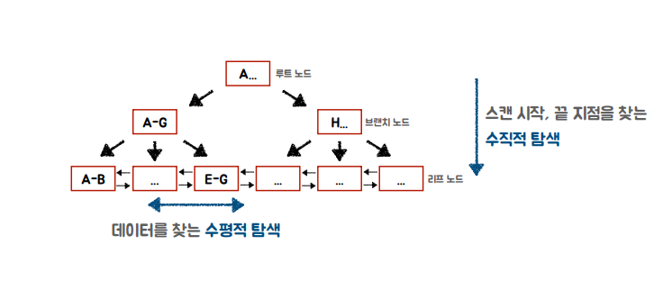

### 2021-10-06

## DB 최적화 대상
- 대상: Client, Database Engine, Filesystem
- **Client**
    - 복수 건의 레코드를 한번의 호출
    - 두 개의 쿼리 하나로 통합
    - JDBC Statement PreparedStatement 세 단계 (쿼리 문장 분석 -> 컴파일 -> 실행)
    - DB Connection Pool 사용하여 대기 시간 Low
    - Fetchsize 조정하거나 Paging

- **Database Engine**
    - 파일 시스템에 저장된 데이터 조회 시 메모리에 저장 (캐싱)
    - 서버 파라미터 튜닝

- **Filesystem**
    - SSD 사용하기
    - SQL 쿼리 최적화하여 읽는 블록수 줄여주기
        - *참고: https://medium.com/watcha/%EC%BF%BC%EB%A6%AC-%EC%B5%9C%EC%A0%81%ED%99%94-%EC%B2%AB%EA%B1%B8%EC%9D%8C-%EB%B3%B4%EB%8B%A4-%EB%B9%A0%EB%A5%B8-%EC%BF%BC%EB%A6%AC%EB%A5%BC-%EC%9C%84%ED%95%9C-7%EA%B0%80%EC%A7%80-%EC%B2%B4%ED%81%AC-%EB%A6%AC%EC%8A%A4%ED%8A%B8-bafec9d2c073*
        1. SELECT 시에는 꼭 필요한 칼럼만 불러오기
        2. 조건 부여 시, 기존 DB 값에 별도 연산 걸지 않을 것
            - `WHERE FLOOR(r.value/2) = 2`: 이따구로 조건에 계산걸면 full table scan
            - `WHERE r.value BETWEEN 4 AND 5`: 이렇게 해야 인덱스 활용할 수 있음
        3. LIKE 사용시 %를 String 앞부분에 쓰지마
            - 앞부분 부터 %라면 full table scan
        4. SELECT DISTINCT, UNION DISTINCT 같이 중복 제거하는 연산 최대한 사용 X
            - DISTINCT 연산은 많은 시간 소요
            - EXISTS 활용을 고려해볼 것
        5. 같은 내용의 조건이라면, GROUP BY 연산 시 가급적 HAVING 보다는 WHERE절 쓸 것
            - WHERE가 HAVING 보다 먼저 실행됨
                - WHERE에서 폭 좁혀놓는 것이 더 효율적임
        6. 3개 이상의 테이블 INNER JOIN시, 크기 큰 테이블 FROM에 배치하고 JOIN으로는 테이블 작은 순서대로 배치
            - 근데 간단한 INNER JOIN의 경우 대부분 Query Planner에서 효과적으로 바꿔서 최적화
        7. 자주 사용하는 데이터의 형식에 대해서는 미리 전처리된 테이블 따로 보관/관리도 좋음

## SQL 최적화 대상
- 쿼리 동작 방식 살펴보기 -> 인덱스 동작 방식 이해 -> 실행계획 확인
- **SQL 쿼리 동작방식**
    1. Query Caching - MySQL 8.0 부터 제거
    2. Parsing - SQL문을 서버가 이해할 수 있도록 쪼개고, 문법확인
    3. Preprocessor - SQL문을 서버가 이해할 수 있도록 쪼개고, 문법확인
    4. Optimization - 실행계획 수립
    5. Handler - 실행엔진의 요청에 따라 데이터를 디스크로 저장/요청

- **테이블에서 데이터 찾기**
    - Table Full Scan: Sequential Access, Multi Block I/O를 통해 효율적으로 디스크 읽기
    - Index Range Scan: Random Access, Single Block I/O로, 레코드 하나 읽기 위해 매번 I/O

## INDEX
- **인덱스?**
    - 큰 테이블에서 소량 데이터 검색할 때 유리
    - Random I/O 횟수를 줄여야해
        - 스캔 범위 줄여야해!
    - 일반적으로 테이블에 데이터가 10~100만건 이내의 경우, 조회 건수가 5~20% 가량에서 손익 분기점

- **탐색 과정**
    - MySQL 5.7 이상은 InnoDB, InnoDB는 B-Tree 인덱스 기본사용
    - 
    - 수직적 탐색 + 수평적 탐색
        - 수직적 탐색: 스캔 시작점과 끝점 찾기 위한 탐색
        - 수평적 탐색: 데이터 페이지가 버퍼 풀에 있는지 확인, 없으면 디스크에서 읽어

## 실행계획과 인덱스
- **튜닝 절차**
    1. 일단 조회해보기
        - 의도한 결과 맞는지 확인
        - 조회 건수, fetch time/duration time 등 확인
    2. 개선 대상 파악하기
        - 실행 계획 확인
        - 조건절, 조인/서브쿼리 확인, 정렬 확인
        - 인덱스 현황 파악
    3. 개선

- **실행계획**
    - MySQL 워크벤치에서 실행계획 확인 가능. 칼럼별로 무슨 뜻인지 살펴보자
    - id
        - SQL 문이 수행되는 순서
        - Driving/Driven 테이블 확인
    - select_type
        - SIMPLE: 단순한 SELECT문
        - PRIMARY: 서브쿼리를 감싸는 외부쿼리
        - SUBQUERY: 독립적으로 수행하는 서브쿼리
        - DERIVED: FROM 절에 작성된 서브쿼리
        - UNION: UNION, UNION ALL로 합쳐진 SELECT
        - DEPENDENT SUBQUERY: 서브쿼리가 바깥쪽 SELECT 쿼리에 정의된 칼럼
        - DEPENDENT UNION: 외부에 정의된 칼럼으 UNION으로 결합된 쿼리에서 사용
    - type
        - all: 테이블 풀 스캔
        - range: 인덱스 레인지 스캔
        - index: 인덱스 풀 스캔
        - ref: eq_ref와 같으나 데이터가 2건 이상
        - eq_ref: 조인 수행시 드리븐 테이블의 데이터에 PK 혹은 고유 인덱스로 단 1건의 데이터 조회
        - const: 조회되는 데이터가 단 1건일때
        - system: 테이블에 데이터가 없거나 한 개만 존재    
    - extra
        - Distinct: 중복 제거시
        - Using Where: WHERE 절로 필터
        - Using temporary: 임시 테이블 생성
        - Using Index: 물리적인 데이터 파일 안 읽고, 인덱스만 읽어서 처리
        - Using filesort: 정렬시
    - [추구해야 할 방향!]
        - select_type: SIMPLE, PRIMARY, DERIVED
        - type: system, const, eq_ref
        - extra: Using index