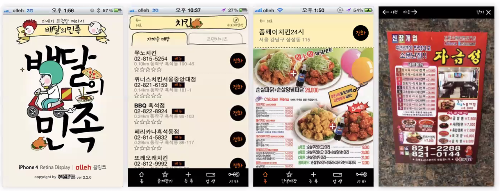
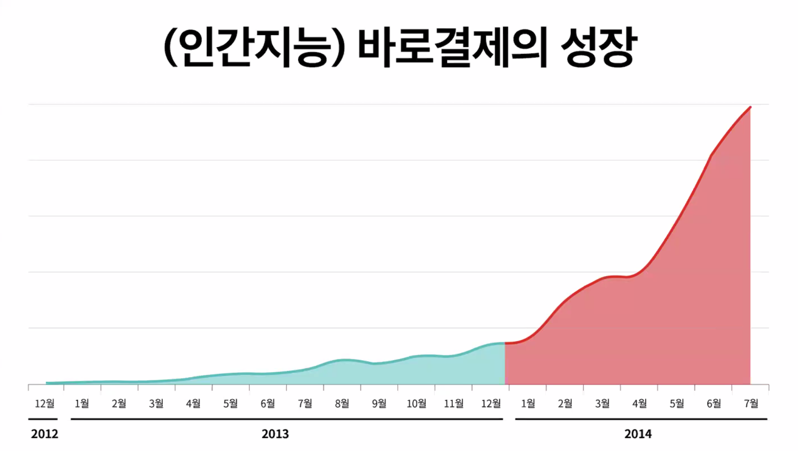
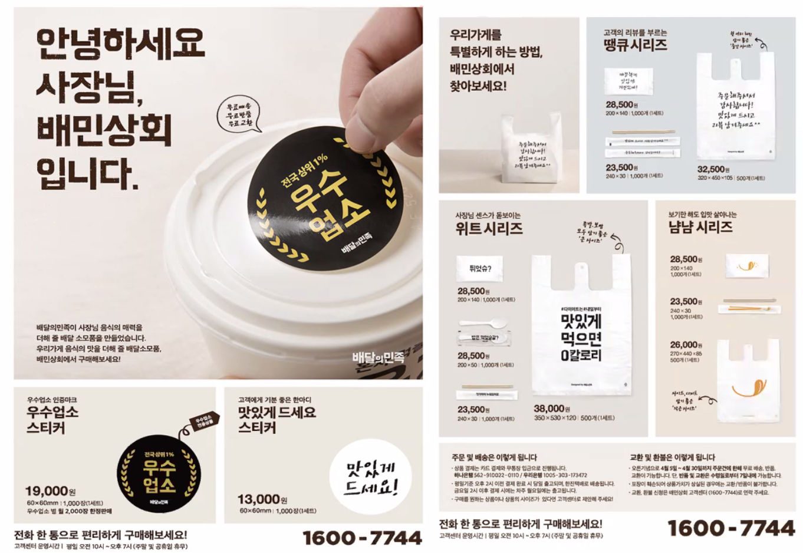
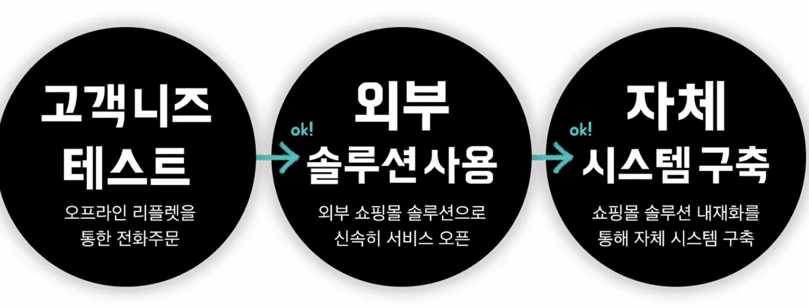
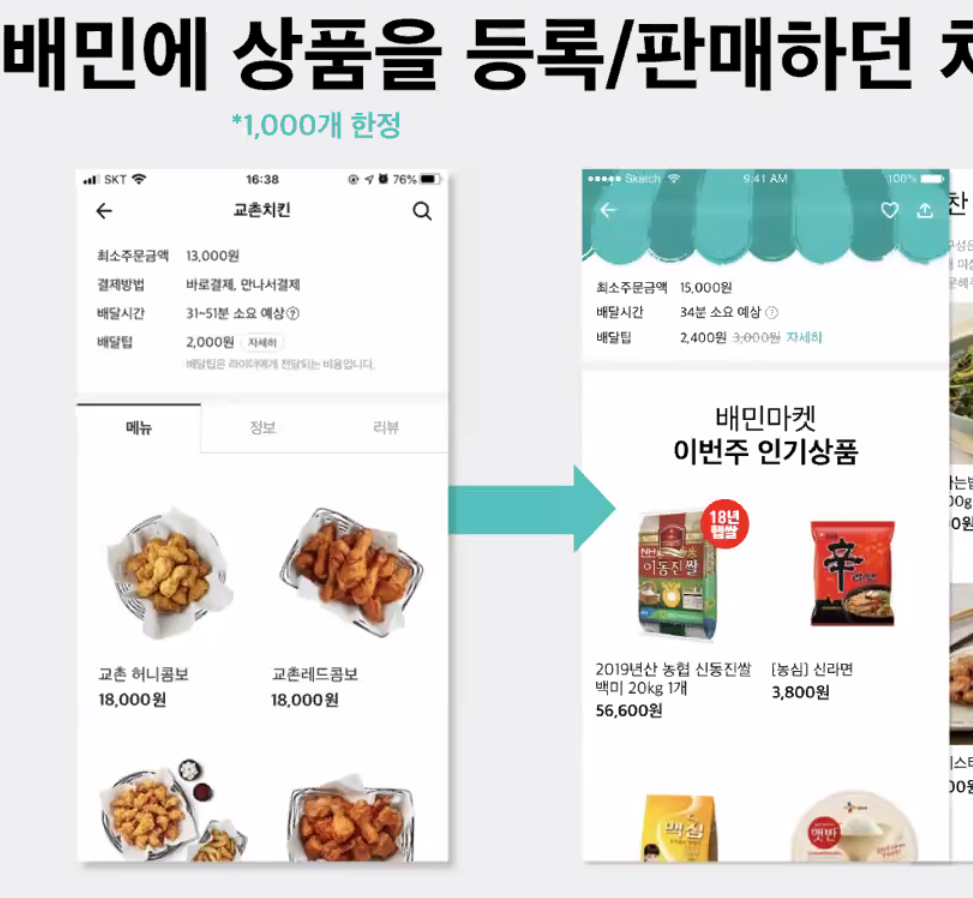
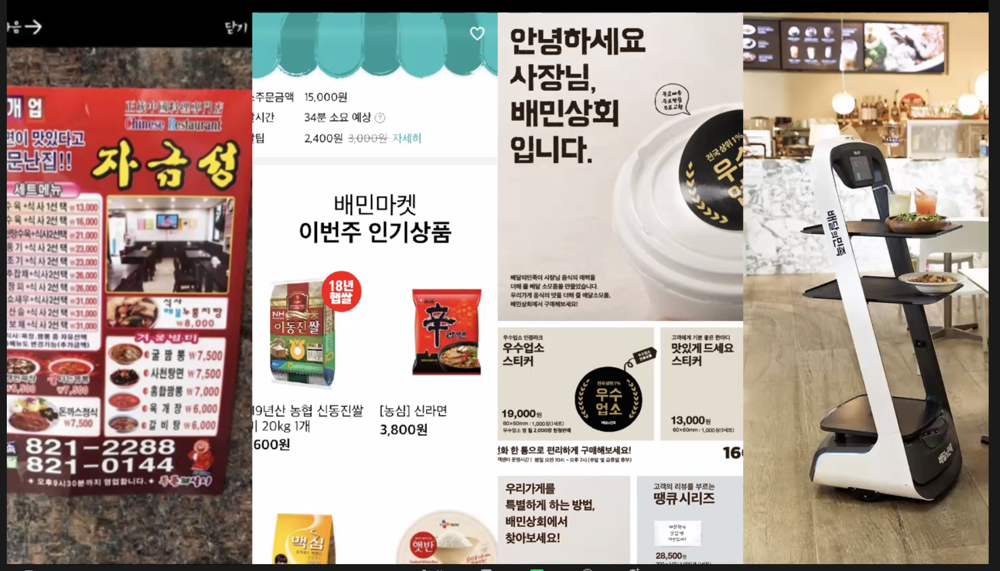

### 2021-10-12

## 김범준님 특강 [우아한형제들의 문제 해결방식]
- **현 배민의 사업확장**
    - 비마트: 슈퍼마켓 딱 대
    - 배민상회: 사장님 대상으로 배달 식자재 제공
    - 배민로봇: 광교에서는 아파트 현관 앞에서 로봇이 가져다준 음식 고객이 픽업

- **배민의 시작은 어땠을까?**
    - 2010/6/25에 시작한 서비스
    - 찾으려면 없던 전단지, 맛있는지도 오리무중
    - 배달 음식 전문 전화번호부를 제공해보자가 시작
    - 10년 전에는,,,
        - 전화를 해서 주문하는게 하나도 불편한게 아니야. 그게 당연한 거였어
        - "전단지를 잘 관리해보자"
            - 잘 모아주자
            - 그 가게가 좋은 가게인지 리뷰해주자
        - 그때 회사의 핵심 역량은 전단지 스캔을 잘하는것
        - 6개월 만에 5만건의 전단지를 모았음
    - 
        - 처음엔 이랬어
    - 사장님들이 배민 쓰는게 이득인 것을 설득해야해
        - 가상번호를 써서 배달 전화가 오면 배민에서 온거구나! 사장님들이 눈치챌 수 있겠다
        - 점점 많은 사람들이 가상번호로 배달전화가 오네? 배민 쓰는게 좋겠구나? 

- **바로 결제 도입**
    - 2012년 기준 배민은 전화주문만 가능
    - 반면 요기요는 메뉴 담아 주문하면 온라인으로 뚝딱 결재
        - 요기요에겐 전용 단말기가 있었어!
    - 배민도 오픈해야겠다! 부랴부랴 앱 결제 (바로 결제) 오픈
    - 하지만 바로 결제의 더딘 성장,,, why?
        - 요기요에겐 전용 단말기가 있어서 사장님들이 쓰기 편했음
        - 배민은 전용 단말기가 없음...
            - 초기에 사장님한테 문자메시지로 배달 주문 보내드림 => 주문 받으려면 1을 회신해주세요. 아니면 2를 회신해주세요. 
                - 제각각의 답장, 오지않는 답장
                - 그 결과 세 번 중 한번은 주문 취소됨 => 당연히 아무도 안씀
            - ARS를 통해 알려준다? => 무지무지무지 길어 기계음 읽어주는거 
            - 사장님, PC 프로그램을 깔아보시는 것은 어떨까요? => 싫어!
        - 사장님들이 귀찮아서 서포트를 안해주심
    - 바로 결제를 어떻게 성장 시킬 수 있을까?
        - 우선 바로 결제를 도입한 업소를 늘려야해!
        - 배우고 싶지 않은걸 억지로 배우게 시키는 것은 포기하자
            - 사장님들은 PC, 단말기로 주문 받기 힘들어하셔!
        - 따라서 바로결제가 진행되면, 즉 고객이 스마트폰에서 주문하면, 식당에 전화로 재주문!
            - 고객은 어찌 처리되는지 알바 없고
            - 사장님은 주문 많이 들어와서 좋고!
            - 콜센터 직원들의 인간 지능 풀가동
            - 
        - 지속 가능한 모델이 아닌 것을 알면서도 우선 많이 쓰게해야해!
    - 이렇게 바로 결제 주문량이 늘어나니까 사장님들의 태도가 변함!
        - 사장님: "이제 배울 의지가 생겼어!", "어렵더라도 배워야할 이유가 생겼어!"
    - Lesson Learn: 망치를 손에 들면 모든게 다 못으로 보인다
        - 더 멋진 바로 결제 프로그램을 만들겠어! => 그게 중요한게 아닐껄?
        - 단말기가 얼마나 멋진데! => 만든 사람의 생각이고
        - 경쟁 상황에서 빠르게 치고 나갈라면 위의 방식 처럼 생각해보자!
        - 어디에 프로그래밍 역량을 사용할 것인가 고민할 것?
            - 고도화된 단말기
            - 바로 결제로 발생한 주문데이터를 안정적으로 콜센터 직원에게 배치

- **배민상회**
    - 매우 잘 성장 중!
    - 시작
        - 사장님들이 배달 비품을 모으고 파는 것을 어색해하시네
            - 물티슈, 젓가락, 봉투, 일회용품 이거 재밌게 팔면 수요가 있을까?
        - Product_Market_Fit 을 검증해야해
            - 처음 내가 만든 프로덕트가 마켓에서도 필요로 하는 경우가 드물어
            - 계속 프로덕트를 마켓에 맞게 수정해야해
            - 배민상회 하고 싶으니까, 테스트를 먼저해보자! 
                - 사장님들한테 물어보자!
                    - 팜플렛을 찍어서 사장님들한테 우편물로 보내!
                    - 
                - 주문 의향이 있는 사장님들이 콜백해주시면 구글 스프레드 시트에 적어놓기
    - 바로바로 개발하는게 좋은걸까?
        - 고객 니즈를 테스트해보고
        - 사업성을 검증해보고
        - 외부 솔루션을 이용해보고
        - 어떤 기능이 진짜 쓰이고 필요한지 분석하고
        - 그 다음 개발! 자체 시스템 구축
        - 

- **B마트**
    - 초기 투입 인원 3명
    - 그냥 배민 주문하는 곳에 "배민마켓" 식당 마냥 오픈
        - 기존의 배민 시스템을 최대한 그대로 써보자!
        - 시장에 빨리 선보이는게 중요!
        - 
    - 사람들이 좋아하네? 이제 B마트 만들자!
        - 후두룩 뚝딱 만들었는데,,, 비마트 하나 당 2000개 정도의 상품을 등록
        - 근데 기존 식당은 1000개의 메뉴까지만 등록 가능하도록 구축해둠
        - 오픈하고 알았네?
            - 임시 조치로 배민 식당 주문도 1000개까지 등록 가능했던 상품을 2000개로 확장
            - DB 쿼리 튜닝해서 성능개선해서 우선 런칭하도록!

- **배민딜리**
    - 배민의 AI 기술력은 탑이 아니야... 라이더 센서 엄청 비싸고... 심지어 오차도 있어
        - 로봇 전문가를 다 초빙하고 채용해? ㄴㄴ
    1. 실내부터 해보자!
        - GPS, 라이더센서... 이거 다 너무 비싼데
        - 오차가 없는 실내용 GPS를 만들자!
            - 표식 세개를 만들어놓고 실내 로봇 운영
    2. 실외는?
        - 네비게이션만 있어도 얼추 ㅇㅋ

- **비슷한 컨셉으로 성장/확장**
    - 문제인지 아닌지를 기존 플랫폼을 통해 검증하고
    - 쫌쫌따리 우리가 할 수 있는 것을 하고, 이후에 확장
    - 초기엔 스펙을 단순화할 필요가 있어
        - 핵심적으로 확인해야 할 이슈가 해결되는 가장 빠른 방법을 찾아가보자
    - 완성된 시스템 (X), but! 단계별로 문제를 해결하며 앞으로! (O)
    - 이렇게 성장했다!
        - 

- **Q&A**
    - Qs. 개발자에서 경영자로 넘어가게 된 과정?
    > Ans. 2005년까지 개발 빡세게 했다. 티맥스에서 C를 이용한 시스템 프로그래밍,   
    2006년 엔씨소프트, 빅데이터 하둡 분산 파일 시스템 개발하는 팀장로 제안받아 이직   
    가자마자 김택진 사장님이 인터넷 서비스 큰 거 만들고 싶은데 리드해볼 것을 제안   
    실장이라는 직책을 맡아 디자인,개발,마케팅 조금씩 진행. 이때 개발자의 view가 유용하게 쓰였음.   
    nc를 나오고 sk를 가면서 더 본격적으로 매니징을 하게 됨  
    우형 오고 CTO => CEO 하게 된 것은 김봉진 CEO님이 삼전 권호현 사장님의 "초격차"란 책을 읽고,   
    조직을 되게 오래가게 하려면 성격이 다른 A조직, B조직 조직장을 서로 스위치하는게 좋다고 깨달으심.   
    서로 후임으로도 길러지고 조직의 이기주의가 덜생김. 삘이 딱 꽂혀서 사업총괄 맡기심
    
    - Qs. 범준님의 배민다움? 
    > Ans. 회사에서 많이하는 질문이 "좋은 회사란 무엇인가?" 사실 정답이 듣고 싶은 것은 아니야. 생각이 듣고싶은거야    
    범준님 + 봉진님은 끊임없이 좋은 회사에 대해 생각하는 것이 필요하다고 생각하심. 물론 이를 그대로 받아들일 필요는 없음.   
    내부 구성원이라면 자기가 생각하는 좋은 구성원? 좋은 회사?에 대해 꾸준히 생각했으면.   
    열려있는 태도와 상대에 대한 존중 나의 의견과 반하는 의견도 존중할 수 있는 태도가 있었으면!  
    
    - Qs. 배달의 민족은 앞으로도 요식업의 BM만 진행할 예정인지, 아니면 확장할 계획이 있는지 궁금합니다. 
    > Ans. 요식업쪽을 택할 것 같긴함. 그렇다고 다른 분야는 안할 거야! 이건 아님.   
    신사업을 생각한다면 주로 이 쪽이긴 하지. 논의를 할때 특정 제약이 창의성을 발휘하기도 함.
    
    - Qs. 인상깊었던 좋은회사에 대한 답변? 
    > Ans. 관점에 따라 다르다른 답변이 인상 깊었음. 
    투자자의 입장에서, 사회적인 측면에서, 구성원 개개인의 입장에서 좋은 회사라고 생각하는 것에 대해 교집합에 놓여있는 회사.  
    본인이 스스로 먼저 다양한 관점에서 해석하는 태도가 인상깊었다. 
    
    - Qs. 앞으로의 우형이 풀고자 하는 문제? 
    > Ans. 환경문제. 배달 활성화 될 수록 일회용품 다수 발생. 친환경 용기 도입 검토 중   
    배달원의 안전문제. 배달원의 경제적인 인센티브 매커니즘은 빠르게 여러개 처리하는 것... 그러다 보니 과속도 하시고 신호위반도 하시고.   
    기업의 사회적 책임으로 이어진다. 배달원 교육센터를 일산에 열어서 무상 교육 진행 중
    
    - Qs. 기업에서 사회적 가치를 지킨다는 것은 어떤걸 의미할지 범준님의 의견을 들어보고 싶습니다 장기적인 이익관점에서 내리는 판단일까요? 
    > Ans. 라이더의 안전문제가 해결되지 않으면, 라이더 지원하시는 분들이 줄어들 수 밖에 없어.   
    라이더의 안전 리스크가 적어질 수록 더 많은 라이더 수용가능.   
    결국 기업 역시 사회 속에서 존재하고, 일정 수준으로 커지면 이젠 기업의 노력만 가지고는 성장을 못함.   
    영속적인 기업이 되기 위해선 사회와의 소통이 필수필수 왕필수
     

    