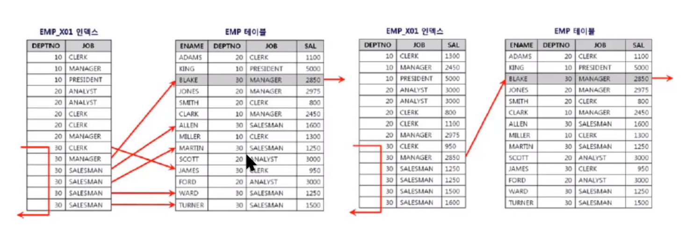

### 2021-10-15

## SQL 미션하면서 궁금증
- **Duration vs Fetch?**
    - *참고: https://stackoverflow.com/questions/9425134/mysql-duration-and-fetch-time*
    - Duration Time: 쿼리가 실행되는데 걸리는 시간. 쿼리 튜닝시 이걸 최소화 하려고 노력할 것
    - Fetch Time: 쿼리 실행과 아무런 관련이 없는, 네트워크 환경에 따라 달라지는 결과를 전송하는데 걸리는 시간. 이게 병목이면 아마 네트워크 문제

- **pk 인덱스 vs 그냥 인덱스**
    - *참고: https://goodgid.github.io/Index-vs-Primary-Key/*
    - PK
        - RDBMS에서는 PK가 자동으로 Index
        - 개념적인 값으로, 여러 Tuple 중 유일한 Tuple임을 보장
        - PK를 쓰면 단박에 찾을 수 있음
            - 약간 Array의 인덱스 갬성 O(1)
    - Index
        - Tuple의 유일성 보장은 X
        - 단지 테이블에서 Tuple을 빨리 찾을 수 있도록 하기 위해 쓰임
        - Index 칼럼 기준으로 B-tree 등을 통해 별도 디스크 공간 차지

- **복합 인덱스의 효과?**
    - 실제 예시
        - `SELECT * FROM emp WHERE deptno = 30 AND sal >= 2000` 의 경우
        - 
        - deptno에 대해서만 인덱스 걸었다면, sal을 검사하기 위해 6번의 테이블 IO
        - deptno, sal에 대해서 복합 인덱스 걸었다면, 조건을 만족하는 하나의 칼럼에 대해 1번 테이블 IO
    - 주의할 점
        - A+B+C에 대해 인덱스 걸었으면, 
        - A 혹은 A+B 에 대해 인덱스 생성하는 것은 무용지물!
        - 범위 검색하는 칼럼을 뒤에다 둘것!!!
            - 앞대가리 인덱스에서 칼럼을 특정 지을 수 있는 것으로 짓도록 노력하자
    - 복합 인덱스의 설정 기준?
        - 복합 인덱스는 결국 디스크 IO를 적게 발생시키기 위함
        - 다음과 같은 우선순위로 인덱스 생성시, 데이터 추출에 디스크 IO 적게 발생시킬 수 있음
            1. 칼럼이 사용한 연산자에 의한 인덱스
            2. 랜덤 액세스를 고려한 인덱스
            3. 정렬 제거를 위한 인덱스
            4. 단일 컬럼의 분포도를 고려한 인덱스
        
- **foreign key면 index를 만드나?**
    - MySQL 8.0 기준, FK 생성시 인덱스 생성 O
        - 참고: https://dev.mysql.com/doc/refman/8.0/en/constraint-foreign-key.html

- **unique를 설정하면 얻는 이점?**
    - 값이 중복되지 않아, 조회 성능에서 한번에 조회할 수 있음 (인덱스 생성)
    - 참고: https://stackoverflow.com/questions/9764120/does-a-unique-constraint-automatically-create-an-index-on-the-fields
    - unique key = special case of index
        - acting like a regular index with added checking for uniqueness    

- **커버링 인덱스?**
    - 참고: https://jojoldu.tistory.com/476
    - 쿼리를 충족시키는데 모든 데이터를 가지고 있는 인덱스
        - MySQL의 경우, 인덱스에 포함된 데이터를 사용할 수 있으므로, 실제 데이터까지 접근할 필요 X
        